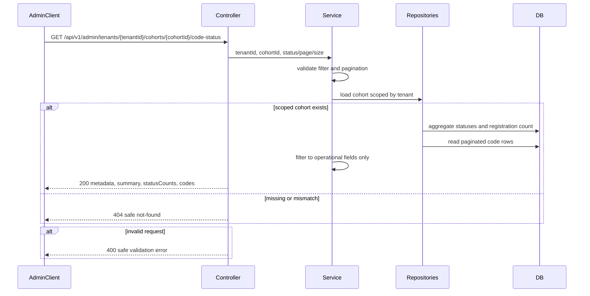

# Evidence: MVP-02-admin-code-status-view-001

Status: `BUILT_AWAITING_VERIFIER`
Updated: 2026-05-09

Latest evidence alias for the active sprint. Immutable refs:

- `.agent/stages/mvp/evidence/MVP-02-admin-code-status-view-001.md`
- `.agent/stages/mvp/evidence/MVP-02-admin-code-status-view-001.json`

Backend/admin API-only slice implemented:

- `GET /api/v1/admin/tenants/{tenantId}/cohorts/{cohortId}/code-status`;
- cohort metadata, invite-code status counts, activation/registration funnel counts;
- paginated privacy-safe per-code operational rows;
- no `apps/admin` UI/scaffold and no screenshots required for this slice;
- no `V005` migration; existing `V002`-`V004` schema is sufficient;
- generated client no-op because `packages/api-client` contains only `.gitkeep` and no generator config/script exists.

Fresh `stage_verifier` is still required. This evidence does not close `MVP-02.04`, full `MVP-02` or any human gate.

Harness note: `verify_harness.py --stage-id mvp` is recorded as `FAIL_EXPECTED_ALIAS_MISMATCH_WAITING_VERIFIER`. The failure is limited to latest artifact id mismatch because builder evidence is for the active sprint, while `verdict.json`/`problems.md` and `latest_verified_sprint_contract_id` still point to the prior verified sprint. Builder did not write verifier verdict aliases.

## Flow

## Required Raw Refs

- `.agent/stages/mvp/raw/stage-builder-mvp-02-admin-code-status-view-001-git-status-20260509.txt`
- `.agent/stages/mvp/raw/stage-builder-mvp-02-admin-code-status-view-001-java-version-20260509.txt`
- `.agent/stages/mvp/raw/stage-builder-mvp-02-admin-code-status-view-001-mvnw-version-20260509.txt`
- `.agent/stages/mvp/raw/stage-builder-mvp-02-admin-code-status-view-001-api-admin-it-20260509.txt`
- `.agent/stages/mvp/raw/stage-builder-mvp-02-admin-code-status-view-001-api-test-report-summary-20260509.txt`
- `.agent/stages/mvp/raw/stage-builder-mvp-02-admin-code-status-view-001-api-mvn-test-20260509.txt`
- `.agent/stages/mvp/raw/stage-builder-mvp-02-admin-code-status-view-001-api-mvn-verify-20260509.txt`
- `.agent/stages/mvp/raw/stage-builder-mvp-02-admin-code-status-view-001-make-verify-20260509.txt`
- `.agent/stages/mvp/raw/stage-builder-mvp-02-admin-code-status-view-001-make-test-unit-20260509.txt`
- `.agent/stages/mvp/raw/stage-builder-mvp-02-admin-code-status-view-001-make-build-20260509.txt`
- `.agent/stages/mvp/raw/stage-builder-mvp-02-admin-code-status-view-001-git-diff-check-20260509.txt`
- `.agent/stages/mvp/raw/stage-builder-mvp-02-admin-code-status-view-001-migration-inspection-20260509.txt`
- `.agent/stages/mvp/raw/stage-builder-mvp-02-admin-code-status-view-001-openapi-source-inspection-20260509.txt`
- `.agent/stages/mvp/raw/stage-builder-mvp-02-admin-code-status-view-001-generated-client-noop-20260509.txt`
- `.agent/stages/mvp/raw/stage-builder-mvp-02-admin-code-status-view-001-guardrail-scan-20260509.txt`
- `.agent/stages/mvp/raw/stage-builder-mvp-02-admin-code-status-view-001-verify-harness-20260509.json`

## Acceptance Status

Builder evidence is ready for all frozen acceptance criteria, except fresh verifier verdict is intentionally pending:

- Criteria 1-11: `PASS` or `PASS_NOOP/PASS_NO_MIGRATION` in immutable evidence.
- Criterion 12: `BUILDER_EVIDENCE_READY_WAITING_VERIFIER`.
- Criterion 13: `WAITING_HUMAN`.

## Human Gates

- Legal/privacy wording: `WAITING_HUMAN`
- Consent copy: `WAITING_HUMAN`
- Real employee/customer data processing: `WAITING_HUMAN`
- Customer-specific reporting boundaries: `WAITING_HUMAN`
- Admin auth/role/audit policy for production use: `WAITING_HUMAN`

## Handoff

Run a fresh `stage_verifier` scoped only to `MVP-02-admin-code-status-view-001`. Do not mark `MVP-02.04` or full `MVP-02` complete from this backend-only evidence; the `apps/admin` UI/status screen remains a separate future slice.
