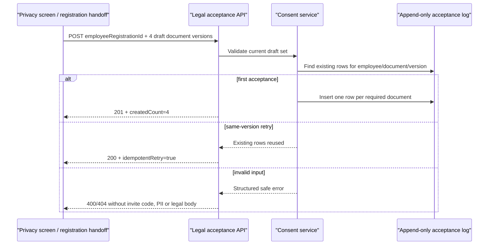

# Evidence: MVP-03-consent-version-logging-001

Status: `SCOPED_PASS`
Updated: 2026-05-12
Stage: `mvp`
Parent unit: `MVP-03.03`

## Scope

Built the frozen backend/API-first consent version logging slice:

- added append-only Flyway migration `V007__legal_document_acceptance_log.sql`;
- added a narrow `apps/api` consent package for draft legal document acceptance;
- records current draft versions for `PRIVACY_POLICY`, `PERSONAL_DATA_CONSENT`, `TERMS_OF_USE` and `FINANCIAL_DISCLAIMER`;
- anchors acceptance rows to existing `employee_registrations.id` and stores tenant / pilot launch / access pool scope;
- supports idempotent same-version retry without duplicate rows;
- rejects unknown document type, unsupported version, missing required document and unknown employee registration through structured safe errors;
- exposes thin API surface at `POST /api/v1/employee-registrations/{employeeRegistrationId}/legal-acceptances`;
- covers OpenAPI runtime `/v3/api-docs` in integration tests;
- updates `packages/api-client` OpenAPI snapshot, generator, drift check and generated contract/client helper for the legal acceptance endpoint;
- exports `LEGAL_DOCUMENT_CURRENT_DRAFT_VERSION = "draft-2026-05-12"` from generated contracts and drift-checks it against backend `LegalAcceptanceService.CURRENT_DRAFT_VERSION`;
- keeps generated api-client EOF formatting stable at generator source and verifies new/untracked generated files with no-index whitespace checks;
- leaves `/onboarding/privacy` non-mutating because there is no trustworthy employee auth/session or registration identity bridge in `apps/web`.

The slice does not approve legal wording, implement final consent/legal text management, add employee auth/session, diagnostics/routing, HR reporting, profile basics, points/wallet, CMS/admin publishing, real data handling, or full `MVP-03` closure.

## Flow

## Source Mapping

- Stage scope: `docs/stages/MVP.md`, `MVP-03.03`.
- Product legal/privacy baseline: `docs/product/b2b-mvp/lemanapro/product-foundation-v1.md`, legal minimum/version logging requirement.
- Access guardrails: `docs/architecture/access-and-subscriptions.md` and `docs/architecture/organization-access-subscription-model.md`.
- Human gates: `docs/engineering/human-gates.md`.
- Documentation workflow: `docs/architecture/documentation-workflow.md`.

## Changed Files

Production/test files for this slice:

- `apps/api/src/main/resources/db/migration/V007__legal_document_acceptance_log.sql`
- `apps/api/src/main/java/com/finrhythm/api/consent/domain/LegalDocumentAcceptance.java`
- `apps/api/src/main/java/com/finrhythm/api/consent/domain/LegalDocumentType.java`
- `apps/api/src/main/java/com/finrhythm/api/consent/persistence/LegalDocumentAcceptanceRepository.java`
- `apps/api/src/main/java/com/finrhythm/api/consent/service/*`
- `apps/api/src/main/java/com/finrhythm/api/consent/web/*`
- `apps/api/src/test/java/com/finrhythm/api/consent/LegalDocumentAcceptanceControllerIT.java`
- `packages/api-client/openapi/finrhythm-api.openapi.json`
- `packages/api-client/scripts/generate-contracts.mjs`
- `packages/api-client/scripts/check-openapi-drift.mjs`
- `packages/api-client/src/generated/contracts.ts`
- `packages/api-client/dist/generated/contracts.js`
- `packages/api-client/dist/generated/contracts.d.ts`
- `packages/api-client/README.md`

Baseline compile fix encountered while running the slice:

- `apps/api/src/main/java/com/finrhythm/api/tenant/persistence/InviteCodeRepository.java`
- `apps/api/src/main/java/com/finrhythm/api/admin/service/AdminCodeStatusService.java`

Reason: existing dirty admin status code expected effective expired-invite repository methods. Maven could not compile until the repository contract and count aggregation matched that existing service. This preserves the active admin status behavior and is not a new consent feature.

Stage artifacts:

- `.agent/stages/mvp/evidence.md`
- `.agent/stages/mvp/evidence.json`
- `.agent/stages/mvp/evidence/MVP-03-consent-version-logging-001.md`
- `.agent/stages/mvp/evidence/MVP-03-consent-version-logging-001.json`
- `.agent/stages/mvp/status.json`
- `.agent/stages/mvp/backlog.md`
- `.agent/stages/mvp/progress.md`
- `.agent/stages/mvp/feature_list.json`
- `docs/architecture/repo-layout.md`

## Acceptance Mapping

| Acceptance item | Status | Evidence |
|---|---|---|
| Append-only migration creates acceptance log | PASS | `V007__legal_document_acceptance_log.sql`; migration test |
| Log anchors to `employee_registrations.id` and preserves tenant/pilot/access-pool scope | PASS | FK and scope columns in `V007`; `assertStoredScope` test |
| Current draft allowlist has four legal document types | PASS | `LegalDocumentType`; service allowlist; OpenAPI test |
| API records current draft versions | PASS | `LegalDocumentAcceptanceController`; `recordsCurrentDraftAcceptance...` test |
| Same-version retry is idempotent and creates no duplicate rows | PASS | retry test checks 4 rows and `idempotentRetry=true` |
| Unknown type, unsupported version, missing document and unknown registration fail safely | PASS | controller integration tests |
| API does not echo raw invite codes, activation subject refs, PII or legal text bodies | PASS | response assertions and guardrail scan |
| Controller remains thin | PASS | controller delegates to service and maps response only |
| OpenAPI includes the new contract | PASS | `/v3/api-docs` integration test |
| Generated client updated without hand-writing generated artifacts | PASS | `packages/api-client` snapshot/generator/drift check cover legal acceptance DTO/path helper and `LEGAL_DOCUMENT_CURRENT_DRAFT_VERSION`; api-client build, generated check, drift check, typecheck and marker scan PASS |
| Web avoids unsafe acceptance without identity bridge | PASS | no `apps/web` change in this slice; privacy screen remains non-mutating |
| Human gates remain open | PASS | status/evidence keep legal and real-data gates open |
| Fresh verifier PASS exists | PASS | `.agent/stages/mvp/verdicts/MVP-03-consent-version-logging-001.json` |

## Validation Summary

- `java -version` with `JAVA_HOME=/opt/homebrew/opt/openjdk@21/libexec/openjdk.jdk/Contents/Home`: PASS, OpenJDK 21.0.11 recorded in every Maven/root raw ref.
- `cd apps/api && ./mvnw -q test`: PASS, `.agent/stages/mvp/raw/orchestrator-mvp-03-consent-version-logging-001-api-mvn-test-20260512-r3.txt`
- `cd apps/api && ./mvnw -q verify`: PASS, `.agent/stages/mvp/raw/orchestrator-mvp-03-consent-version-logging-001-api-mvn-verify-20260512-r2.txt`
- `make verify`: PASS, `.agent/stages/mvp/raw/orchestrator-mvp-03-consent-version-logging-001-make-verify-20260512.txt`
- `make test-unit`: PASS, `.agent/stages/mvp/raw/orchestrator-mvp-03-consent-version-logging-001-make-test-unit-20260512.txt`
- `make build`: PASS, `.agent/stages/mvp/raw/orchestrator-mvp-03-consent-version-logging-001-make-build-20260512.txt`
- `pnpm --filter @finrhythm/api-client build`: PASS, `.agent/stages/mvp/raw/orchestrator-mvp-03-consent-version-logging-001-api-client-build-20260512-r3.txt`
- `pnpm --filter @finrhythm/api-client check:generated`: PASS, `.agent/stages/mvp/raw/orchestrator-mvp-03-consent-version-logging-001-api-client-check-generated-20260512-r2.txt`
- `pnpm --filter @finrhythm/api-client check:openapi-drift`: PASS, `.agent/stages/mvp/raw/orchestrator-mvp-03-consent-version-logging-001-api-client-check-openapi-drift-20260512-r2.txt`
- `pnpm --filter @finrhythm/api-client typecheck`: PASS, `.agent/stages/mvp/raw/orchestrator-mvp-03-consent-version-logging-001-api-client-typecheck-20260512-r2.txt`
- `pnpm --filter @finrhythm/api-client build` after current-version marker fix: PASS, `.agent/stages/mvp/raw/orchestrator-mvp-03-consent-version-logging-001-api-client-build-current-version-fix-20260512.txt`
- `pnpm --filter @finrhythm/api-client check:generated` after current-version marker fix: PASS, `.agent/stages/mvp/raw/orchestrator-mvp-03-consent-version-logging-001-api-client-check-generated-current-version-fix-20260512.txt`
- `pnpm --filter @finrhythm/api-client check:openapi-drift` after current-version marker fix: PASS, `.agent/stages/mvp/raw/orchestrator-mvp-03-consent-version-logging-001-api-client-check-openapi-drift-current-version-fix-20260512.txt`
- `pnpm --filter @finrhythm/api-client typecheck` after current-version marker fix: PASS, `.agent/stages/mvp/raw/orchestrator-mvp-03-consent-version-logging-001-api-client-typecheck-current-version-fix-20260512.txt`
- `rg -n "<legal acceptance markers>" packages/api-client`: PASS, `.agent/stages/mvp/raw/orchestrator-mvp-03-consent-version-logging-001-api-client-marker-scan-current-version-fix-20260512.txt`
- `pnpm --filter @finrhythm/api-client build` after EOF generator fix: PASS, `.agent/stages/mvp/raw/orchestrator-mvp-03-consent-version-logging-001-api-client-build-eof-fix-20260512.txt`
- `pnpm --filter @finrhythm/api-client check:generated` after EOF generator fix: PASS, `.agent/stages/mvp/raw/orchestrator-mvp-03-consent-version-logging-001-api-client-check-generated-eof-fix-20260512.txt`
- `pnpm --filter @finrhythm/api-client check:openapi-drift` after EOF generator fix: PASS, `.agent/stages/mvp/raw/orchestrator-mvp-03-consent-version-logging-001-api-client-check-openapi-drift-eof-fix-20260512.txt`
- `pnpm --filter @finrhythm/api-client typecheck` after EOF generator fix: PASS, `.agent/stages/mvp/raw/orchestrator-mvp-03-consent-version-logging-001-api-client-typecheck-eof-fix-20260512.txt`
- `rg -n "<legal acceptance markers>" packages/api-client` after EOF generator fix: PASS, `.agent/stages/mvp/raw/orchestrator-mvp-03-consent-version-logging-001-api-client-marker-scan-eof-fix-20260512.txt`
- Fresh `stage_verifier`: PASS, `.agent/stages/mvp/verdicts/MVP-03-consent-version-logging-001.json`
- JSON validation: PASS, `.agent/stages/mvp/raw/orchestrator-mvp-03-consent-version-logging-001-json-validation-20260512.txt`
- JSON validation after generated-client proof fix: PASS, `.agent/stages/mvp/raw/orchestrator-mvp-03-consent-version-logging-001-json-validation-fix-20260512.txt`
- JSON validation after final generated-client proof sync: PASS, `.agent/stages/mvp/raw/orchestrator-mvp-03-consent-version-logging-001-json-validation-fix-20260512-r2.txt`
- JSON validation after current-version marker fix: PASS, `.agent/stages/mvp/raw/orchestrator-mvp-03-consent-version-logging-001-json-validation-current-version-fix-20260512.txt`
- JSON validation after final current-version proof sync: PASS, `.agent/stages/mvp/raw/orchestrator-mvp-03-consent-version-logging-001-json-validation-current-version-fix-20260512-r2.txt`
- `git diff --check -- <changed files>`: PASS, `.agent/stages/mvp/raw/orchestrator-mvp-03-consent-version-logging-001-git-diff-check-20260512.txt`
- `git diff --check -- <generated-client proof fix files>`: PASS, `.agent/stages/mvp/raw/orchestrator-mvp-03-consent-version-logging-001-git-diff-check-fix-20260512.txt`
- `git diff --check -- <generated-client proof fix files>` after final proof sync: PASS, `.agent/stages/mvp/raw/orchestrator-mvp-03-consent-version-logging-001-git-diff-check-fix-20260512-r2.txt`
- `git diff --check -- <api-client current-version marker fix files>`: PASS, `.agent/stages/mvp/raw/orchestrator-mvp-03-consent-version-logging-001-git-diff-check-current-version-fix-20260512.txt`
- `git diff --check -- <api-client current-version marker fix files>` after final proof sync: PASS, `.agent/stages/mvp/raw/orchestrator-mvp-03-consent-version-logging-001-git-diff-check-current-version-fix-20260512-r2.txt`
- `git diff --check -- <api-client EOF fix files>`: PASS, `.agent/stages/mvp/raw/orchestrator-mvp-03-consent-version-logging-001-git-diff-check-eof-fix-20260512.txt`
- no-index whitespace checks for new/untracked scoped files after EOF fix: PASS, `.agent/stages/mvp/raw/orchestrator-mvp-03-consent-version-logging-001-no-index-whitespace-eof-fix-20260512.txt`
- JSON validation after EOF proof sync: PASS, `.agent/stages/mvp/raw/orchestrator-mvp-03-consent-version-logging-001-json-validation-eof-fix-20260512.txt`
- `git diff --check -- <api-client EOF fix files>` after EOF proof sync: PASS, `.agent/stages/mvp/raw/orchestrator-mvp-03-consent-version-logging-001-git-diff-check-eof-fix-20260512-r2.txt`
- JSON validation after final EOF proof sync: PASS, `.agent/stages/mvp/raw/orchestrator-mvp-03-consent-version-logging-001-json-validation-eof-fix-20260512-r2.txt`
- `git diff --check -- <api-client EOF fix files>` after final EOF proof sync: PASS, `.agent/stages/mvp/raw/orchestrator-mvp-03-consent-version-logging-001-git-diff-check-eof-fix-20260512-r3.txt`
- Parent sync JSON validation: PASS, `.agent/stages/mvp/raw/orchestrator-mvp-03-consent-version-logging-001-parent-sync-json-validation-20260512.txt`
- Parent sync `git diff --check`: PASS, `.agent/stages/mvp/raw/orchestrator-mvp-03-consent-version-logging-001-parent-sync-git-diff-check-20260512.txt`
- Harness validation: PASS, `.agent/stages/mvp/raw/orchestrator-mvp-03-consent-version-logging-001-verify-harness-20260512.txt`
- Guardrail scan: PASS_WITH_ASSERTION_MATCHES, `.agent/stages/mvp/raw/orchestrator-mvp-03-consent-version-logging-001-guardrail-scan-20260512.txt`
  - matches are test assertions proving raw invite code / activation subject ref / legal text are not echoed;
  - no production consent source echoes raw invite codes, activation subject refs, full contact PII, real data, customer brand, final legal approval, diagnostics completion, `user.organization_id` or `pro_user`.

Known failed/interrupted raw refs kept for audit:

- first Maven test attempt failed on pre-existing admin repository/service compile mismatch: `.agent/stages/mvp/raw/orchestrator-mvp-03-consent-version-logging-001-api-mvn-test-20260512.txt`;
- second Maven test attempt conflicted with an orphaned builder Maven process and missing surefirebooter jar: `.agent/stages/mvp/raw/orchestrator-mvp-03-consent-version-logging-001-api-mvn-test-20260512-r2.txt`;
- first Maven verify attempt exposed the JPQL effective-status grouping bug and was fixed before final PASS: `.agent/stages/mvp/raw/orchestrator-mvp-03-consent-version-logging-001-api-mvn-verify-20260512.txt`.

## Docs Sync

`CANONICAL_DOC_UPDATED`.

Reason: canonical MVP/product docs already require consent/legal document version logging. This slice implements the backend/API technical foundation without changing product policy, access architecture, setup contract or legal wording. API contract is represented in Spring/OpenAPI source, runtime `/v3/api-docs` tests and the checked-in `packages/api-client` snapshot/generator/drift checks. `packages/api-client/README.md` now documents the narrow current-version marker export, and `docs/architecture/repo-layout.md` was synced to stop saying generated client integration is a no-op.

## Human Gates Remaining Open

- Legal/privacy wording and consent copy.
- Real employee/customer data processing.
- Customer-specific HR/reporting boundaries.
- HR/privacy wording review for diagnostics, self-assessment and reports.
- Final financial correctness of lessons, diagnostics, quizzes and explanations.
- Legal/tax review for tax wording.
- Reward economy, stock, prices and fulfillment.
- Support answer policy for sensitive topics.
- `production_ready` content approval.
- Admin auth/role/audit policy for production use.

## Fresh Verifier

Fresh verifier returned `PASS` for this sprint. Latest verifier aliases point to `MVP-03-consent-version-logging-001`; parent sync updated `status.json`, `verdict.json`, `problems.md` and feature entries for the scoped PASS. Full `MVP-03`, the MVP stage and human gates remain open.
