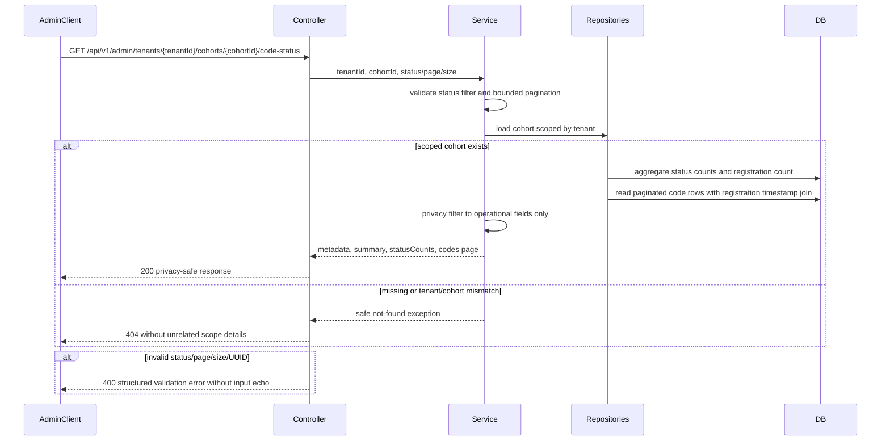

# Evidence: MVP-02-admin-code-status-view-001

Status: `BUILT_AWAITING_VERIFIER`  
Updated: 2026-05-09

Backend/admin API-only slice implemented:

- `GET /api/v1/admin/tenants/{tenantId}/cohorts/{cohortId}/code-status`;
- cohort metadata, invite-code status counts, activation/registration funnel counts;
- paginated per-code operational rows with `inviteCodeId`, lifecycle timestamps and `registered` flag only;
- no `apps/admin` UI/scaffold, no admin mutations, no auth/role/audit implementation;
- no schema migration; read support uses existing `V002`-`V004` tables through repository projections;
- OpenAPI/springdoc source is updated through controller/read-model annotations;
- generated client is an explicit no-op because `packages/api-client` contains only `.gitkeep` and no generator config/script exists.

Fresh `stage_verifier` is still required. This evidence does not close `MVP-02.04`, full `MVP-02` or any human gate.

Harness note: `verify_harness.py --stage-id mvp` is recorded as `FAIL_EXPECTED_ALIAS_MISMATCH_WAITING_VERIFIER`. The failure is limited to latest artifact id mismatch because builder evidence is for the active sprint, while `verdict.json`/`problems.md` and `latest_verified_sprint_contract_id` still point to the prior verified sprint. Builder did not write verifier verdict aliases by design.

## Flow

## Commands And Raw Refs

| Command / inspection | Outcome | Raw ref |
|---|---:|---|
| `git status --short` | RECORDED | `.agent/stages/mvp/raw/stage-builder-mvp-02-admin-code-status-view-001-git-status-20260509.txt` |
| `java -version` | PASS | `.agent/stages/mvp/raw/stage-builder-mvp-02-admin-code-status-view-001-java-version-20260509.txt` |
| `cd apps/api && ./mvnw -v` | PASS | `.agent/stages/mvp/raw/stage-builder-mvp-02-admin-code-status-view-001-mvnw-version-20260509.txt` |
| `cd apps/api && ./mvnw -q -Dtest=AdminCodeStatusControllerIT test` | PASS | `.agent/stages/mvp/raw/stage-builder-mvp-02-admin-code-status-view-001-api-admin-it-20260509.txt` |
| API test report summary | PASS | `.agent/stages/mvp/raw/stage-builder-mvp-02-admin-code-status-view-001-api-test-report-summary-20260509.txt` |
| `cd apps/api && ./mvnw -q test` | PASS | `.agent/stages/mvp/raw/stage-builder-mvp-02-admin-code-status-view-001-api-mvn-test-20260509.txt` |
| `cd apps/api && ./mvnw -q verify` | PASS | `.agent/stages/mvp/raw/stage-builder-mvp-02-admin-code-status-view-001-api-mvn-verify-20260509.txt` |
| `make verify` | PASS | `.agent/stages/mvp/raw/stage-builder-mvp-02-admin-code-status-view-001-make-verify-20260509.txt` |
| `make test-unit` | PASS | `.agent/stages/mvp/raw/stage-builder-mvp-02-admin-code-status-view-001-make-test-unit-20260509.txt` |
| `make build` | PASS | `.agent/stages/mvp/raw/stage-builder-mvp-02-admin-code-status-view-001-make-build-20260509.txt` |
| `git diff --check` | PASS | `.agent/stages/mvp/raw/stage-builder-mvp-02-admin-code-status-view-001-git-diff-check-20260509.txt` |
| API/read-model IT summary | PASS | `.agent/stages/mvp/raw/stage-builder-mvp-02-admin-code-status-view-001-api-admin-it-20260509.txt` |
| migration/no-migration inspection | PASS_NO_MIGRATION | `.agent/stages/mvp/raw/stage-builder-mvp-02-admin-code-status-view-001-migration-inspection-20260509.txt` |
| OpenAPI/springdoc source inspection | PASS_SOURCE_AND_RUNTIME_TEST | `.agent/stages/mvp/raw/stage-builder-mvp-02-admin-code-status-view-001-openapi-source-inspection-20260509.txt` |
| generated-client regeneration/no-op note | NOOP_NO_GENERATOR | `.agent/stages/mvp/raw/stage-builder-mvp-02-admin-code-status-view-001-generated-client-noop-20260509.txt` |
| privacy/raw-code/PII/customer-brand guardrail scan | PASS_SOURCE_AND_TEST | `.agent/stages/mvp/raw/stage-builder-mvp-02-admin-code-status-view-001-guardrail-scan-20260509.txt` |
| `python3 .agents/skills/stage-launch-proof-loop/scripts/verify_harness.py --stage-id mvp` | FAIL_EXPECTED_ALIAS_MISMATCH_WAITING_VERIFIER | `.agent/stages/mvp/raw/stage-builder-mvp-02-admin-code-status-view-001-verify-harness-20260509.json` |

## Acceptance Criteria Mapping

| # | Status | Evidence |
|---:|---|---|
| 1 | PASS | Java/Maven/root command raw refs; existing Spring Boot/Flyway/PostgreSQL baseline unchanged. |
| 2 | PASS | No `apps/admin` files changed beyond pre-existing `apps/admin/AGENTS.md`; implementation is under `apps/api`. |
| 3 | PASS | `AdminCodeStatusController`, `AdminCodeStatusService`, repository projections and `AdminCodeStatusControllerIT`. |
| 4 | PASS | `AdminCodeStatusControllerIT` seeds 500 synthetic Wave 1 codes with mixed issued/activated/registered/revoked/expired states. |
| 5 | PASS | Tests cover status filter, lowercase filter normalization, page 0/page 1 and size bound validation. |
| 6 | PASS | Response tests and guardrail scan verify no raw invite code, lookup hash, activation subject ref or employee contact fields in admin response. |
| 7 | PASS | Test data uses `Synthetic Pilot Tenant`, `Synthetic Learner` and `example.test`; no real customer/employee data or customer brand. |
| 8 | PASS | Controller only delegates; validation, aggregation, pagination and privacy-safe row mapping live in `AdminCodeStatusService` and repository projections. |
| 9 | PASS_NO_MIGRATION | No `V005__*.sql` added; migration inspection records existing `V001`-`V004` only. |
| 10 | PASS | Springdoc annotations and runtime `/v3/api-docs` test cover endpoint, params, schemas and safe errors/examples. |
| 11 | PASS_NOOP | No generator/artifacts exist in `packages/api-client`; no generated client files edited. |
| 12 | BUILDER_EVIDENCE_READY_WAITING_VERIFIER | Raw refs are recorded for required commands and inspections. Fresh verifier verdict is intentionally absent and must be produced by a separate `stage_verifier`. |
| 13 | WAITING_HUMAN | Legal/privacy wording, consent text, real-data processing, customer-specific reporting and production admin auth/role/audit remain open gates. |

## Changed Files

- `apps/api/src/main/java/com/finrhythm/api/admin/readmodel/AdminCodeStatusCount.java`
- `apps/api/src/main/java/com/finrhythm/api/admin/readmodel/AdminCodeStatusPage.java`
- `apps/api/src/main/java/com/finrhythm/api/admin/readmodel/AdminCodeStatusQuery.java`
- `apps/api/src/main/java/com/finrhythm/api/admin/readmodel/AdminCodeStatusResponse.java`
- `apps/api/src/main/java/com/finrhythm/api/admin/readmodel/AdminCodeStatusRow.java`
- `apps/api/src/main/java/com/finrhythm/api/admin/readmodel/AdminCodeStatusSummary.java`
- `apps/api/src/main/java/com/finrhythm/api/admin/service/AdminCodeStatusException.java`
- `apps/api/src/main/java/com/finrhythm/api/admin/service/AdminCodeStatusFieldViolation.java`
- `apps/api/src/main/java/com/finrhythm/api/admin/service/AdminCodeStatusService.java`
- `apps/api/src/main/java/com/finrhythm/api/admin/web/AdminApiErrorResponse.java`
- `apps/api/src/main/java/com/finrhythm/api/admin/web/AdminApiFieldError.java`
- `apps/api/src/main/java/com/finrhythm/api/admin/web/AdminCodeStatusController.java`
- `apps/api/src/main/java/com/finrhythm/api/admin/web/AdminCodeStatusExceptionHandler.java`
- `apps/api/src/main/java/com/finrhythm/api/tenant/persistence/CohortRepository.java`
- `apps/api/src/main/java/com/finrhythm/api/tenant/persistence/InviteCodeRepository.java`
- `apps/api/src/main/java/com/finrhythm/api/tenant/persistence/InviteCodeStatusCountProjection.java`
- `apps/api/src/main/java/com/finrhythm/api/tenant/persistence/InviteCodeStatusRowProjection.java`
- `apps/api/src/main/java/com/finrhythm/api/registration/persistence/EmployeeRegistrationRepository.java`
- `apps/api/src/test/java/com/finrhythm/api/admin/AdminCodeStatusControllerIT.java`

## Docs Sync

- Canonical API contract changed through Spring/OpenAPI source in `apps/api`.
- No canonical product, architecture or stage source doc change was needed; behavior stays within frozen sprint contract.
- Stage evidence includes the required Mermaid flow above.
- `apps/admin` UI docs/screenshots are `NOT_APPLICABLE` for this backend-only slice.

## Human Gates

- Legal/privacy wording: `WAITING_HUMAN`
- Consent copy: `WAITING_HUMAN`
- Real employee/customer data processing: `WAITING_HUMAN`
- Customer-specific reporting boundaries: `WAITING_HUMAN`
- Admin auth/role/audit policy for production use: `WAITING_HUMAN`

## Handoff

Run a fresh `stage_verifier` scoped to `MVP-02-admin-code-status-view-001`. The verifier should not edit production code and should focus on the raw refs above, the privacy-safe response contract, no-migration/no-client no-op evidence, and the fact that this backend API slice does not close `MVP-02.04` UI or full `MVP-02`.
