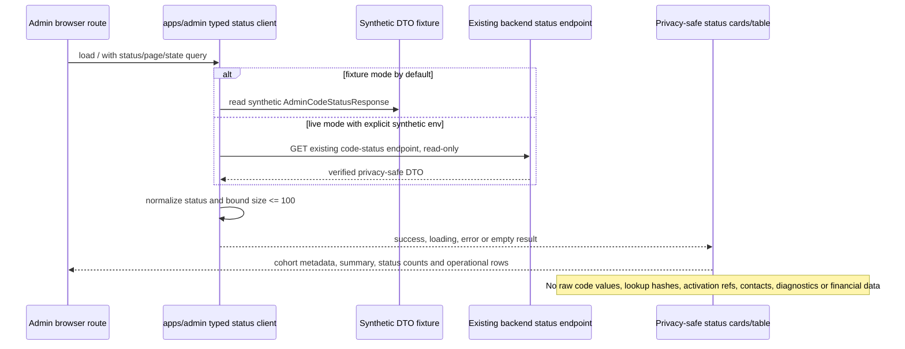

# Evidence: MVP-02-admin-ui-status-view-001

Status: `PASS`
Updated: 2026-05-11

Latest evidence alias for the active sprint. Immutable refs:

- `.agent/stages/mvp/evidence/MVP-02-admin-ui-status-view-001.md`
- `.agent/stages/mvp/evidence/MVP-02-admin-ui-status-view-001.json`

This slice implements the minimal screenshotable `apps/admin` scaffold and read-only cohort/code status view for the already verified backend DTO. It does not change backend/API/schema behavior and does not close full `MVP-02.04`, full `MVP-02` or any human gate.

## Implemented Scope

- Added a minimal Next.js admin app under `apps/admin`.
- Added a typed local DTO/client/fixture boundary matching the verified backend code-status response.
- Added Russian operator UI copy and success/loading/error/empty states.
- Added synthetic fixture mode for screenshots and tests; live mode remains read-only and requires explicit synthetic tenant/cohort env vars.
- Added focused admin boundary tests and browser smoke using system Google Chrome through `CHROMIUM_EXECUTABLE_PATH`.
- Wired root `make verify`, `make test-unit` and `make build` to include relevant admin checks.
- Updated setup/runtime docs for the new admin app/root wrappers.
- Added `.gitignore` entries for generated frontend build output.

## Flow

## Raw Refs

- `.agent/stages/mvp/raw/orchestrator-mvp-02-admin-ui-status-view-001-git-status-20260511.txt`
- `.agent/stages/mvp/raw/orchestrator-mvp-02-admin-ui-status-view-001-java-version-20260511.txt`
- `.agent/stages/mvp/raw/orchestrator-mvp-02-admin-ui-status-view-001-mvnw-version-20260511.txt`
- `.agent/stages/mvp/raw/orchestrator-mvp-02-admin-ui-status-view-001-pnpm-resolution-only-20260511.txt`
- `.agent/stages/mvp/raw/orchestrator-mvp-02-admin-ui-status-view-001-pnpm-frozen-install-finpulse-20260511.txt`
- `.agent/stages/mvp/raw/orchestrator-mvp-02-admin-ui-status-view-001-admin-typecheck-final-20260511.txt`
- `.agent/stages/mvp/raw/orchestrator-mvp-02-admin-ui-status-view-001-admin-test-final-20260511.txt`
- `.agent/stages/mvp/raw/orchestrator-mvp-02-admin-ui-status-view-001-admin-build-final-20260511.txt`
- `.agent/stages/mvp/raw/orchestrator-mvp-02-admin-ui-status-view-001-admin-dev-server-final-20260511.txt`
- `.agent/stages/mvp/raw/orchestrator-mvp-02-admin-ui-status-view-001-browser-smoke-system-chrome-final-20260511.txt`
- `.agent/stages/mvp/raw/mvp-02-admin-ui-status-view-001-screenshots-final/mvp-02-admin-ui-status-view-001-browser-smoke.json`
- `.agent/stages/mvp/raw/mvp-02-admin-ui-status-view-001-screenshots-final/mvp-02-admin-ui-status-view-001-desktop-success.png`
- `.agent/stages/mvp/raw/mvp-02-admin-ui-status-view-001-screenshots-final/mvp-02-admin-ui-status-view-001-mobile-success.png`
- `.agent/stages/mvp/raw/mvp-02-admin-ui-status-view-001-screenshots-final/mvp-02-admin-ui-status-view-001-desktop-empty.png`
- `.agent/stages/mvp/raw/mvp-02-admin-ui-status-view-001-screenshots-final/mvp-02-admin-ui-status-view-001-desktop-error.png`
- `.agent/stages/mvp/raw/mvp-02-admin-ui-status-view-001-screenshots-final/mvp-02-admin-ui-status-view-001-desktop-loading.png`
- `.agent/stages/mvp/raw/orchestrator-mvp-02-admin-ui-status-view-001-guardrail-scan-20260511.txt`
- `.agent/stages/mvp/raw/orchestrator-mvp-02-admin-ui-status-view-001-generated-client-noop-20260511.txt`
- `.agent/stages/mvp/raw/orchestrator-mvp-02-admin-ui-status-view-001-docs-decision-20260511.txt`
- `.agent/stages/mvp/raw/orchestrator-mvp-02-admin-ui-status-view-001-git-diff-check-20260511.txt`
- `.agent/stages/mvp/raw/orchestrator-mvp-02-admin-ui-status-view-001-make-verify-20260511.txt`
- `.agent/stages/mvp/raw/orchestrator-mvp-02-admin-ui-status-view-001-make-test-unit-20260511.txt`
- `.agent/stages/mvp/raw/orchestrator-mvp-02-admin-ui-status-view-001-make-build-20260511.txt`
- `.agent/stages/mvp/raw/orchestrator-mvp-02-admin-ui-status-view-001-make-verify-final-20260511.txt`
- `.agent/stages/mvp/raw/orchestrator-mvp-02-admin-ui-status-view-001-make-test-unit-final-20260511.txt`
- `.agent/stages/mvp/raw/orchestrator-mvp-02-admin-ui-status-view-001-make-build-final-20260511.txt`
- `.agent/stages/mvp/raw/orchestrator-mvp-02-admin-ui-status-view-001-verify-harness-20260511.json`
- `.agent/stages/mvp/raw/stage-fixer-mvp-02-admin-ui-status-view-001-admin-typecheck-20260511.txt`
- `.agent/stages/mvp/raw/stage-fixer-mvp-02-admin-ui-status-view-001-admin-test-20260511.txt`
- `.agent/stages/mvp/raw/stage-fixer-mvp-02-admin-ui-status-view-001-admin-build-20260511.txt`
- `.agent/stages/mvp/raw/stage-fixer-mvp-02-admin-ui-status-view-001-admin-start-20260511.txt`
- `.agent/stages/mvp/raw/stage-fixer-mvp-02-admin-ui-status-view-001-admin-start-rerun-20260511.txt`
- `.agent/stages/mvp/raw/stage-fixer-mvp-02-admin-ui-status-view-001-admin-start-curl-20260511.html`
- `.agent/stages/mvp/raw/stage-fixer-mvp-02-admin-ui-status-view-001-browser-smoke-system-chrome-20260511.txt`
- `.agent/stages/mvp/raw/stage-fixer-mvp-02-admin-ui-status-view-001-guardrail-scan-20260511.txt`
- `.agent/stages/mvp/raw/stage-fixer-mvp-02-admin-ui-status-view-001-git-diff-check-20260511.txt`
- `.agent/stages/mvp/raw/stage-verifier-mvp-02-admin-ui-status-view-001-post-fix-admin-typecheck-20260511.txt`
- `.agent/stages/mvp/raw/stage-verifier-mvp-02-admin-ui-status-view-001-post-fix-admin-test-20260511.txt`
- `.agent/stages/mvp/raw/stage-verifier-mvp-02-admin-ui-status-view-001-post-fix-git-diff-check-20260511.txt`
- `.agent/stages/mvp/raw/stage-verifier-mvp-02-admin-ui-status-view-001-post-fix-rendered-label-proof-exact-20260511.txt`
- `.agent/stages/mvp/raw/stage-verifier-mvp-02-admin-ui-status-view-001-post-fix-rendered-raw-enum-scan-exact-20260511.txt`
- `.agent/stages/mvp/raw/stage-verifier-mvp-02-admin-ui-status-view-001-post-fix-guardrail-scan-exact-20260511.txt`
- `.agent/stages/mvp/raw/stage-verifier-mvp-02-admin-ui-status-view-001-post-fix-verify-harness-after-verdict-20260511.json`
- `.agent/stages/mvp/raw/orchestrator-mvp-02-admin-ui-status-view-001-verify-harness-final-20260511.json`
- `.agent/stages/mvp/verdicts/MVP-02-admin-ui-status-view-001.json`
- `.agent/stages/mvp/problems/MVP-02-admin-ui-status-view-001.md`

## Fixer Refresh

- Fixed verifier gap: cohort status now renders through `COHORT_STATUS_LABELS`, preserving the backend DTO while displaying Russian labels for `PLANNED`, `ACTIVE` and `CLOSED`.
- Production HTML proof from `next start` shows `500 · Запланирована`; targeted scan found no rendered `500 · PLANNED`.
- Removed trailing whitespace from the evidence status line that broke `git diff --check`.
- Reran admin typecheck, test and build; all passed.
- Attempted browser smoke through installed system Google Chrome using `CHROMIUM_EXECUTABLE_PATH`; Chrome aborted before navigation, so screenshots were not refreshed and no browser download was attempted.
- Reran targeted guardrail scan; no raw invite-code-like values, PII/contact fields, diagnostic, financial or customer-brand tokens were found in managed admin source or rendered HTML.
- Evidence is fixed and awaiting one fresh verifier; this does not close `MVP-02-admin-ui-status-view-001`, `MVP-02.04`, `MVP-02` or the MVP stage.

## Fresh Verifier PASS

- Fresh post-fix verifier returned `PASS` for `MVP-02-admin-ui-status-view-001` only.
- Prior raw enum gap is fixed: current production HTML contains `500 · Запланирована` and no rendered `PLANNED`.
- Prior `git diff --check` gap is fixed.
- Orchestrator-owned alias sync completed after the verifier, and harness verification now passes.
- Final root `make verify`, `make test-unit` and `make build` were rerun after the fixer and passed with explicit Homebrew JDK 21.
- Admin typecheck/test evidence was rerun by the verifier and passed; builder/root make checks remain the root wrapper evidence.
- Browser evidence is honest: builder system-Chrome screenshots prove route states/layout, but success screenshots predate the label fix; post-fix production HTML proves the corrected label because the fixer Chrome rerun aborted before navigation.
- This does not close full `MVP-02.04`, full `MVP-02`, the MVP stage, admin auth/role/audit policy, real data production use or customer-specific reporting human gates.

## Acceptance Status

1. Backend baseline unchanged: `PASS`; no backend/API/schema files changed by this slice.
2. Minimal Next.js admin scaffold: `PASS`; `apps/admin/package.json`, Next config, TS config and app route exist.
3. Read-only status view from typed DTO boundary: `PASS`; local DTO/fixture tests pass.
4. Russian operator copy and UI states: `PASS`; browser smoke covers success, loading, error and empty states.
5. Cohort metadata, summary/funnel/status/page/code rows: `PASS`; screenshots and fixture prove rendered state.
6. Status filters and page size bound: `PASS`; source uses the frozen enum and `MAX_PAGE_SIZE = 100`.
7. Synthetic fixture mode: `PASS`; screenshots use synthetic fixture data only.
8. Optional live mode read-only: `PASS_LIMITED`; live mode only calls the existing endpoint when explicit synthetic env vars are set.
9. No raw codes/PII/diagnostics/financial/customer data: `PASS`; source/render guardrail scan has no hits.
10. Root wrappers include admin checks: `PASS`; `make verify`, `make test-unit`, `make build` passed.
11. Admin package commands: `PASS`; typecheck, test and build passed.
12. Browser smoke/screenshots: `PASS_WITH_LIMITATION`; system Google Chrome produced five builder screenshots for route states/layout. Fixer refresh attempted the same installed Chrome path, but Chrome aborted before navigation; post-fix production HTML proves the corrected Russian cohort label.
13. Generated client: `NOOP_NO_GENERATOR`; `packages/api-client` still has only `.gitkeep`.
14. Documentation sync: `PASS`; setup/runtime docs updated for the admin app and root wrapper behavior.
15. Evidence mapping: `PASS`.
16. Human gates: `WAITING_HUMAN`.

## Human Gates

- Legal/privacy wording: `WAITING_HUMAN`
- Consent copy: `WAITING_HUMAN`
- Real employee/customer data processing: `WAITING_HUMAN`
- Customer-specific reporting boundaries: `WAITING_HUMAN`
- Admin auth/role/audit policy for production use: `WAITING_HUMAN`

## Notes

- The actual Git checkout during implementation is `/Users/elena/cursor/FinPulse`; `/Users/elena/cursor/FinRhythm` was observed as a stale/empty path with only generated `node_modules`. Evidence uses the real checkout path.
- The initial Playwright-managed Chromium install was stopped because it was slow. Builder browser smoke passed using installed system Google Chrome via `CHROMIUM_EXECUTABLE_PATH`; the fixer rerun attempted the same path but Google Chrome aborted before navigation, so screenshots were not refreshed and no browser download was attempted.
- `docs/product/b2b-mvp/lemanapro/content-mvp-spec-v0.1.md` and `.agent/tasks/repo-rename-finpulse/` show unrelated repo-rename edits outside this UI slice; they were not reverted.
- Harness validation currently fails only on latest artifact alias mismatch: `evidence.json` and `sprint_contract.md` point to `MVP-02-admin-ui-status-view-001`, while `verdict.json`/`problems.md` still point to the latest verified backend/API sprint until a fresh verifier writes UI verdict aliases.

## Handoff

`MVP-02-admin-ui-status-view-001` has fresh verifier `PASS`. Do not mark full `MVP-02.04`, full `MVP-02` or MVP complete from this sprint alone; admin auth/role/audit policy, real-data production use and customer-specific reporting boundaries remain human-gated.
