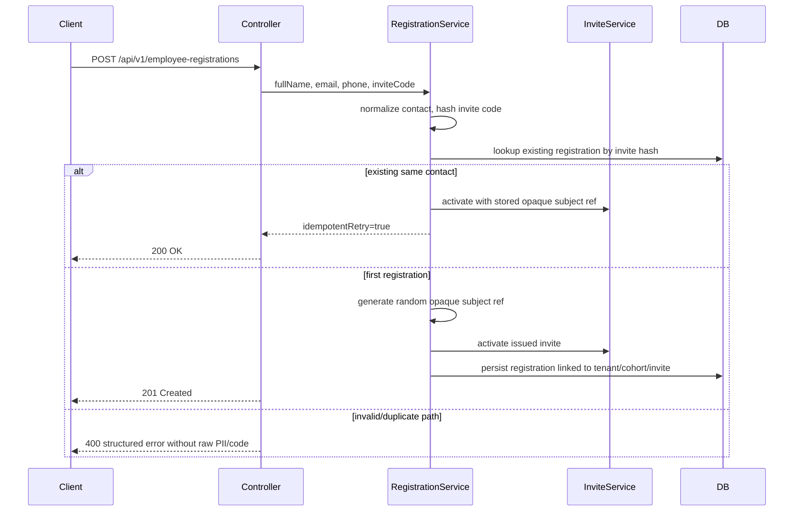

# Evidence: MVP-02-employee-registration-001

Status: `PASS`  
Updated: 2026-05-09

Backend/API-only employee registration has been implemented in source, with focused Testcontainers/MockMvc tests added and Maven/root checks passing. Java 21 is available through Homebrew OpenJDK 21; Docker 29 compatibility is handled by the Testcontainers 1.21.4 pin. Fresh `stage_verifier` recorded `PASS` for this slice.

## Flow

## Raw Refs

- `.agent/stages/mvp/raw/stage-builder-mvp-02-employee-registration-001-git-status-20260509.txt`
- `.agent/stages/mvp/raw/stage-builder-mvp-02-employee-registration-001-java-version-20260509.txt`
- `.agent/stages/mvp/raw/stage-builder-mvp-02-employee-registration-001-mvnw-version-20260509.txt`
- `.agent/stages/mvp/raw/stage-builder-mvp-02-employee-registration-001-api-mvn-test-20260509.txt`
- `.agent/stages/mvp/raw/stage-builder-mvp-02-employee-registration-001-api-mvn-verify-20260509.txt`
- `.agent/stages/mvp/raw/stage-builder-mvp-02-employee-registration-001-make-verify-20260509.txt`
- `.agent/stages/mvp/raw/stage-builder-mvp-02-employee-registration-001-make-test-unit-20260509.txt`
- `.agent/stages/mvp/raw/stage-builder-mvp-02-employee-registration-001-make-build-20260509.txt`
- `.agent/stages/mvp/raw/stage-builder-mvp-02-employee-registration-001-migration-inspection-20260509.txt`
- `.agent/stages/mvp/raw/stage-builder-mvp-02-employee-registration-001-openapi-source-inspection-20260509.txt`
- `.agent/stages/mvp/raw/stage-builder-mvp-02-employee-registration-001-generated-client-noop-20260509.txt`
- `.agent/stages/mvp/raw/stage-builder-mvp-02-employee-registration-001-guardrail-scan-20260509.txt`
- `.agent/stages/mvp/raw/stage-builder-mvp-02-employee-registration-001-registration-field-scan-20260509.txt`
- `.agent/stages/mvp/raw/stage-builder-mvp-02-employee-registration-001-git-diff-check-20260509.txt`
- `.agent/stages/mvp/raw/stage-builder-mvp-02-employee-registration-001-verify-harness-20260509.json`

## Human Gates

- Legal/privacy wording: `WAITING_HUMAN`
- Consent copy: `WAITING_HUMAN`
- Real employee/customer data processing: `WAITING_HUMAN`
- Customer-specific reporting boundaries: `WAITING_HUMAN`

## Verdict

Fresh verifier `PASS`: `.agent/stages/mvp/verdicts/MVP-02-employee-registration-001.json`.

`MVP-02.03` is complete for this backend/API slice. `MVP-02.04`, full MVP-02 and human gates remain open.
