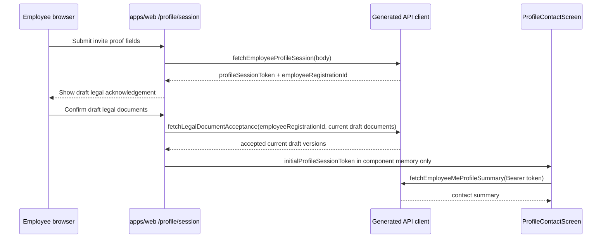

# Evidence: MVP-03-profile-session-legal-acceptance-ui-001

Stage: `mvp`
Status: `BUILDER_EVIDENCE_READY`
Verification: `PENDING_FRESH_VERIFIER`
Functional passes: `false` until a fresh verifier runs.

## Scope

First touched production/test file: `apps/web/components/profile-session-entry-screen.ts`.

Implemented the narrow apps/web flow:

`/start -> /onboarding/privacy -> /profile/session -> profile-session proof -> legal acknowledgement -> legal acceptance POST -> existing contact update screen`

Production/test files changed:

- `apps/web/components/profile-session-entry-screen.ts`
- `apps/web/tests/learning-shell.test.mjs`
- `apps/web/tests/browser-smoke.mjs`

Evidence/status files changed:

- `.agent/stages/mvp/evidence/MVP-03-profile-session-legal-acceptance-ui-001.md`
- `.agent/stages/mvp/evidence/MVP-03-profile-session-legal-acceptance-ui-001.json`
- `.agent/stages/mvp/evidence.md`
- `.agent/stages/mvp/evidence.json`
- `.agent/stages/mvp/progress.md`
- `.agent/stages/mvp/status.json`

Pre-existing freezer artifacts not owned by this builder:

- `.agent/stages/mvp/sprint_contract.md`
- `.agent/stages/mvp/task-files/MVP-03-profile-session-legal-acceptance-ui-001.md`

## Flow Diagram

## Browser Proof

Raw directory: `.agent/stages/mvp/raw/builder-MVP-03-profile-session-legal-acceptance-ui-001-20260513/`

Browser smoke: `.agent/stages/mvp/raw/builder-MVP-03-profile-session-legal-acceptance-ui-001-20260513/pnpm-web-browser-smoke.log`

Index: `.agent/stages/mvp/raw/builder-MVP-03-profile-session-legal-acceptance-ui-001-20260513/mvp-03-profile-session-legal-acceptance-ui-001-browser-smoke.json`

Screenshots include:

- `/start`: `mvp-03-profile-session-legal-acceptance-ui-001-mobile-start.png`
- `/onboarding/privacy` after navigation: `mvp-03-profile-session-legal-acceptance-ui-001-mobile-start-to-onboarding-privacy.png`
- `/profile/session` form: `mvp-03-profile-session-legal-acceptance-ui-001-mobile-profile-session-start.png`
- legal acknowledgement: `mvp-03-profile-session-legal-acceptance-ui-001-mobile-profile-session-legal-acknowledgement.png`
- legal acceptance loading: `mvp-03-profile-session-legal-acceptance-ui-001-mobile-profile-session-legal-acceptance-loading.png`
- contact update after legal acceptance: `mvp-03-profile-session-legal-acceptance-ui-001-mobile-profile-session-loaded.png`
- direct `/profile/contact` safe state: `mvp-03-profile-session-legal-acceptance-ui-001-mobile-profile-contact-start.png`
- legal acceptance failure state: `mvp-03-profile-session-legal-acceptance-ui-001-mobile-profile-session-legal-failure-503.png`

Browser/API mock proof in the JSON index shows:

- legal acknowledgement scenario has profile-session request/response only, with no legal or contact-summary request;
- success scenario orders profile-session request/response, legal-acceptance request/response, then contact-summary request/response;
- legal failure scenario has no contact-summary request;
- legal acceptance body uses all generated current draft document types/version;
- legal acceptance URL uses only the synthetic employee-registration path parameter and not the invite code or profile-session token.

Browser limitation: bundled Playwright Chromium cache was unavailable locally, so smoke used installed Google Chrome through `CHROMIUM_EXECUTABLE_PATH`.

## Commands

All raw outputs are under `.agent/stages/mvp/raw/builder-MVP-03-profile-session-legal-acceptance-ui-001-20260513/`.

| Command | Status | Raw ref |
|---|---:|---|
| `pnpm --filter @finrhythm/web typecheck` | PASS | `pnpm-web-typecheck.log` |
| `pnpm --filter @finrhythm/web test` | PASS | `pnpm-web-test.log` |
| `pnpm --filter @finrhythm/web build` | PASS | `pnpm-web-build.log` |
| browser smoke with installed Chrome fallback | PASS | `pnpm-web-browser-smoke.log` |
| generated-client boundary check | PASS | `generated-client-boundary-check.log` |
| token storage/url/cookie/indexedDB scan | PASS | `guardrail-token-storage-url-cookie-indexeddb.log` |
| legal token leakage and ordering scan | PASS | `guardrail-legal-token-leakage-and-order.log` |
| raw invite/id/token echo scan | PASS | `guardrail-raw-invite-id-token-echo-scan.log` |
| brand/real-data/claims/legal-finality scan | PASS | `guardrail-brand-real-data-claims-legal-approval-scan.log` |
| tracked evidence echo scan | PASS | `guardrail-tracked-evidence-echo-scan.log` |
| `make verify` | PASS | `make-verify.log` |
| `make test-unit` | PASS | `make-test-unit.log` |
| `make build` | PASS | `make-build.log` |
| `jq empty` for changed JSON artifacts | PASS | `jq-changed-json.log` |
| `git diff --check -- . ':(exclude).agent/stages/**/raw/**' ':(exclude).agent/tasks/**/raw/**'` | PASS | `git-diff-check-excluding-raw.log` |

## Guardrails

PASS evidence:

- `profileSessionToken` remains only in mounted React state and is passed to `ProfileContactScreen` only after legal acceptance succeeds.
- Legal acceptance request uses `employeeRegistrationId` only as the generated path parameter and never receives `profileSessionToken`.
- No token URL/query/hash/path handoff, browser storage, cookies or IndexedDB usage was introduced.
- No raw invite code, raw profile-session token or raw employee-registration value appears in raw logs, JSON index or screenshots.
- No customer brand, real employee/customer data, forbidden financial claims or claims that legal wording is final/approved in changed web files/raw proof.
- Direct `/profile/contact` remains the safe missing-session state.

## Docs Sync

Canonical docs: `NOOP_EXPECTED`.

Reason: the builder only consumes the existing generated legal acceptance contract and implements the already-scoped MVP-03 web legal acknowledgement step. No product/access/API/schema/setup/workflow decision changed.

Mermaid: `EXPECTED_IN_EVIDENCE`, included above.

Backend baseline unchanged: Spring Boot, Java 21, Maven Wrapper, PostgreSQL, Flyway and OpenAPI/springdoc. No backend/API/schema/OpenAPI/generated-client source file was changed by this builder.

## Human Gates

| Gate | Status |
|---|---|
| Legal/privacy wording and consent copy | `WAITING_HUMAN` |
| `MVP-03.01` legal drafts | `DONE_WITH_HUMAN_PENDING` |
| Real employee/customer data processing | `WAITING_HUMAN` |
| Customer-specific HR/reporting boundaries | `WAITING_HUMAN` |
| Final financial correctness of lessons/diagnostics/quizzes/explanations | `WAITING_HUMAN` |
| Reward economy, stock, prices and fulfillment | `WAITING_HUMAN` |

## Known Limitations

- Fresh `stage_verifier` has now recorded scoped `PASS` in `.agent/stages/mvp/verdicts/MVP-03-profile-session-legal-acceptance-ui-001.json`.
- Full `MVP-03` and the MVP stage remain open.
- Legal wording is explicitly draft/human-gated.
- No auth/login/User/OrgMembership/subscriptions/HR/diagnostics/points/CMS/rewards/admin scope was added.

## Fresh Verifier

Verdict: `PASS` scoped only to `MVP-03-profile-session-legal-acceptance-ui-001`.

Verifier artifacts:

- `.agent/stages/mvp/verdicts/MVP-03-profile-session-legal-acceptance-ui-001.json`
- `.agent/stages/mvp/problems/MVP-03-profile-session-legal-acceptance-ui-001.md`

Verifier reran `jq empty`, `git diff --check`, `pnpm --filter @finrhythm/web typecheck`, `pnpm --filter @finrhythm/web test`, focused generated-client and guardrail scans, backend/schema/OpenAPI/generated-client diff checks, and JSON validation for verdict artifacts. Browser smoke and root wrapper outputs were reviewed from exact builder raw refs instead of rerunning.
