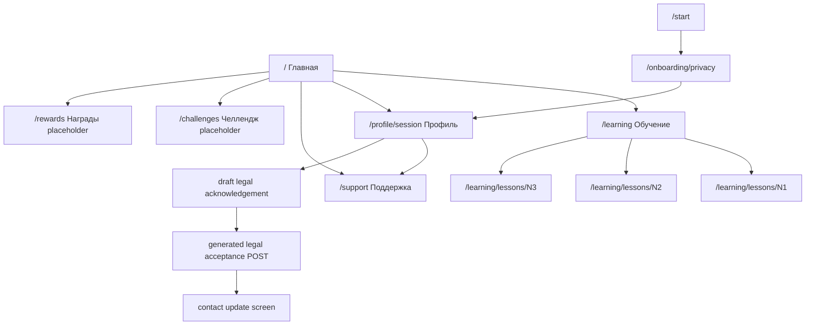

# Evidence: MVP-04-employee-app-ia-nav-001

Stage: `mvp`
Parent unit: `MVP-04.02`
Builder status: `SCOPED_PASS`
Updated: 2026-05-13

## Summary

Built the smallest mobile-first employee IA/navigation shell in `apps/web`.

- `/` is now a calm Home hub.
- Bottom nav has five items: `Главная`, `Обучение`, `Челлендж`, `Награды`, `Профиль`.
- `/learning` and `/learning/lessons/N1|N2|N3` remain reachable.
- `/challenges`, `/rewards` and `/support` are informational placeholder routes only.
- Profile remains reachable through `/profile/session`, preserving legal acknowledgement before contact update.
- Support is visible from Home and Profile as secondary IA, not a bottom-nav item.
- No backend/API/schema/OpenAPI/generated-client, admin, `packages/ui`, `content` or infra files were changed.
- Fresh verifier reported one concrete proof gap: the nav had the right five items but appeared near the top of the viewport. A minimal fixer change now anchors `.bottom-nav` to the bottom viewport edge and adds browser layout assertions.
- Fresh verifier re-run returned `PASS` for this scoped sprint only.

## Changed Files

Production/test scope:

- `apps/web/app/page.tsx`
- `apps/web/app/challenges/page.tsx`
- `apps/web/app/rewards/page.tsx`
- `apps/web/app/support/page.tsx`
- `apps/web/app/globals.css`
- `apps/web/components/employee-app-shell.ts`
- `apps/web/components/employee-home-screen.ts`
- `apps/web/components/employee-placeholder-screen.ts`
- `apps/web/components/learning-shell.ts`
- `apps/web/components/lesson-renderer.ts`
- `apps/web/components/profile-contact-screen.ts`
- `apps/web/components/profile-session-entry-screen.ts`
- `apps/web/tests/learning-shell.test.mjs`
- `apps/web/tests/browser-smoke.mjs`

Stage artifacts:

- `.agent/stages/mvp/evidence/MVP-04-employee-app-ia-nav-001.md`
- `.agent/stages/mvp/evidence/MVP-04-employee-app-ia-nav-001.json`
- `.agent/stages/mvp/evidence.md`
- `.agent/stages/mvp/evidence.json`
- `.agent/stages/mvp/status.json`
- `.agent/stages/mvp/backlog.md`
- `.agent/stages/mvp/progress.md`
- `.agent/stages/mvp/feature_list.json`
- raw outputs under `.agent/stages/mvp/raw/builder-MVP-04-employee-app-ia-nav-001-20260513/`

## IA / Route Map

## Acceptance Mapping

| Criterion | Status | Evidence |
|---|---|---|
| Bottom nav has no more than five items, follows baseline labels/order and is visually anchored at the bottom of mobile routes. | FIXED | `employeeBottomNavItems` test in `apps/web/tests/learning-shell.test.mjs`; fixed-position `.bottom-nav` in `apps/web/app/globals.css`; browser layout assertions in `apps/web/tests/browser-smoke.mjs`; `.agent/stages/mvp/raw/fixer-MVP-04-employee-app-ia-nav-001-20260513/browser-layout-check.json`. |
| Learning, Challenges, Rewards/Store and Profile reachable from bottom nav. | BUILT | Browser smoke screenshots and JSON for `mobile-ready`, `mobile-challenges`, `mobile-rewards`, `mobile-profile-session-start`. |
| Support visible from Home and Profile, not a sixth bottom-nav item. | BUILT | `mobile-home`, `mobile-profile-session-start`, `mobile-support`; nav guardrail scan. |
| Challenges placeholder has no participation, check-in, persistence or points claim. | BUILT | Placeholder source/test guardrails; `mobile-challenges.png`. |
| Rewards placeholder has no store operation, account-balance, ruble/value or guaranteed-result claim. | BUILT | Placeholder source/test guardrails; `mobile-rewards.png`. |
| Support is informational only and limited to app/access/navigation help. | BUILT | `mobile-support.png`; no form/button in placeholder source scan. |
| `/start -> /onboarding/privacy -> /profile/session` still works. | BUILT | Browser scenario `mobile-start-to-profile-session`; profile-session request ordering scenarios still pass. |
| `/profile/session` legal acknowledgement/acceptance ordering remains intact. | BUILT | Browser request event summaries for legal acknowledgement, legal acceptance loading, loaded profile and failure scenarios. |
| Direct `/profile/contact` safe missing-session state remains intact. | BUILT | Browser scenario `mobile-profile-contact-start`; render test. |
| Russian neutral copy, no customer brand, no real data, no forbidden promises. | BUILT | Source/render tests, browser smoke checks and added-line guardrail scans. |
| Backend baseline remains unchanged. | BUILT | `git diff --name-only -- apps/api packages/api-client apps/admin packages/ui infra content` guardrail passed; root `make verify`, `make test-unit`, `make build` passed. |
| Canonical docs sync decision recorded. | BUILT | `NOOP_EXPECTED`: implementation follows `docs/stages/MVP.md` and design-system five-item IA baseline. |
| Fresh verifier PASS exists. | PASS | `.agent/stages/mvp/verdicts/MVP-04-employee-app-ia-nav-001.json`; `.agent/stages/mvp/problems/MVP-04-employee-app-ia-nav-001.md`; `.agent/stages/mvp/raw/verifier-MVP-04-employee-app-ia-nav-001-20260513-fresh/verifier-layout-check.json`. |

## Commands

| Command | Exit | Raw ref |
|---|---:|---|
| `pnpm --filter @finrhythm/web typecheck` | 0 | `.agent/stages/mvp/raw/builder-MVP-04-employee-app-ia-nav-001-20260513/pnpm-web-typecheck.txt` |
| `pnpm --filter @finrhythm/web test` | 0 | `.agent/stages/mvp/raw/builder-MVP-04-employee-app-ia-nav-001-20260513/pnpm-web-test.txt` |
| `pnpm --filter @finrhythm/web build` | 0 | `.agent/stages/mvp/raw/builder-MVP-04-employee-app-ia-nav-001-20260513/pnpm-web-build.txt` |
| `pnpm --filter @finrhythm/web smoke:browser` | 1 | `.agent/stages/mvp/raw/builder-MVP-04-employee-app-ia-nav-001-20260513/pnpm-web-smoke-browser.txt` |
| `CHROMIUM_EXECUTABLE_PATH="/Applications/Google Chrome.app/Contents/MacOS/Google Chrome" pnpm --filter @finrhythm/web smoke:browser` | 0 | `.agent/stages/mvp/raw/builder-MVP-04-employee-app-ia-nav-001-20260513/pnpm-web-smoke-browser-system-chrome.txt` |
| guardrail scans | 0 | `.agent/stages/mvp/raw/builder-MVP-04-employee-app-ia-nav-001-20260513/guardrail-scans.txt` |
| `make verify` | 0 | `.agent/stages/mvp/raw/builder-MVP-04-employee-app-ia-nav-001-20260513/make-verify.txt` |
| `make test-unit` | 0 | `.agent/stages/mvp/raw/builder-MVP-04-employee-app-ia-nav-001-20260513/make-test-unit.txt` |
| `make build` | 0 | `.agent/stages/mvp/raw/builder-MVP-04-employee-app-ia-nav-001-20260513/make-build.txt` |
| `jq empty` for changed JSON artifacts | 0 | `.agent/stages/mvp/raw/builder-MVP-04-employee-app-ia-nav-001-20260513/jq-json-artifacts.txt` |
| `git diff --check -- . ':(exclude).agent/stages/**/raw/**' ':(exclude).agent/tasks/**/raw/**'` | 0 | `.agent/stages/mvp/raw/builder-MVP-04-employee-app-ia-nav-001-20260513/git-diff-check.txt` |
| `pnpm --filter @finrhythm/web typecheck` after bottom-nav fix | 0 | `.agent/stages/mvp/raw/fixer-MVP-04-employee-app-ia-nav-001-20260513/pnpm-web-typecheck.txt` |
| `pnpm --filter @finrhythm/web test` after bottom-nav fix | 0 | `.agent/stages/mvp/raw/fixer-MVP-04-employee-app-ia-nav-001-20260513/pnpm-web-test.txt` |
| `pnpm --filter @finrhythm/web build` after bottom-nav fix | 0 | `.agent/stages/mvp/raw/fixer-MVP-04-employee-app-ia-nav-001-20260513/pnpm-web-build.txt` |
| `CHROMIUM_EXECUTABLE_PATH="/Applications/Google Chrome.app/Contents/MacOS/Google Chrome" WEB_SMOKE_BASE_URL=http://127.0.0.1:3410 pnpm --filter @finrhythm/web smoke:browser` after bottom-nav fix | 0 | `.agent/stages/mvp/raw/fixer-MVP-04-employee-app-ia-nav-001-20260513/MVP-04-employee-app-ia-nav-001-fixed-browser-smoke.json` |
| independent Playwright layout spot-check on 390x844 viewport | 0 | `.agent/stages/mvp/raw/fixer-MVP-04-employee-app-ia-nav-001-20260513/browser-layout-check.json` |
| `jq empty` for fixed evidence/status/raw JSON artifacts | 0 | `.agent/stages/mvp/raw/fixer-MVP-04-employee-app-ia-nav-001-20260513/jq-json-artifacts.txt` |
| `git diff --check -- . ':(exclude).agent/stages/**/raw/**' ':(exclude).agent/tasks/**/raw/**'` after bottom-nav fix | 0 | `.agent/stages/mvp/raw/fixer-MVP-04-employee-app-ia-nav-001-20260513/git-diff-check.txt` |
| backend/canonical-doc drift check after bottom-nav fix | 0 | `.agent/stages/mvp/raw/fixer-MVP-04-employee-app-ia-nav-001-20260513/no-backend-canonical-doc-drift.txt` |
| parent `jq empty` after PASS alias sync | 0 | `.agent/stages/mvp/raw/orchestrator-MVP-04-employee-app-ia-nav-001-parent-sync-20260513/jq-json-artifacts.txt` |
| parent `git diff --check` after PASS alias sync | 0 | `.agent/stages/mvp/raw/orchestrator-MVP-04-employee-app-ia-nav-001-parent-sync-20260513/git-diff-check.txt` |
| parent `verify_harness.py --stage-id mvp` after PASS alias sync | 0 | `.agent/stages/mvp/raw/orchestrator-MVP-04-employee-app-ia-nav-001-parent-sync-20260513/verify-harness.txt` |

The first browser smoke failed because Playwright's bundled Chromium was not installed. The same smoke passed with system Chrome.

## Browser Evidence

Browser smoke summary:

- `.agent/stages/mvp/raw/builder-MVP-04-employee-app-ia-nav-001-20260513/MVP-04-employee-app-ia-nav-001-browser-smoke.json`
- 29 screenshots captured.
- Post-fix browser smoke summary: `.agent/stages/mvp/raw/fixer-MVP-04-employee-app-ia-nav-001-20260513/MVP-04-employee-app-ia-nav-001-fixed-browser-smoke.json`
- Post-fix layout check on `/`, `/learning`, `/challenges`, `/rewards`, `/support`, `/profile/session` and `/profile/contact`: bottom nav `top=770`, `bottom=836`, `bottomGap=8` on a `390x844` viewport.
- Fresh verifier browser smoke summary: `.agent/stages/mvp/raw/verifier-MVP-04-employee-app-ia-nav-001-20260513-fresh/MVP-04-employee-app-ia-nav-001-verifier-prod-browser-smoke.json`
- Fresh verifier layout check confirms the same seven routes have exactly five nav labels, no `Поддержка` item and `top=770`, `bottom=836`, `bottomGap=8`.

Key screenshot refs:

- Home: `.agent/stages/mvp/raw/builder-MVP-04-employee-app-ia-nav-001-20260513/MVP-04-employee-app-ia-nav-001-mobile-home.png`
- Learning: `.agent/stages/mvp/raw/builder-MVP-04-employee-app-ia-nav-001-20260513/MVP-04-employee-app-ia-nav-001-mobile-ready.png`
- Challenges: `.agent/stages/mvp/raw/builder-MVP-04-employee-app-ia-nav-001-20260513/MVP-04-employee-app-ia-nav-001-mobile-challenges.png`
- Rewards: `.agent/stages/mvp/raw/builder-MVP-04-employee-app-ia-nav-001-20260513/MVP-04-employee-app-ia-nav-001-mobile-rewards.png`
- Profile: `.agent/stages/mvp/raw/builder-MVP-04-employee-app-ia-nav-001-20260513/MVP-04-employee-app-ia-nav-001-mobile-profile-session-start.png`
- Support: `.agent/stages/mvp/raw/builder-MVP-04-employee-app-ia-nav-001-20260513/MVP-04-employee-app-ia-nav-001-mobile-support.png`
- Start/privacy/profile path: `.agent/stages/mvp/raw/builder-MVP-04-employee-app-ia-nav-001-20260513/MVP-04-employee-app-ia-nav-001-mobile-start-to-profile-session.png`

## Guardrails

Passed guardrails:

- max-five bottom nav;
- Support is not in bottom nav;
- Challenges, Rewards and Support placeholders have no active workflow primitives;
- no backend/API/generated-client/admin/shared-ui/content/infra diff;
- added-line scan for customer brand, old access terms, storage/cookie leakage, raw profile-session token URL leakage, ruble/value wording and forbidden financial-result claims;
- added-line scan for participation, reward-operation and support-mutation language;
- no current-slice proof artifact remains under `apps/web/.agent`.

## Docs

Canonical docs sync: `NOOP_EXPECTED`.

Reason: the implementation follows the already frozen MVP-04.02 contract, `docs/stages/MVP.md` MVP-04 IA scope and `docs/product/b2b-mvp/lemanapro/design-system-v0.1.md` five-item navigation baseline. No product, architecture, workflow, API, schema, setup or contract decision changed.

## Human Gates

Human gates remain open:

- brand naming and final anti-shame voice review;
- accessibility contrast audit;
- final legal/privacy wording review;
- design QA on real mobile screens;
- real employee/customer data processing;
- customer-specific HR/reporting boundaries;
- final financial correctness review;
- reward economy/stock/prices/fulfillment;
- support answer policy for sensitive topics.

## Known Limitations

- Challenges, Rewards and Support are placeholder/hub screens only.
- Full `MVP-04`, full MVP stage and all human gates remain open.
- The first Playwright smoke attempt could not use bundled Chromium; system Chrome was used successfully.
