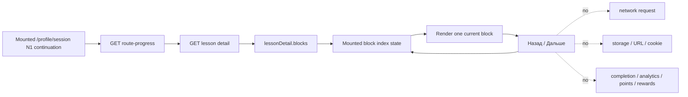

# Evidence: MVP-06-07-n1-readonly-block-stepper-001

Stage: `mvp`
Sprint contract: `MVP-06-07-n1-readonly-block-stepper-001`
Proof status: `BUILT_AWAITING_FRESH_VERIFIER`
Functional passes: `false`
Updated: 2026-05-14

## Scope Summary

Implemented one in-memory, read-only N1 block reader/stepper inside the already-mounted `/profile/session` N1 continuation.

The stepper renders from existing backend-owned `lessonDetail.blocks` loaded by the current `GET route-progress` plus `GET lesson detail` continuation flow. It shows one block at a time with `1 из N`, block type, title, body and any display-only CTA label. `Назад` and `Дальше` update only mounted React state with a safe clamped index.

No backend/API/schema/OpenAPI/generated-client change was introduced.

## Changed Files

- `apps/web/components/diagnostic-api-flow-screen.ts`
- `apps/web/app/globals.css`
- `apps/web/tests/learning-shell.test.mjs`
- `apps/web/tests/browser-smoke.mjs`
- `.agent/stages/mvp/evidence/MVP-06-07-n1-readonly-block-stepper-001.md`
- `.agent/stages/mvp/evidence/MVP-06-07-n1-readonly-block-stepper-001.json`
- `.agent/stages/mvp/evidence.md`
- `.agent/stages/mvp/evidence.json`
- `.agent/stages/mvp/progress.md`
- `.agent/stages/mvp/status.json`
- `.agent/stages/mvp/feature_list.json`
- `.agent/stages/mvp/publish_manifest.json`

Pre-existing freezer edits in `.agent/stages/mvp/backlog.md`, `.agent/stages/mvp/feature_list.json`, `.agent/stages/mvp/progress.md`, `.agent/stages/mvp/publish_manifest.json`, `.agent/stages/mvp/sprint_contract.md`, `.agent/stages/mvp/status.json` and the current task file were preserved and not reverted.

## First Touch

First meaningful builder write was in `apps/web/components/diagnostic-api-flow-screen.ts`, before builder writes to `.agent` evidence or canonical docs.

## Behavior Proof

- Source of blocks: existing `lessonDetail.blocks` from generated `LearningLessonDetailResponse`.
- `N1BackendLessonBlocks` keeps `currentBlockIndex` in mounted component state with `useState(0)`.
- `getSafeN1LessonBlockIndex(...)` clamps invalid/out-of-range indexes and is used for previous/next and refresh-safe rendering.
- When `lessonDetail.blocks` is empty, the N1 continuation remains mounted and shows `Материал недоступен`; it does not create hidden completion.
- Stepper next/previous does not call:
  - `fetchLearningMeRouteProgress`;
  - `fetchLearningMeLessonDetail`;
  - `startLearningMeLesson`;
  - diagnostic draft/submit helpers;
  - completion, analytics, points or rewards endpoints;
  - browser storage, URL/history, cookies, IndexedDB or logging APIs.
- Existing paths remain covered:
  - first `START_N1` path still posts N1 start, refreshes route-progress and reads lesson detail;
  - read-only reopen still uses `GET route-progress` + `GET lesson detail` with no `POST /start`;
  - status refresh still rereads route-progress/detail and keeps safe N1 content visible.

Browser smoke summary ref: `.agent/stages/mvp/raw/builder-MVP-06-07-n1-readonly-block-stepper-001-20260514/browser-smoke-summary-2.json`.

Key browser screenshots:

- Stepper after next/previous proof: `.agent/stages/mvp/raw/builder-MVP-06-07-n1-readonly-block-stepper-001-20260514/browser-smoke-rerun/MVP-06-07-n1-readonly-block-stepper-001-rerun-mobile-profile-session-diagnostic-n1-readonly-block-stepper.png`
- Empty blocks safe continuation: `.agent/stages/mvp/raw/builder-MVP-06-07-n1-readonly-block-stepper-001-20260514/browser-smoke-rerun/MVP-06-07-n1-readonly-block-stepper-001-rerun-mobile-profile-session-diagnostic-n1-readonly-empty-blocks.png`
- Read-only reopen: `.agent/stages/mvp/raw/builder-MVP-06-07-n1-readonly-block-stepper-001-20260514/browser-smoke-rerun/MVP-06-07-n1-readonly-block-stepper-001-rerun-mobile-profile-session-diagnostic-n1-readonly-resume.png`
- Status refresh: `.agent/stages/mvp/raw/builder-MVP-06-07-n1-readonly-block-stepper-001-20260514/browser-smoke-rerun/MVP-06-07-n1-readonly-block-stepper-001-rerun-mobile-profile-session-diagnostic-n1-readonly-refresh.png`
- First-start path: `.agent/stages/mvp/raw/builder-MVP-06-07-n1-readonly-block-stepper-001-20260514/browser-smoke-rerun/MVP-06-07-n1-readonly-block-stepper-001-rerun-mobile-start-to-profile-session-diagnostic-n1-progress.png`

## Validation Commands

| Command | Status | Raw ref | Notes |
|---|---:|---|---|
| `pnpm --filter @finrhythm/web test` | 0 | `.agent/stages/mvp/raw/builder-MVP-06-07-n1-readonly-block-stepper-001-20260514/web-test-2.txt` | Focused test covers stepper clamp/source isolation/no mutation usage. |
| `pnpm --filter @finrhythm/web typecheck` | 0 | `.agent/stages/mvp/raw/builder-MVP-06-07-n1-readonly-block-stepper-001-20260514/web-typecheck-1.txt` | Web TS check. |
| `pnpm --filter @finrhythm/web build` | 0 | `.agent/stages/mvp/raw/builder-MVP-06-07-n1-readonly-block-stepper-001-20260514/web-build-1.txt` | Production-like web build. |
| Browser smoke via local Google Chrome | 0 | `.agent/stages/mvp/raw/builder-MVP-06-07-n1-readonly-block-stepper-001-20260514/web-browser-smoke-2.txt` | Passed with 40 screenshots and structured request proof. |
| `pnpm --filter @finrhythm/api-client check:generated` | 0 | `.agent/stages/mvp/raw/builder-MVP-06-07-n1-readonly-block-stepper-001-20260514/api-client-check-generated-1.txt` | Generated client unchanged/current. |
| `pnpm --filter @finrhythm/api-client check:openapi-drift` | 0 | `.agent/stages/mvp/raw/builder-MVP-06-07-n1-readonly-block-stepper-001-20260514/api-client-check-openapi-drift-1.txt` | No OpenAPI drift. |
| `pnpm --filter @finrhythm/api-client typecheck` | 0 | `.agent/stages/mvp/raw/builder-MVP-06-07-n1-readonly-block-stepper-001-20260514/api-client-typecheck-1.txt` | Api-client TS check. |
| `pnpm --filter @finrhythm/api-client build` | 0 | `.agent/stages/mvp/raw/builder-MVP-06-07-n1-readonly-block-stepper-001-20260514/api-client-build-1.txt` | Api-client build/generate; no generated diff remained. |
| `make verify` | 0 | `.agent/stages/mvp/raw/builder-MVP-06-07-n1-readonly-block-stepper-001-20260514/make-verify-1.txt` | Root wrapper passed. |
| `make test-unit` | 0 | `.agent/stages/mvp/raw/builder-MVP-06-07-n1-readonly-block-stepper-001-20260514/make-test-unit-1.txt` | Root unit wrapper passed. |
| `make build` | 0 | `.agent/stages/mvp/raw/builder-MVP-06-07-n1-readonly-block-stepper-001-20260514/make-build-1.txt` | Root build wrapper passed. |
| Guardrail scans | 0 | `.agent/stages/mvp/raw/builder-MVP-06-07-n1-readonly-block-stepper-001-20260514/guardrail-scans-final.txt` | No backend/API/schema/generated edits; no token storage/URL/logging; stepper has no network/storage/mutation calls. |
| `jq empty` for changed JSON artifacts | 0 | `.agent/stages/mvp/raw/builder-MVP-06-07-n1-readonly-block-stepper-001-20260514/jq-empty-final.txt` | Final JSON validity check for changed stage JSON/evidence artifacts. |
| `git diff --check -- . ':(exclude).agent/stages/**/raw/**' ':(exclude).agent/tasks/**/raw/**'` | 0 | `.agent/stages/mvp/raw/builder-MVP-06-07-n1-readonly-block-stepper-001-20260514/git-diff-check-final.txt` | Final whitespace check excluding raw evidence paths. |

Superseded attempts:

- `.agent/stages/mvp/raw/builder-MVP-06-07-n1-readonly-block-stepper-001-20260514/web-test-1.txt`: test itself passed, but the shell wrapper used zsh read-only variable `status`; rerun passed as `web-test-2.txt`.
- `.agent/stages/mvp/raw/builder-MVP-06-07-n1-readonly-block-stepper-001-20260514/web-dev-server-3406.txt`: wrong pnpm/Next argument forwarding; no server started.
- `.agent/stages/mvp/raw/builder-MVP-06-07-n1-readonly-block-stepper-001-20260514/web-dev-server-3406-2.txt`: Next dev detected an existing server for this workspace on `localhost:3404`; browser smoke used that server.
- `.agent/stages/mvp/raw/builder-MVP-06-07-n1-readonly-block-stepper-001-20260514/web-browser-smoke-1.txt`: passed with 39 screenshots before adding the empty-block edge-case smoke; rerun passed with 40 screenshots.

## Docs Sync

Canonical docs decision: `NOOP_EXPECTED`.

No product, architecture, workflow or API boundary changed. Existing docs already cover backend-owned N1 progress/detail reads, memory-only profile-session token handling, mobile lesson blocks and sensitive-data boundaries. Stage evidence contains the compact flow diagram for this slice.

## Backend And API Boundary

Backend baseline remains Spring Boot, Java 21, Maven Wrapper, PostgreSQL, Flyway and OpenAPI/springdoc. No backend production code, Flyway migration, OpenAPI source/snapshot or generated api-client source was changed.

No separate focused backend regression was required because this is a web-only in-memory renderer change. Root `make verify`, `make test-unit` and `make build` still exercised backend wrappers/Testcontainers.

## Human Gates And Non-Closure

Still open:

- final N1 financial correctness and wording review;
- final Q0/SA/Q diagnostic wording review;
- scoring correctness and route-rule correctness;
- HR/privacy wording and reporting-boundary approval;
- legal/privacy boundaries and real employee/customer data processing approval;
- production content approval and methodologist publish approval;
- points/reward economy, real fulfillment and paid-tier/reward decisions;
- admin/support production access policy for sensitive diagnostic/learning data;
- design/accessibility QA on real mobile screens.

This evidence does not close full `MVP-06`, full `MVP-07`, the MVP stage or any human gate.

## Explicit Out Of Scope Confirmation

No final scoring, final route assignment, full `Q1-Q27`, `Q28`, `R1-R6`, HR reporting, analytics/events, points, rewards, wallet, learning completion, theory completion, quiz/practice submission, exact sensitive data, personal financial/investment/tax/credit/legal advice, customer brand, real data, account/org/subscription/seat/entitlement, SSO/SCIM or billing work was introduced.

## Fresh Verifier Status

Fresh verifier has not run for this sprint.

- Latest verified sprint remains `MVP-07-n1-readonly-status-refresh-001`.
- Latest PASS verdict remains `.agent/stages/mvp/verdicts/MVP-07-n1-readonly-status-refresh-001.json`.
- Current sprint status is `BUILT_AWAITING_FRESH_VERIFIER`.
- `publish_after_pass=true`, but publish remains blocked until a fresh verifier writes PASS for `MVP-06-07-n1-readonly-block-stepper-001`.

## Known Limitations / Blockers

- No verifier PASS exists yet for this sprint.
- Browser smoke used the already-running local Next dev server on `127.0.0.1:3404` because Next reported a lock for the same `apps/web` workspace.
- Default Playwright bundled browser was not used; smoke ran with `/Applications/Google Chrome.app/Contents/MacOS/Google Chrome`.
