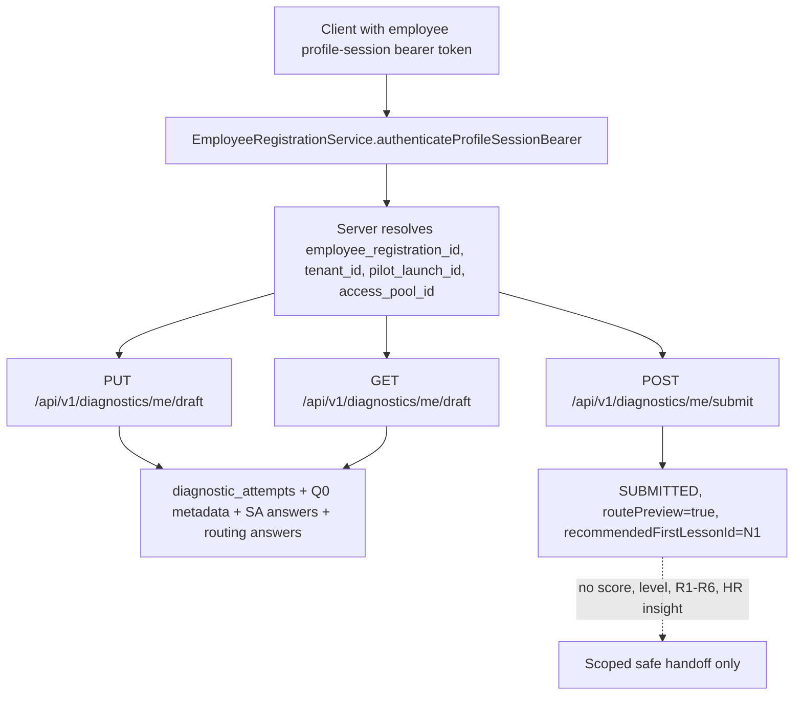
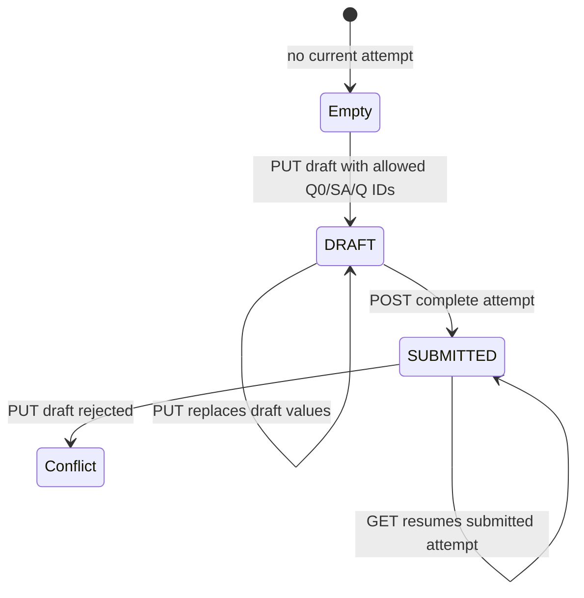

# Evidence: MVP-07-diagnostic-draft-api-001

Stage: `mvp`
Parent unit: scoped prerequisite for `MVP-07.01` + `MVP-07.04`
Builder status: `SCOPED_PASS`
Verifier status: `PASS`
Updated: 2026-05-13

## Summary

Built the narrow backend/API diagnostic draft foundation.

- Added employee-profile-session authenticated diagnostic endpoints:
  - `GET /api/v1/diagnostics/me/draft`
  - `PUT /api/v1/diagnostics/me/draft`
  - `POST /api/v1/diagnostics/me/submit`
- Persisted one current diagnostic attempt per employee registration for exactly `Q0`, `SA1-SA3` and `Q1-Q3`.
- Kept Q0 privacy metadata, self-assessment answers and routing answers in separate tables and response sections.
- Added `DRAFT` and `SUBMITTED` state handling with deterministic safe handoff: `routePreview=true` and `recommendedFirstLessonId="N1"`.
- Reused existing employee profile-session bearer auth and resolved registration/tenant/pilot/access-pool scope server-side.
- Rejected missing, malformed, expired, revoked and unknown profile-session tokens without persisting diagnostic data.
- Rejected unknown diagnostic IDs, full-bank markers, scoring/final-route fields, advice-like fields and exact sensitive data by DTO/service allowlists and tests/scans.
- Updated OpenAPI snapshot and generated `packages/api-client` contracts/dist/scripts.
- Updated `docs/architecture/access-and-subscriptions.md` with the profile-session diagnostic attempt boundary and Mermaid diagrams.
- Did not integrate `apps/web`, did not add browser storage/screenshots, did not implement final scoring/routing, full `Q1-Q27`, `Q28`, final `R1-R6`, HR reports, analytics/events, points or learning completion.

First fresh verifier returned `FAIL` for one proof gap: submit returned the full draft/attempt response instead of a handoff-only response. The minimal fixer added a dedicated `DiagnosticSubmitResponse`, updated OpenAPI/generated client artifacts and focused tests, and reran post-fix validation. Fresh post-fix verifier returned `PASS` for this scoped sprint.

## Changed Files

Production backend/API:

- `apps/api/src/main/resources/db/migration/V011__diagnostic_draft_attempt.sql`
- `apps/api/src/main/java/com/finrhythm/api/diagnostic/domain/DiagnosticAllowedIds.java`
- `apps/api/src/main/java/com/finrhythm/api/diagnostic/domain/DiagnosticAttempt.java`
- `apps/api/src/main/java/com/finrhythm/api/diagnostic/domain/DiagnosticAttemptState.java`
- `apps/api/src/main/java/com/finrhythm/api/diagnostic/domain/DiagnosticDraft.java`
- `apps/api/src/main/java/com/finrhythm/api/diagnostic/domain/DiagnosticQ0Metadata.java`
- `apps/api/src/main/java/com/finrhythm/api/diagnostic/domain/DiagnosticRoutingAnswer.java`
- `apps/api/src/main/java/com/finrhythm/api/diagnostic/domain/DiagnosticRoutingOptions.java`
- `apps/api/src/main/java/com/finrhythm/api/diagnostic/domain/DiagnosticSelfAssessmentAnswer.java`
- `apps/api/src/main/java/com/finrhythm/api/diagnostic/persistence/DiagnosticAttemptRepository.java`
- `apps/api/src/main/java/com/finrhythm/api/diagnostic/service/DiagnosticAttemptException.java`
- `apps/api/src/main/java/com/finrhythm/api/diagnostic/service/DiagnosticAttemptFailureReason.java`
- `apps/api/src/main/java/com/finrhythm/api/diagnostic/service/DiagnosticAttemptService.java`
- `apps/api/src/main/java/com/finrhythm/api/diagnostic/web/DiagnosticAllowedAnswerIdsResponse.java`
- `apps/api/src/main/java/com/finrhythm/api/diagnostic/web/DiagnosticAllowedRoutingOptionsResponse.java`
- `apps/api/src/main/java/com/finrhythm/api/diagnostic/web/DiagnosticAttemptController.java`
- `apps/api/src/main/java/com/finrhythm/api/diagnostic/web/DiagnosticAttemptResponse.java`
- `apps/api/src/main/java/com/finrhythm/api/diagnostic/web/DiagnosticDraftUpdateRequest.java`
- `apps/api/src/main/java/com/finrhythm/api/diagnostic/web/DiagnosticQ0MetadataRequest.java`
- `apps/api/src/main/java/com/finrhythm/api/diagnostic/web/DiagnosticQ0MetadataResponse.java`
- `apps/api/src/main/java/com/finrhythm/api/diagnostic/web/DiagnosticRoutingAnswerRequest.java`
- `apps/api/src/main/java/com/finrhythm/api/diagnostic/web/DiagnosticRoutingAnswerResponse.java`
- `apps/api/src/main/java/com/finrhythm/api/diagnostic/web/DiagnosticSelfAssessmentAnswerRequest.java`
- `apps/api/src/main/java/com/finrhythm/api/diagnostic/web/DiagnosticSelfAssessmentAnswerResponse.java`
- `apps/api/src/main/java/com/finrhythm/api/diagnostic/web/DiagnosticSubmitResponse.java`
- `apps/api/src/main/java/com/finrhythm/api/registration/service/AuthenticatedEmployeeProfileSession.java`
- `apps/api/src/main/java/com/finrhythm/api/registration/service/EmployeeRegistrationService.java`

Tests:

- `apps/api/src/test/java/com/finrhythm/api/diagnostic/DiagnosticAttemptControllerIT.java`

Generated API client and OpenAPI snapshot:

- `packages/api-client/openapi/finrhythm-api.openapi.json`
- `packages/api-client/scripts/generate-contracts.mjs`
- `packages/api-client/scripts/check-openapi-drift.mjs`
- `packages/api-client/src/generated/contracts.ts`
- `packages/api-client/dist/generated/contracts.js`
- `packages/api-client/dist/generated/contracts.d.ts`

Canonical docs:

- `docs/architecture/access-and-subscriptions.md`

Stage artifacts:

- `.agent/stages/mvp/evidence/MVP-07-diagnostic-draft-api-001.md`
- `.agent/stages/mvp/evidence/MVP-07-diagnostic-draft-api-001.json`
- `.agent/stages/mvp/evidence.md`
- `.agent/stages/mvp/evidence.json`
- `.agent/stages/mvp/backlog.md`
- `.agent/stages/mvp/progress.md`
- `.agent/stages/mvp/status.json`
- `.agent/stages/mvp/feature_list.json`
- `.agent/stages/mvp/publish_manifest.json`

## API Surface

State behavior:

## Acceptance Mapping

| Criterion | Builder status | Evidence |
|---|---|---|
| Append-only Flyway migration exists and separates Q0, self-assessment and routing answers. | BUILT | `apps/api/src/main/resources/db/migration/V011__diagnostic_draft_attempt.sql`; focused backend IT; docs diagram. |
| Endpoints exist for current draft get/update/submit. | BUILT | `apps/api/src/main/java/com/finrhythm/api/diagnostic/web/DiagnosticAttemptController.java`; OpenAPI snapshot; generated client. |
| All endpoints require employee profile-session bearer auth. | BUILT | Controller security annotations; `AuthenticatedEmployeeProfileSession`; focused IT auth cases. |
| Missing, malformed, expired, revoked and unknown bearer tokens return safe `401` and do not persist diagnostic data. | BUILT | `DiagnosticAttemptControllerIT.authenticationFailuresDoNotPersistDiagnosticDataOrEchoPayload`; focused backend test raw output. |
| Scope is resolved server-side from authenticated registration and cannot be spoofed. | BUILT | Service repository calls; request DTO allowlist; focused IT cross-registration and spoofing cases. |
| Draft upsert persists and returns Q0, SA1-SA3 and Q1-Q3 in separate response sections. | BUILT | Focused IT draft save/get assertions; migration table split. |
| Same employee can resume through a new profile-session token. | BUILT | Focused IT same-registration resume case. |
| Another employee cannot read or mutate the attempt. | BUILT | Focused IT cross-registration isolation. |
| Submit marks `SUBMITTED` and returns only `routePreview=true`, `recommendedFirstLessonId=N1` and safe state/timestamps. | FIXED | Dedicated `DiagnosticSubmitResponse`; focused IT asserts no attempt/scope/allowed-answer/Q0/SA/routing echo; OpenAPI/generated client now uses `DiagnosticSubmitResponse` for submit. |
| Post-submit draft mutation is deterministic and safe. | BUILT | Focused IT conflict assertion. |
| Unknown IDs, `Q28`, score/final-route/advice/exact-sensitive-data payloads are rejected or ignored by allowlists. | BUILT | Focused IT invalid payload cases; guardrail scans. |
| OpenAPI snapshot and generated API client artifacts are synchronized. | BUILT | API client generate/build/check/openapi-drift/typecheck raw refs. |
| Canonical docs sync is implemented. | BUILT | `docs/architecture/access-and-subscriptions.md` section 7.3 and Mermaid diagrams. |
| Backend baseline is preserved. | BUILT | `apps/api ./mvnw verify`, `make verify`, `make test-unit`, `make build`. |
| First fresh verifier gap is fixed. | PASS | First verifier FAIL refs: `.agent/stages/mvp/verdicts/MVP-07-diagnostic-draft-api-001-prefix-fail.json`, `.agent/stages/mvp/problems/MVP-07-diagnostic-draft-api-001-prefix-fail.md`; fixer raw refs under `.agent/stages/mvp/raw/fixer-MVP-07-diagnostic-draft-api-001-20260513/`; post-fix root refs under `.agent/stages/mvp/raw/orchestrator-MVP-07-diagnostic-draft-api-001-postfix-20260513/`; fresh post-fix PASS refs under `.agent/stages/mvp/raw/verifier-MVP-07-diagnostic-draft-api-001-20260513-postfix-fresh/`. |
| Fresh post-fix verifier PASS exists. | PASS | `.agent/stages/mvp/verdicts/MVP-07-diagnostic-draft-api-001.json`; `.agent/stages/mvp/problems/MVP-07-diagnostic-draft-api-001.md`; raw refs under `.agent/stages/mvp/raw/verifier-MVP-07-diagnostic-draft-api-001-20260513-postfix-fresh/`. |

## Commands

| Command | Exit | Raw ref |
|---|---:|---|
| `env JAVA_HOME=/opt/homebrew/opt/openjdk@21 PATH=/opt/homebrew/opt/openjdk@21/bin:$PATH ./mvnw -q -Dtest=DiagnosticAttemptControllerIT test` | 0 | `.agent/stages/mvp/raw/orchestrator-MVP-07-diagnostic-draft-api-001-finalize-20260513/focused-backend-diagnostic-test.txt` |
| `env JAVA_HOME=/opt/homebrew/opt/openjdk@21 PATH=/opt/homebrew/opt/openjdk@21/bin:$PATH ./mvnw -q verify` | 0 | `.agent/stages/mvp/raw/orchestrator-MVP-07-diagnostic-draft-api-001-finalize-20260513/api-mvn-verify.txt` |
| `pnpm --filter @finrhythm/api-client generate` | 0 | `.agent/stages/mvp/raw/orchestrator-MVP-07-diagnostic-draft-api-001-finalize-20260513/api-client-generate.txt` |
| `pnpm --filter @finrhythm/api-client build` | 0 | `.agent/stages/mvp/raw/orchestrator-MVP-07-diagnostic-draft-api-001-finalize-20260513/api-client-build.txt` |
| `pnpm --filter @finrhythm/api-client check:generated` | 0 | `.agent/stages/mvp/raw/orchestrator-MVP-07-diagnostic-draft-api-001-finalize-20260513/api-client-check-generated-final.txt` |
| `pnpm --filter @finrhythm/api-client check:openapi-drift` | 0 | `.agent/stages/mvp/raw/orchestrator-MVP-07-diagnostic-draft-api-001-finalize-20260513/api-client-check-openapi-drift.txt` |
| `pnpm --filter @finrhythm/api-client typecheck` | 0 | `.agent/stages/mvp/raw/orchestrator-MVP-07-diagnostic-draft-api-001-finalize-20260513/api-client-typecheck.txt` |
| `pnpm --filter @finrhythm/api-client build` rerun | 0 | `.agent/stages/mvp/raw/orchestrator-MVP-07-diagnostic-draft-api-001-finalize-20260513/api-client-build-rerun.txt` |
| `make verify` | 0 | `.agent/stages/mvp/raw/orchestrator-MVP-07-diagnostic-draft-api-001-finalize-20260513/make-verify.txt` |
| `make test-unit` | 0 | `.agent/stages/mvp/raw/orchestrator-MVP-07-diagnostic-draft-api-001-finalize-20260513/make-test-unit.txt` |
| `make build` | 0 | `.agent/stages/mvp/raw/orchestrator-MVP-07-diagnostic-draft-api-001-finalize-20260513/make-build.txt` |
| guardrail scans | 0 | `.agent/stages/mvp/raw/orchestrator-MVP-07-diagnostic-draft-api-001-finalize-20260513/guardrail-scans.txt` |
| OpenAPI snapshot refresh method note | 0 | `.agent/stages/mvp/raw/orchestrator-MVP-07-diagnostic-draft-api-001-finalize-20260513/openapi-snapshot-refresh-method.txt` |
| first fresh verifier focused/backend/API/client/JQ/diff checks | 0 | `.agent/stages/mvp/raw/verifier-MVP-07-diagnostic-draft-api-001-20260513-fresh/` |
| first fresh verifier verdict | 1 | `.agent/stages/mvp/verdicts/MVP-07-diagnostic-draft-api-001-prefix-fail.json`; `.agent/stages/mvp/problems/MVP-07-diagnostic-draft-api-001-prefix-fail.md` |
| fixer `env JAVA_HOME=/opt/homebrew/opt/openjdk@21 PATH=/opt/homebrew/opt/openjdk@21/bin:$PATH ./mvnw -q -Dtest=DiagnosticAttemptControllerIT test` | 0 | `.agent/stages/mvp/raw/fixer-MVP-07-diagnostic-draft-api-001-20260513/mvn-diagnostic-attempt-controller-it.txt` |
| fixer `pnpm --filter @finrhythm/api-client generate` | 0 | `.agent/stages/mvp/raw/fixer-MVP-07-diagnostic-draft-api-001-20260513/pnpm-api-client-generate.txt` |
| fixer `pnpm --filter @finrhythm/api-client build` | 0 | `.agent/stages/mvp/raw/fixer-MVP-07-diagnostic-draft-api-001-20260513/pnpm-api-client-build.txt` |
| fixer `pnpm --filter @finrhythm/api-client check:generated` | 0 | `.agent/stages/mvp/raw/fixer-MVP-07-diagnostic-draft-api-001-20260513/pnpm-api-client-check-generated.txt` |
| fixer `pnpm --filter @finrhythm/api-client check:openapi-drift` | 0 | `.agent/stages/mvp/raw/fixer-MVP-07-diagnostic-draft-api-001-20260513/pnpm-api-client-check-openapi-drift.txt` |
| fixer `pnpm --filter @finrhythm/api-client typecheck` | 0 | `.agent/stages/mvp/raw/fixer-MVP-07-diagnostic-draft-api-001-20260513/pnpm-api-client-typecheck.txt` |
| fixer `jq empty packages/api-client/openapi/finrhythm-api.openapi.json` | 0 | `.agent/stages/mvp/raw/fixer-MVP-07-diagnostic-draft-api-001-20260513/jq-openapi-empty.txt` |
| fixer `git diff --check -- . ':(exclude).agent/stages/**/raw/**' ':(exclude).agent/tasks/**/raw/**'` | 0 | `.agent/stages/mvp/raw/fixer-MVP-07-diagnostic-draft-api-001-20260513/git-diff-check.txt` |
| post-fix `env JAVA_HOME=/opt/homebrew/opt/openjdk@21 PATH=/opt/homebrew/opt/openjdk@21/bin:$PATH ./mvnw -q verify` | 0 | `.agent/stages/mvp/raw/orchestrator-MVP-07-diagnostic-draft-api-001-postfix-20260513/api-mvn-verify.txt` |
| post-fix `make verify` | 0 | `.agent/stages/mvp/raw/orchestrator-MVP-07-diagnostic-draft-api-001-postfix-20260513/make-verify.txt` |
| post-fix `make test-unit` | 0 | `.agent/stages/mvp/raw/orchestrator-MVP-07-diagnostic-draft-api-001-postfix-20260513/make-test-unit.txt` |
| post-fix `make build` | 0 | `.agent/stages/mvp/raw/orchestrator-MVP-07-diagnostic-draft-api-001-postfix-20260513/make-build.txt` |
| fresh post-fix verifier focused diagnostic test | 0 | `.agent/stages/mvp/raw/verifier-MVP-07-diagnostic-draft-api-001-20260513-postfix-fresh/focused-backend-diagnostic-test.txt` |
| fresh post-fix verifier `apps/api ./mvnw -q verify` | 0 | `.agent/stages/mvp/raw/verifier-MVP-07-diagnostic-draft-api-001-20260513-postfix-fresh/api-mvn-verify.txt` |
| fresh post-fix verifier `pnpm --filter @finrhythm/api-client check:generated` | 0 | `.agent/stages/mvp/raw/verifier-MVP-07-diagnostic-draft-api-001-20260513-postfix-fresh/api-client-check-generated.txt` |
| fresh post-fix verifier `pnpm --filter @finrhythm/api-client check:openapi-drift` | 0 | `.agent/stages/mvp/raw/verifier-MVP-07-diagnostic-draft-api-001-20260513-postfix-fresh/api-client-check-openapi-drift.txt` |
| fresh post-fix verifier `pnpm --filter @finrhythm/api-client typecheck` | 0 | `.agent/stages/mvp/raw/verifier-MVP-07-diagnostic-draft-api-001-20260513-postfix-fresh/api-client-typecheck.txt` |
| fresh post-fix verifier JSON validation | 0 | `.agent/stages/mvp/raw/verifier-MVP-07-diagnostic-draft-api-001-20260513-postfix-fresh/jq-empty.txt` |
| fresh post-fix verifier `git diff --check` | 0 | `.agent/stages/mvp/raw/verifier-MVP-07-diagnostic-draft-api-001-20260513-postfix-fresh/git-diff-check.txt` |
| fresh post-fix verifier OpenAPI submit-surface check | 0 | `.agent/stages/mvp/raw/verifier-MVP-07-diagnostic-draft-api-001-20260513-postfix-fresh/openapi-diagnostic-surface.txt` |

Note: an earlier parallel `pnpm --filter @finrhythm/api-client check:generated` run raced with generation and is superseded by the final serial pass above.

## OpenAPI And Generated Client

- Spring/OpenAPI source exposes the new diagnostic endpoints with `employeeProfileSessionBearerAuth`.
- `packages/api-client/openapi/finrhythm-api.openapi.json` was refreshed.
- Generated contracts include diagnostic draft/update/submit request and response types plus fetch helpers/constants.
- Submit now uses a dedicated `DiagnosticSubmitResponse` schema in OpenAPI/generated client, limited to `state`, `routePreview`, `recommendedFirstLessonId`, `createdAt`, `updatedAt` and `submittedAt`.
- Generator and drift scripts were updated so the new API surface stays reproducible.
- `generate`, `build`, `check:generated`, `check:openapi-drift` and `typecheck` all passed after serialization.

## Guardrails

Passed builder guardrails:

- No final diagnostic score, competency scores, level, final `routeId`, final `R1-R6`, weak-zone report or HR insight response field.
- No full `Q1-Q27` engine, no `Q28` implementation and no final route/scoring correctness claim.
- No analytics/events, points, wallet, reward, lesson completion, quiz submission or practice submission implementation.
- No exact income, debt, balance, account number, photo, document or bank screenshot fields.
- No personal financial, investment, tax, credit, debt or legal advice field.
- No raw profile-session bearer token or raw invite-code persistence in the diagnostic tables.
- No UI integration and no browser evidence requirement for this backend/API-only slice.

## Docs

Canonical docs sync: `UPDATED`.

- `docs/architecture/access-and-subscriptions.md` now documents the MVP diagnostic draft/submission boundary under profile-session auth.
- The doc includes flow/state diagrams for profile-session auth, draft save, submit and safe N1 handoff.

Product docs sync: `NOOP_EXPECTED`.

Reason: this slice follows existing diagnostic IDs, privacy boundary and sensitive-data constraints from the current product/methodology baselines. It does not approve final wording, scoring correctness or final route semantics.

## Backend Baseline

Preserved and explicitly verified:

- Spring Boot
- Java 21
- Maven Wrapper
- PostgreSQL
- Flyway
- OpenAPI/springdoc

## Human Gates

Human gates remain open:

- Final Q0/SA/Q wording review.
- Scoring correctness and route-rule correctness.
- Final financial correctness of diagnostic questions and explanations.
- HR/privacy wording and reporting-boundary approval.
- Legal/privacy boundaries and real employee/customer data processing approval.
- Admin/support production access policy for sensitive diagnostic data.
- Design/accessibility QA on real mobile screens for later UI integration.

## Explicit Out Of Scope

Not implemented or closed:

- Full production diagnostic engine.
- Full `Q1-Q27`, `Q28`, `C1-C10`, final `R1-R6`, scoring correctness, level assignment or final route assignment.
- HR reports, analytics/events, aggregated diagnostic insights or personal HR report surfaces.
- `apps/web` integration, browser screenshots, admin/CMS/operator UI or diagnostic bank management.
- Lesson progress/completion, scored quiz submission, practice submission, points, rewards, wallet, merch, redemption, challenges or learning completion.
- Exact personal financial inputs, documents, photos, bank screenshots or advice.
- Login/password setup, `User`, `OrgMembership`, organization codes, subscriptions/seats, entitlements, SSO/SCIM or billing.
- Real employee/customer/personal/financial data.
- Full `MVP-07.01`, full `MVP-07.04`, full `MVP-07`, MVP stage or human-gate closure.

## Known Limitations

- First fresh verifier ran and found one gap; the gap is fixed and fresh post-fix verifier returned `PASS`.
- Evidence/verdict/problems aliases now point to this scoped PASS.
- UI still uses the previously verified preview-only `/diagnostics` flow and is not wired to this API in this slice.
