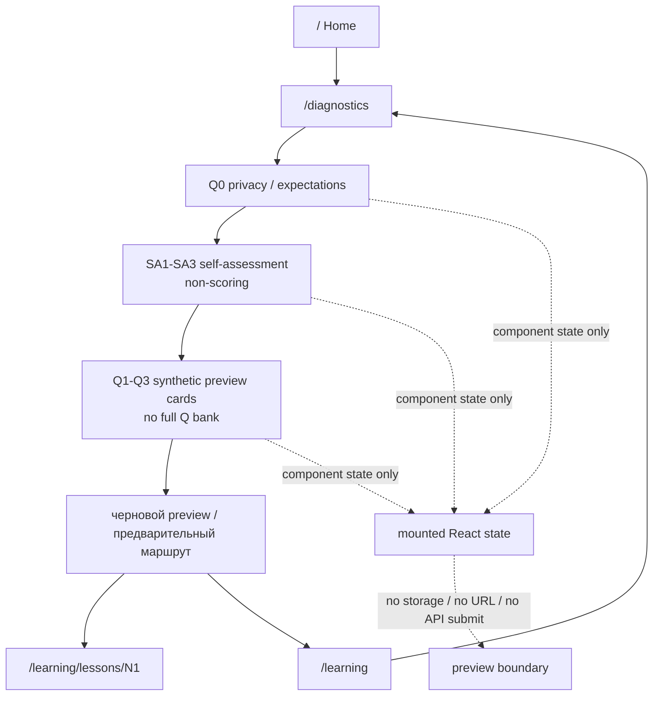

# Evidence: MVP-07-diagnostic-entry-preview-ui-001

Stage: `mvp`
Parent unit: scoped prerequisite for `MVP-07.01` + `MVP-07.03`
Builder status: `SCOPED_PASS`
Verifier status: `PASS`
Updated: 2026-05-13

## Summary

Built the narrow `apps/web` diagnostic entry/preview UI slice.

- Added `/diagnostics` as a mobile-first employee-facing preview flow.
- Home links to `/diagnostics`; Learning includes a secondary diagnostic entry card.
- Q0 privacy/expectation screen renders before `SA1-SA3` and before any `Q1-Q3` preview question.
- `SA1`, `SA2`, `SA3` are framed as non-scoring self-assessment and not route-determining.
- Preview questions are limited to synthetic `Q1`, `Q2`, `Q3` cards.
- Answers/progress live only in mounted component state; no browser storage, URL handoff, backend/API call or generated-client change was introduced.
- Draft result card uses safe `черновой preview` / `предварительный маршрут` wording and links to `/learning/lessons/N1` plus `/learning`.
- Existing `/start -> /onboarding/privacy -> /profile/session -> legal acknowledgement -> generated legal acceptance POST -> contact update screen` smoke scenarios remain covered.
- Existing `/learning` and `/learning/lessons/N1|N2|N3` smoke scenarios remain covered.
- No backend/API/schema/OpenAPI/generated-client files were changed.
- Fresh verifier returned `PASS`; the status is scoped to this preview UI sprint only.

## Changed Files

Production/test implementation owned by this slice:

- `apps/web/app/diagnostics/page.tsx`
- `apps/web/components/diagnostic-preview-screen.ts`
- `apps/web/components/employee-home-screen.ts`
- `apps/web/components/learning-shell.ts`
- `apps/web/app/globals.css`
- `apps/web/tests/learning-shell.test.mjs`
- `apps/web/tests/browser-smoke.mjs`

Stage artifacts owned by this builder update:

- `.agent/stages/mvp/evidence/MVP-07-diagnostic-entry-preview-ui-001.md`
- `.agent/stages/mvp/evidence/MVP-07-diagnostic-entry-preview-ui-001.json`
- `.agent/stages/mvp/evidence.md`
- `.agent/stages/mvp/evidence.json`
- `.agent/stages/mvp/status.json`
- `.agent/stages/mvp/backlog.md`
- `.agent/stages/mvp/progress.md`
- `.agent/stages/mvp/feature_list.json`

Note: the worktree already contained unrelated dirty stage artifacts and prior `apps/web` files at builder start. They were not reverted.

## Diagnostic Preview Flow

## Acceptance Mapping

| Criterion | Builder status | Evidence |
|---|---|---|
| `/diagnostics` route renders a Russian mobile-first diagnostic preview/entry flow. | BUILT | `apps/web/app/diagnostics/page.tsx`; `apps/web/components/diagnostic-preview-screen.ts`; browser screenshots `mobile-diagnostics-q0`, `mobile-diagnostics-sa`, `mobile-diagnostics-preview-questions`, `mobile-diagnostics-route-preview`. |
| Reachable from Home and Learning. | BUILT | `apps/web/components/employee-home-screen.ts`; `apps/web/components/learning-shell.ts`; unit render assertions; browser scenarios `mobile-home`, `mobile-ready`. |
| Q0 appears before `SA1-SA3` and before routing-preview questions. | BUILT | Unit test `renders diagnostic preview with Q0 privacy before any SA or routing-preview question`; browser scenario `mobile-diagnostics-q0`; guardrail scans. |
| Q0 states personal diagnostic answers, weak zones, exact sums and reflection details are not personal HR reports by default. | BUILT | Q0 privacy card source and screenshot `mobile-diagnostics-q0.png`. |
| `SA1-SA3` present and explicitly non-scoring / non-route-determining. | BUILT | Component copy, unit constants test, browser scenario `mobile-diagnostics-sa`, guardrail scans. |
| Preview questions include only `Q1-Q3`; no full `Q1-Q27`, no `Q28`, no production engine. | BUILT | `diagnosticPreviewQuestions` constants; unit and guardrail scans; browser scenario `mobile-diagnostics-preview-questions`. |
| Answers/progress are local mounted component memory only. | BUILT | `useState` component implementation; no storage/url/network/API/generated-client guardrail scans; unit source test. |
| Result uses safe preview wording and links to `N1` / `/learning` without final scoring, final level, final route, points or HR report claim. | BUILT | `mobile-diagnostics-route-preview` browser scenario; result card source; guardrail scans. |
| No exact income/debt/balance/account/photo/document/bank screenshot request. | BUILT | Guardrail scans and source tests. |
| No personal financial, investment, tax, credit, debt or legal advice. | BUILT | Guardrail scans and source tests. |
| Existing `/start -> /onboarding/privacy -> /profile/session` path and legal/contact ordering remain preserved. | BUILT | Browser scenarios `mobile-start-to-profile-session`, profile-session legal acknowledgement/acceptance/loading/loaded/update/failure scenarios. |
| Existing `/learning` and `/learning/lessons/N1|N2|N3` render. | BUILT | Browser scenarios `mobile-ready`, `mobile-lesson-n1`, `mobile-lesson-n2`, `mobile-lesson-n3`; web tests. |
| No backend/API/schema/OpenAPI/generated-client changes. | BUILT | Guardrail scan and `no-backend-api-generated-client-status.txt`; root wrappers passed. |
| Canonical docs-sync decision and Mermaid evidence recorded. | BUILT | `NOOP_EXPECTED`; Mermaid flow above. |
| Backend baseline preserved. | BUILT | No backend diffs; `make verify`, `make test-unit`, `make build` passed with existing Spring Boot/Java 21/Maven/PostgreSQL/Flyway/OpenAPI baseline. |
| Fresh verifier PASS exists. | PASS | `.agent/stages/mvp/verdicts/MVP-07-diagnostic-entry-preview-ui-001.json`; `.agent/stages/mvp/problems/MVP-07-diagnostic-entry-preview-ui-001.md`. |

## Commands

| Command | Exit | Raw ref |
|---|---:|---|
| `pnpm --filter @finrhythm/web typecheck` | 0 | `.agent/stages/mvp/raw/builder-MVP-07-diagnostic-entry-preview-ui-001-20260513/pnpm-web-typecheck.txt` |
| `pnpm --filter @finrhythm/web test` | 0 | `.agent/stages/mvp/raw/builder-MVP-07-diagnostic-entry-preview-ui-001-20260513/pnpm-web-test.txt` |
| `pnpm --filter @finrhythm/web build` | 0 | `.agent/stages/mvp/raw/builder-MVP-07-diagnostic-entry-preview-ui-001-20260513/pnpm-web-build.txt` |
| `CHROMIUM_EXECUTABLE_PATH="/Applications/Google Chrome.app/Contents/MacOS/Google Chrome" WEB_SMOKE_BASE_URL=http://127.0.0.1:3470 WEB_SMOKE_OUTPUT_DIR=/Users/elena/cursor/FinPulse/.agent/stages/mvp/raw/builder-MVP-07-diagnostic-entry-preview-ui-001-20260513 WEB_SMOKE_SCREENSHOT_PREFIX=MVP-07-diagnostic-entry-preview-ui-001 pnpm --filter @finrhythm/web smoke:browser` | 0 | `.agent/stages/mvp/raw/builder-MVP-07-diagnostic-entry-preview-ui-001-20260513/pnpm-web-smoke-browser-system-chrome.txt` |
| guardrail scans | 0 | `.agent/stages/mvp/raw/builder-MVP-07-diagnostic-entry-preview-ui-001-20260513/guardrail-scans.txt` |
| no backend/API/generated-client status check | 0 | `.agent/stages/mvp/raw/builder-MVP-07-diagnostic-entry-preview-ui-001-20260513/no-backend-api-generated-client-status.txt` |
| `make verify` | 0 | `.agent/stages/mvp/raw/builder-MVP-07-diagnostic-entry-preview-ui-001-20260513/make-verify.txt` |
| `make test-unit` | 0 | `.agent/stages/mvp/raw/builder-MVP-07-diagnostic-entry-preview-ui-001-20260513/make-test-unit.txt` |
| `make build` | 0 | `.agent/stages/mvp/raw/builder-MVP-07-diagnostic-entry-preview-ui-001-20260513/make-build.txt` |
| parent `jq empty` after evidence whitespace fix | 0 | `.agent/stages/mvp/raw/orchestrator-MVP-07-diagnostic-entry-preview-ui-001-parent-checks-20260513/jq-json-artifacts-post-evidence-whitespace-fix.txt` |
| parent `git diff --check` after evidence whitespace fix | 0 | `.agent/stages/mvp/raw/orchestrator-MVP-07-diagnostic-entry-preview-ui-001-parent-checks-20260513/git-diff-check-post-evidence-whitespace-fix.txt` |
| parent final `jq empty` after verdict/problems alias sync | 0 | `.agent/stages/mvp/raw/orchestrator-MVP-07-diagnostic-entry-preview-ui-001-parent-sync-20260513/jq-json-artifacts-final.txt` |
| parent final `git diff --check` after verdict/problems alias sync | 0 | `.agent/stages/mvp/raw/orchestrator-MVP-07-diagnostic-entry-preview-ui-001-parent-sync-20260513/git-diff-check-final.txt` |
| parent final stage harness validation after alias sync | 0 | `.agent/stages/mvp/raw/orchestrator-MVP-07-diagnostic-entry-preview-ui-001-parent-sync-20260513/verify-harness-final.txt` |
| parent stale MVP-07 preview string scan after alias sync | 0 | `.agent/stages/mvp/raw/orchestrator-MVP-07-diagnostic-entry-preview-ui-001-parent-sync-20260513/stale-mvp07-preview-strings-after-alias-sync.txt` |

Final JSON validation and diff whitespace checks are recorded after artifact updates and the parent whitespace cleanup.

## Browser Evidence

Browser smoke summary:

- `.agent/stages/mvp/raw/builder-MVP-07-diagnostic-entry-preview-ui-001-20260513/MVP-07-diagnostic-entry-preview-ui-001-browser-smoke.json`
- Screenshot count: 33.
- Covered scenarios include Home, Q0, SA, preview questions, route preview, Learning, `N1`, `N2`, `N3`, `/start`, `/onboarding/privacy`, `/profile/session` legal acknowledgement/acceptance/contact states and safe failure states.

Key screenshot refs:

- Home: `.agent/stages/mvp/raw/builder-MVP-07-diagnostic-entry-preview-ui-001-20260513/MVP-07-diagnostic-entry-preview-ui-001-mobile-home.png`
- Q0 privacy: `.agent/stages/mvp/raw/builder-MVP-07-diagnostic-entry-preview-ui-001-20260513/MVP-07-diagnostic-entry-preview-ui-001-mobile-diagnostics-q0.png`
- SA1-SA3: `.agent/stages/mvp/raw/builder-MVP-07-diagnostic-entry-preview-ui-001-20260513/MVP-07-diagnostic-entry-preview-ui-001-mobile-diagnostics-sa.png`
- Q1-Q3 preview: `.agent/stages/mvp/raw/builder-MVP-07-diagnostic-entry-preview-ui-001-20260513/MVP-07-diagnostic-entry-preview-ui-001-mobile-diagnostics-preview-questions.png`
- Draft route preview: `.agent/stages/mvp/raw/builder-MVP-07-diagnostic-entry-preview-ui-001-20260513/MVP-07-diagnostic-entry-preview-ui-001-mobile-diagnostics-route-preview.png`
- Learning: `.agent/stages/mvp/raw/builder-MVP-07-diagnostic-entry-preview-ui-001-20260513/MVP-07-diagnostic-entry-preview-ui-001-mobile-ready.png`
- N1/N2/N3: `.agent/stages/mvp/raw/builder-MVP-07-diagnostic-entry-preview-ui-001-20260513/MVP-07-diagnostic-entry-preview-ui-001-mobile-lesson-n1.png`, `...mobile-lesson-n2.png`, `...mobile-lesson-n3.png`
- Start to profile session: `.agent/stages/mvp/raw/builder-MVP-07-diagnostic-entry-preview-ui-001-20260513/MVP-07-diagnostic-entry-preview-ui-001-mobile-start-to-profile-session.png`

## Guardrails

Passed guardrails:

- Q0-only render before SA and Q cards.
- `SA1-SA3` non-scoring and non-route-determining.
- No full Q bank, no `Q4-Q28`, no `Q28`, no `R1-R6` final assignment token in diagnostic implementation.
- No `localStorage`, `sessionStorage`, cookies, IndexedDB, URL/query/hash answer handoff, `fetch`, `sendBeacon`, generated-client import or backend submission in diagnostic implementation.
- No exact income/debt/balance/account/photo/document/bank screenshot request.
- No personal financial/legal/tax/credit/investment advice.
- No HR personal report claim and no claim that HR sees individual diagnostic answers.
- No raw invite/session token/test identity/customer brand/old access term.
- No real data, money/cash-equivalence wording, random reward, guaranteed result or forbidden financial claim.
- No backend/API/schema/OpenAPI/generated-client/admin/shared package/content/infra/canonical-doc diff.

## Docs

Canonical docs sync: `NOOP_EXPECTED`.

Reason: this slice follows the existing frozen MVP stage, learning methodology and design-system baselines and implements only a non-persistent preview UI. It changes no product privacy/reporting decision, no methodology/scoring/route semantics, no architecture, no API contract and no setup/workflow.

## Backend Baseline

Unchanged: Spring Boot, Java 21, Maven Wrapper, PostgreSQL, Flyway and OpenAPI/springdoc remain the backend baseline. This slice changed no `apps/api`, Flyway migration, OpenAPI source or generated `packages/api-client` artifact.

## Human Gates

Human gates remain open:

- Final Q/SA wording review.
- Scoring correctness and route-rule correctness.
- Final financial correctness of diagnostic questions and explanations.
- HR/privacy wording and reporting-boundary approval.
- Legal/privacy boundaries and real employee/customer data processing approval.
- Design/accessibility QA on real mobile screens.

## Explicit Out Of Scope

Not implemented or closed:

- Full diagnostic engine.
- Full `Q1-Q27`, `Q28`, `C1-C10` scoring, final level or final `R1-R6` route assignment.
- Backend persistence, browser storage, saved answers, resume/retry, network submission, analytics/event tracking.
- Backend/API/schema/Flyway/OpenAPI/generated-client changes.
- HR reports, personal HR reports, admin/CMS/operator surfaces or diagnostic bank management.
- Lesson progress/completion, scored quiz submission, practice submission, points/wallet/rewards/store/challenge operations.
- Personal financial, investment, tax, credit, debt or legal advice.
- Exact income, debt, balance, account, photo, document or bank screenshot requests.
- Customer brand, real employee/customer/personal/financial data.
- Full `MVP-07.01`, `MVP-07.03`, `MVP-07`, MVP stage or any human-gate closure.

## Known Limitations

- `MVP-07-diagnostic-entry-preview-ui-001` is built but not fresh-verified.
- Latest verified sprint remains `MVP-04-employee-app-ia-nav-001` until a fresh verifier passes.
- The preview result is intentionally non-final and not a production diagnostic completion state.
