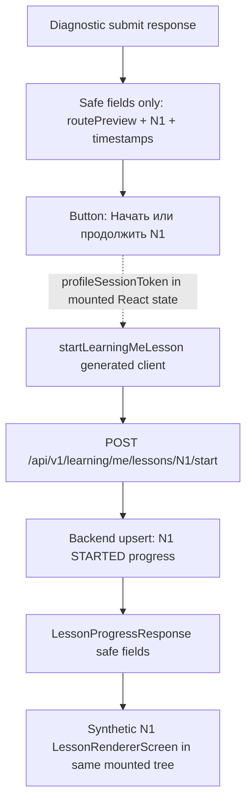

# Evidence: MVP-07-diagnostic-n1-learning-progress-001

Stage: `mvp`
Parent unit: scoped prerequisite across `MVP-07` safe diagnostic handoff and `MVP-06.04` / N1 learning delivery
Builder status: `BUILT`
Verifier status: `PASS`
Functional passes: `true`
Updated: 2026-05-14

## Summary

Implemented and fresh-verified the frozen backend-first slice for safe diagnostic-to-N1 continuation.

The new scoped flow is:

`/profile/session -> legal acceptance -> diagnostic GET/PUT/POST -> safe N1 handoff -> generated learning start/resume API -> synthetic N1 rendered in the same mounted component tree`.

Backend now owns a minimal N1 start/resume progress row for an authenticated employee profile session. The web continuation calls generated `@finrhythm/api-client` learning helper(s) while the profile-session token remains only in mounted React memory. This does not implement lesson completion, quiz/practice submission, points, rewards, final diagnostic scoring/routing, HR reports, analytics/events or full MVP closure.

## Changed Files

Backend production/test:

- `apps/api/src/main/resources/db/migration/V012__employee_lesson_progress.sql`
- `apps/api/src/main/java/com/finrhythm/api/learning/domain/LessonProgress.java`
- `apps/api/src/main/java/com/finrhythm/api/learning/domain/LessonProgressStatus.java`
- `apps/api/src/main/java/com/finrhythm/api/learning/persistence/LessonProgressRepository.java`
- `apps/api/src/main/java/com/finrhythm/api/learning/service/LearningProgressException.java`
- `apps/api/src/main/java/com/finrhythm/api/learning/service/LearningProgressFailureReason.java`
- `apps/api/src/main/java/com/finrhythm/api/learning/service/LearningProgressService.java`
- `apps/api/src/main/java/com/finrhythm/api/learning/web/LessonProgressController.java`
- `apps/api/src/main/java/com/finrhythm/api/learning/web/LessonProgressResponse.java`
- `apps/api/src/test/java/com/finrhythm/api/learning/LearningProgressControllerIT.java`

Web and generated client:

- `apps/web/components/diagnostic-api-flow-screen.ts`
- `apps/web/components/lesson-renderer.ts`
- `apps/web/tests/learning-shell.test.mjs`
- `apps/web/tests/browser-smoke.mjs`
- `packages/api-client/openapi/finrhythm-api.openapi.json`
- `packages/api-client/scripts/generate-contracts.mjs`
- `packages/api-client/scripts/check-openapi-drift.mjs`
- `packages/api-client/src/generated/contracts.ts`
- `packages/api-client/dist/generated/contracts.js`
- `packages/api-client/dist/generated/contracts.d.ts`
- `packages/api-client/README.md`

Docs and stage artifacts:

- `docs/architecture/access-and-subscriptions.md`
- `.agent/stages/mvp/evidence/MVP-07-diagnostic-n1-learning-progress-001.md`
- `.agent/stages/mvp/evidence/MVP-07-diagnostic-n1-learning-progress-001.json`
- `.agent/stages/mvp/evidence.md`
- `.agent/stages/mvp/evidence.json`
- `.agent/stages/mvp/progress.md`
- `.agent/stages/mvp/status.json`
- `.agent/stages/mvp/feature_list.json`
- `.agent/stages/mvp/publish_manifest.json`

## First Touch

The single `stage_builder` reported the first meaningful implementation touch in `apps/api` production/test files, with backend migration and learning package implementation before web, generated-client, docs or evidence work. No second builder was spawned. The parent only completed missing validation/evidence after the builder was interrupted before evidence alias sync.

## Backend Implementation

- Append-only migration `V012__employee_lesson_progress.sql` creates one minimal N1 progress row per `employee_registration_id` and `lesson_id`.
- Scope columns `tenant_id`, `pilot_launch_id` and `access_pool_id` are copied from authenticated registration scope and protected by existing FK constraints.
- The only persisted lesson status is `STARTED`.
- Repeated start/resume updates only `last_opened_at`/`updated_at` and returns `idempotentResume=true`.
- Unsupported lesson IDs return safe `400` without persistence.
- Missing, malformed, unknown, expired and revoked profile-session tokens return safe `401` through existing profile-session auth and do not create N1 progress.
- No request body is accepted by the learning start endpoint.
- Response exposes only `lessonId`, `status`, `startedAt`, `lastOpenedAt` and `idempotentResume`; it does not expose employee/scope IDs.

## API And Web Flow

The web no longer sends the user from the handoff card directly to `/learning/lessons/N1` before backend progress starts. After successful generated-client `startLearningMeLesson`, the existing synthetic N1 renderer opens inside the mounted profile-session component tree with a backend progress banner.

## Commands

Full outputs are under `.agent/stages/mvp/raw/builder-MVP-07-diagnostic-n1-learning-progress-001-20260514/`.

| Command | Exit | Raw ref |
|---|---:|---|
| `cd apps/api && JAVA_HOME=/opt/homebrew/opt/openjdk@21 PATH=/opt/homebrew/opt/openjdk@21/bin:$PATH ./mvnw -q -Dtest=LearningProgressControllerIT test` | 0 | `.agent/stages/mvp/raw/builder-MVP-07-diagnostic-n1-learning-progress-001-20260514/backend-learning-focused-test-rerun2.txt` |
| `cd apps/api && JAVA_HOME=/opt/homebrew/opt/openjdk@21 PATH=/opt/homebrew/opt/openjdk@21/bin:$PATH ./mvnw -q verify` | 0 | `.agent/stages/mvp/raw/builder-MVP-07-diagnostic-n1-learning-progress-001-20260514/backend-mvn-verify.txt` |
| `pnpm --filter @finrhythm/api-client build` | 0 | `.agent/stages/mvp/raw/builder-MVP-07-diagnostic-n1-learning-progress-001-20260514/api-client-build-after-spring-shape.txt` |
| `pnpm --filter @finrhythm/api-client check:generated` | 0 | `.agent/stages/mvp/raw/builder-MVP-07-diagnostic-n1-learning-progress-001-20260514/api-client-check-generated-after-spring-shape.txt` |
| `pnpm --filter @finrhythm/api-client check:openapi-drift` | 0 | `.agent/stages/mvp/raw/builder-MVP-07-diagnostic-n1-learning-progress-001-20260514/api-client-check-openapi-drift-after-spring-shape.txt` |
| `pnpm --filter @finrhythm/api-client typecheck` | 0 | `.agent/stages/mvp/raw/builder-MVP-07-diagnostic-n1-learning-progress-001-20260514/api-client-typecheck-after-spring-shape.txt` |
| `pnpm --filter @finrhythm/web typecheck` | 0 | `.agent/stages/mvp/raw/builder-MVP-07-diagnostic-n1-learning-progress-001-20260514/web-typecheck-after-client-shape.txt` |
| `pnpm --filter @finrhythm/web test` | 0 | `.agent/stages/mvp/raw/builder-MVP-07-diagnostic-n1-learning-progress-001-20260514/web-test-after-client-shape.txt` |
| `pnpm --filter @finrhythm/web build` | 0 | `.agent/stages/mvp/raw/builder-MVP-07-diagnostic-n1-learning-progress-001-20260514/web-build-after-client-shape.txt` |
| `WEB_SMOKE_BASE_URL=http://127.0.0.1:3414 ... pnpm --filter @finrhythm/web smoke:browser` | 0 | `.agent/stages/mvp/raw/builder-MVP-07-diagnostic-n1-learning-progress-001-20260514/official-browser-smoke-parent-rerun.txt` |
| `make verify` | 0 | `.agent/stages/mvp/raw/builder-MVP-07-diagnostic-n1-learning-progress-001-20260514/make-verify-rerun.txt` |
| `make test-unit` | 0 | `.agent/stages/mvp/raw/builder-MVP-07-diagnostic-n1-learning-progress-001-20260514/make-test-unit.txt` |
| `make build` | 0 | `.agent/stages/mvp/raw/builder-MVP-07-diagnostic-n1-learning-progress-001-20260514/make-build-parent.txt` |
| `jq empty ...` | 0 | `.agent/stages/mvp/raw/builder-MVP-07-diagnostic-n1-learning-progress-001-20260514/jq-empty-after-artifact-status-sync.txt` |
| `git diff --check -- . ':(exclude).agent/stages/**/raw/**' ':(exclude).agent/tasks/**/raw/**'` | 0 | `.agent/stages/mvp/raw/builder-MVP-07-diagnostic-n1-learning-progress-001-20260514/git-diff-check-after-trailing-whitespace-fix.txt` |

Earlier failed commands were fixed and superseded:

- Initial focused backend command without explicit Java 21 failed; rerun with `JAVA_HOME` passed.
- Initial `make verify` failed on duplicate migration constraint; migration was fixed and rerun passed.
- Initial official browser smoke expected the previous direct `Открыть N1` link; smoke was updated to assert backend N1 start/resume and rerun passed.
- Artifact status-sync diff check found trailing whitespace in the current evidence markdown header; whitespace was removed and final `git diff --check` passed.

## Browser Evidence

- Official smoke summary: `.agent/stages/mvp/raw/builder-MVP-07-diagnostic-n1-learning-progress-001-20260514/official-browser-smoke-rerun/MVP-07-diagnostic-n1-learning-progress-001-parent-rerun-browser-smoke.json`
- Screenshot count: 34 screenshots + summary JSON under root `.agent/stages/mvp/raw/.../official-browser-smoke-rerun/`
- Key screenshot: `.agent/stages/mvp/raw/builder-MVP-07-diagnostic-n1-learning-progress-001-20260514/official-browser-smoke-rerun/MVP-07-diagnostic-n1-learning-progress-001-parent-rerun-mobile-start-to-profile-session-diagnostic-n1-progress.png`
- Builder standalone smoke screenshot: `.agent/stages/mvp/raw/builder-MVP-07-diagnostic-n1-learning-progress-001-20260514/browser-smoke/05-n1-started-rendered.png`
- Artifact-location check: `.agent/stages/mvp/raw/builder-MVP-07-diagnostic-n1-learning-progress-001-20260514/browser-smoke-artifact-location-check.txt`

The smoke verifies profile-session creation, legal acceptance, diagnostic GET/PUT/POST, generated N1 learning start request and N1 rendered continuation. It also verifies the profile-session token is not present in the URL or visible text.

## Guardrails

Raw scan ref: `.agent/stages/mvp/raw/builder-MVP-07-diagnostic-n1-learning-progress-001-20260514/guardrail-scans-parent.txt`.

Passed guardrails:

- Web uses generated `startLearningMeLesson`; no hand-written `/api/v1/learning` fetch is introduced in production web code.
- Profile-session token is not written to URL query/hash, `localStorage`, `sessionStorage`, cookies, IndexedDB, service-worker caches or logs.
- N1 progress response and UI expose only safe progress fields.
- Backend storage does not include raw token, raw invite code, token hash, lookup hash, diagnostic answers, request body, response body, exact sums or free-form financial reports.
- Tests intentionally contain negative assertions for strings such as `quiz`, `points`, `hrInsights`; these are not implementation claims.

## Docs Sync

Canonical docs updated:

- `docs/architecture/access-and-subscriptions.md` section `7.4 Current MVP N1 learning progress boundary`.

The section records the profile-session bearer boundary for `POST /api/v1/learning/me/lessons/{lessonId}/start`, N1-only scope, no-body request, server-side scope resolution, idempotent start/resume behavior, sensitive-data exclusions and compact Mermaid flow/state diagrams.

Product docs remain `NOOP_EXPECTED`: this slice follows existing N1, lesson-status, sensitive-data and mobile design baselines without changing methodology or product semantics.

## Fresh Verifier

Fresh verifier returned scoped `PASS`.

- Verdict: `.agent/stages/mvp/verdicts/MVP-07-diagnostic-n1-learning-progress-001.json`
- Problems: `.agent/stages/mvp/problems/MVP-07-diagnostic-n1-learning-progress-001.md`
- Raw proof: `.agent/stages/mvp/raw/verifier-MVP-07-diagnostic-n1-learning-progress-001-20260514-fresh/`
- Browser smoke: `.agent/stages/mvp/raw/verifier-MVP-07-diagnostic-n1-learning-progress-001-20260514-fresh/browser-smoke/MVP-07-diagnostic-n1-learning-progress-001-fresh-browser-smoke.json`
- Key screenshot: `.agent/stages/mvp/raw/verifier-MVP-07-diagnostic-n1-learning-progress-001-20260514-fresh/browser-smoke/MVP-07-diagnostic-n1-learning-progress-001-fresh-mobile-start-to-profile-session-diagnostic-n1-progress.png`

Verifier checks passed: focused backend learning test, `apps/api ./mvnw verify`, api-client generated/OpenAPI/typecheck/build checks, web typecheck/test/build, browser smoke with 34 screenshots, `make verify`, `make test-unit`, `make build`, JSON validation, `git diff --check` and guardrail scans.

Parent alias/status/evidence sync also passed JSON validation, `git diff --check` and `verify_harness.py --stage-id mvp`.

## Human Gates And Out Of Scope

Still open:

- Final N1 financial correctness and wording review.
- Final Q0/SA/Q diagnostic wording review.
- Scoring correctness and route-rule correctness.
- HR/privacy wording and reporting-boundary approval.
- Legal/privacy boundaries and real employee/customer data processing approval.
- Production content approval and methodologist publish approval.
- Points/reward economy, real fulfillment and any paid-tier/reward rule decisions.
- Admin/support production access policy for sensitive diagnostic/learning data.
- Design/accessibility QA on real mobile screens.

Explicitly out of scope: learning completion, quiz submission/scoring, practice submission, points, rewards, wallet, challenge progress, final diagnostic scoring/routing, full `Q1-Q27`, `Q28`, final `R1-R6`, HR reports, analytics/events, exact sensitive data, personal advice, full `MVP-06`, full `MVP-07`, full MVP stage and human-gate closure.
