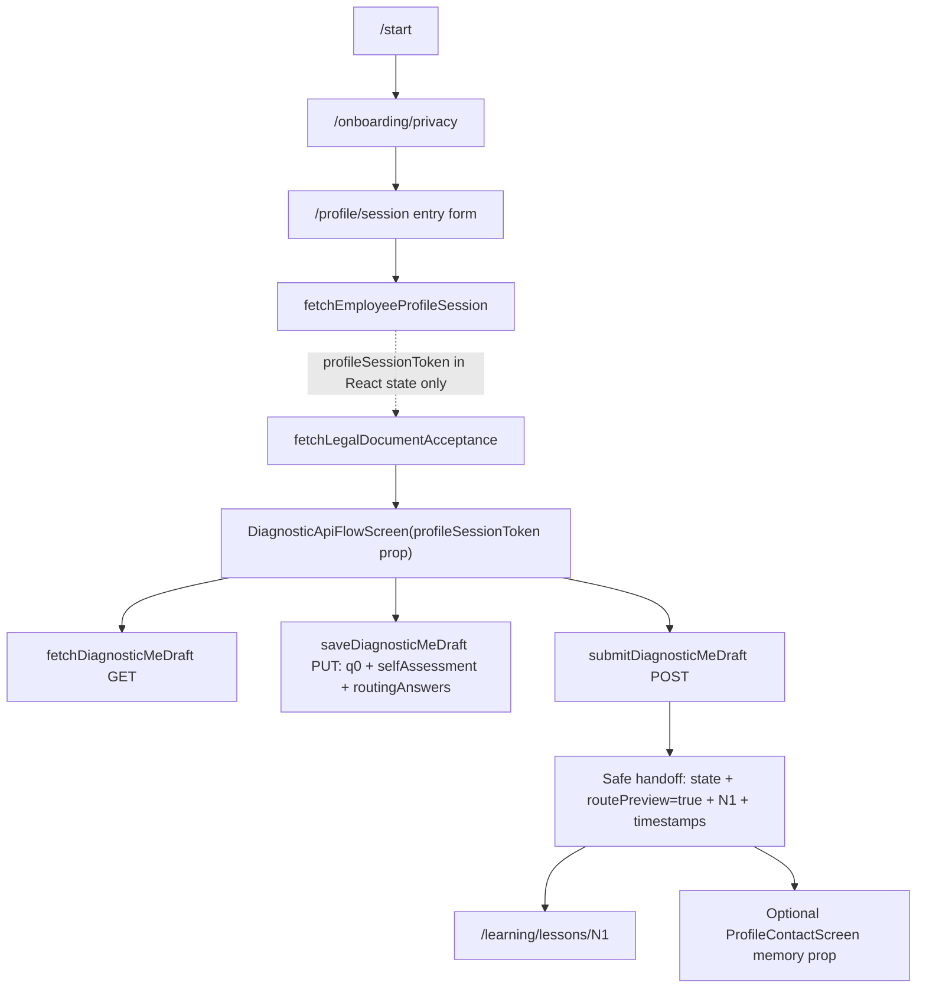

# Evidence: MVP-07-diagnostic-web-api-integration-001

Stage: `mvp`
Parent unit: scoped prerequisite for `MVP-07.01`, `MVP-07.03` and `MVP-07.04`
Builder status: `SCOPED_PASS`
Verifier status: `PASS`
Functional passes: `true`
Updated: 2026-05-14

## Summary

Built and fresh-verified the frozen `apps/web` integration slice for the verified diagnostic draft API. The mounted `/profile/session` flow now goes:

`/start -> /onboarding/privacy -> /profile/session -> profile-session API -> legal acceptance API -> diagnostic draft API GET/PUT/POST -> safe N1 routePreview handoff`.

The profile-session token remains in mounted React state/props only. Diagnostic calls use the generated `@finrhythm/api-client` helpers `fetchDiagnosticMeDraft`, `saveDiagnosticMeDraft` and `submitDiagnosticMeDraft`. No backend, schema, Flyway, OpenAPI or generated-client files were edited by this builder slice. Fresh verifier returned scoped `PASS`; full `MVP-07`, MVP stage and human gates remain open.

## Changed Files

Production:

- `apps/web/components/diagnostic-api-flow-screen.ts`
- `apps/web/components/profile-session-entry-screen.ts`
- `apps/web/app/globals.css`

Tests:

- `apps/web/tests/learning-shell.test.mjs`
- `apps/web/tests/browser-smoke.mjs`

Stage artifacts:

- `.agent/stages/mvp/evidence/MVP-07-diagnostic-web-api-integration-001.md`
- `.agent/stages/mvp/evidence/MVP-07-diagnostic-web-api-integration-001.json`
- `.agent/stages/mvp/evidence.md`
- `.agent/stages/mvp/evidence.json`
- `.agent/stages/mvp/progress.md`
- `.agent/stages/mvp/status.json`
- `.agent/stages/mvp/feature_list.json`
- `.agent/stages/mvp/publish_manifest.json`

## Flow Map

## Request/Response Mapping

- Q0 metadata maps only to `q0.selectedOptionIds` with backend option IDs `WHO_SEES_ANSWERS`, `TRAINING_TIME`, `ASSIGNMENTS_REQUIRED`, `POINTS_ACCRUAL`, `READY_TO_START`.
- Self-assessment maps only to `selfAssessment[{ id: SA1|SA2|SA3, value: 1..5 }]`.
- Routing answers map only to `routingAnswers[{ id: Q1|Q2|Q3, optionId }]` with `Q1 A-D`, `Q2 A-E`, `Q3 A-D`.
- Final submitted state renders only `state`, `routePreview=true`, `recommendedFirstLessonId=N1`, `createdAt`, `updatedAt`, `submittedAt` and safe links/actions.
- Final handoff does not render attempt id, employee registration id, tenant id, pilot launch id, access pool id, allowed answer ids, Q0 selections, self-assessment answers or routing answers.

## Commands

All full outputs are stored under `.agent/stages/mvp/raw/builder-MVP-07-diagnostic-web-api-integration-001-20260514/`.

| Command | Exit | Raw ref |
|---|---:|---|
| `pnpm --filter @finrhythm/web typecheck` | 0 | `.agent/stages/mvp/raw/builder-MVP-07-diagnostic-web-api-integration-001-20260514/commands/web-typecheck.log` |
| `pnpm --filter @finrhythm/web test` | 0 | `.agent/stages/mvp/raw/builder-MVP-07-diagnostic-web-api-integration-001-20260514/commands/web-test.log` |
| `pnpm --filter @finrhythm/web build` | 0 | `.agent/stages/mvp/raw/builder-MVP-07-diagnostic-web-api-integration-001-20260514/commands/web-build.log` |
| `CHROMIUM_EXECUTABLE_PATH="/Applications/Google Chrome.app/Contents/MacOS/Google Chrome" WEB_SMOKE_BASE_URL=http://127.0.0.1:3404 WEB_SMOKE_OUTPUT_DIR=/Users/elena/cursor/FinPulse/.agent/stages/mvp/raw/builder-MVP-07-diagnostic-web-api-integration-001-20260514/browser-smoke WEB_SMOKE_SCREENSHOT_PREFIX=MVP-07-diagnostic-web-api-integration-001 pnpm --filter @finrhythm/web smoke:browser` | 0 | `.agent/stages/mvp/raw/builder-MVP-07-diagnostic-web-api-integration-001-20260514/commands/web-smoke-browser.log` |
| `pnpm --filter @finrhythm/api-client check:generated` | 0 | `.agent/stages/mvp/raw/builder-MVP-07-diagnostic-web-api-integration-001-20260514/commands/api-client-check-generated.log` |
| `pnpm --filter @finrhythm/api-client check:openapi-drift` | 0 | `.agent/stages/mvp/raw/builder-MVP-07-diagnostic-web-api-integration-001-20260514/commands/api-client-check-openapi-drift.log` |
| `pnpm --filter @finrhythm/api-client typecheck` | 0 | `.agent/stages/mvp/raw/builder-MVP-07-diagnostic-web-api-integration-001-20260514/commands/api-client-typecheck.log` |
| `make verify` | 0 | `.agent/stages/mvp/raw/builder-MVP-07-diagnostic-web-api-integration-001-20260514/commands/make-verify.log` |
| `make test-unit` | 0 | `.agent/stages/mvp/raw/builder-MVP-07-diagnostic-web-api-integration-001-20260514/commands/make-test-unit.log` |
| `make build` | 0 | `.agent/stages/mvp/raw/builder-MVP-07-diagnostic-web-api-integration-001-20260514/commands/make-build.log` |
| `jq empty .agent/stages/mvp/evidence/MVP-07-diagnostic-web-api-integration-001.json .agent/stages/mvp/evidence.json .agent/stages/mvp/status.json .agent/stages/mvp/feature_list.json .agent/stages/mvp/publish_manifest.json` | 0 | `.agent/stages/mvp/raw/builder-MVP-07-diagnostic-web-api-integration-001-20260514/commands/jq-json-artifacts.log` |
| `git diff --check -- . ':(exclude).agent/stages/**/raw/**' ':(exclude).agent/tasks/**/raw/**'` | 0 | `.agent/stages/mvp/raw/builder-MVP-07-diagnostic-web-api-integration-001-20260514/commands/git-diff-check.log` |
| fresh `stage_verifier` independent checks | 0 | `.agent/stages/mvp/raw/verifier-MVP-07-diagnostic-web-api-integration-001-20260514-fresh/` |
| parent alias sync `jq empty` | 0 | `.agent/stages/mvp/raw/orchestrator-MVP-07-diagnostic-web-api-integration-001-parent-sync-20260514/jq-empty.txt` |
| parent alias sync `git diff --check` | 0 | `.agent/stages/mvp/raw/orchestrator-MVP-07-diagnostic-web-api-integration-001-parent-sync-20260514/git-diff-check.txt` |
| parent alias sync git status/name-status | 0 | `.agent/stages/mvp/raw/orchestrator-MVP-07-diagnostic-web-api-integration-001-parent-sync-20260514/git-status-name-status.txt` |

Browser smoke note: the local Playwright-managed Chromium binary was missing, so the smoke used installed system Chrome through `CHROMIUM_EXECUTABLE_PATH`. A pre-existing Next dev server was available at `http://127.0.0.1:3404`; the smoke output records that base URL.

## Browser Evidence

- Summary JSON: `.agent/stages/mvp/raw/builder-MVP-07-diagnostic-web-api-integration-001-20260514/browser-smoke/MVP-07-diagnostic-web-api-integration-001-browser-smoke.json`
- Screenshot count: 34
- Key screenshots:
  - Full mounted handoff path: `.agent/stages/mvp/raw/builder-MVP-07-diagnostic-web-api-integration-001-20260514/browser-smoke/MVP-07-diagnostic-web-api-integration-001-mobile-start-to-profile-session-diagnostic-api-handoff.png`
  - Diagnostic loaded after legal acceptance: `.agent/stages/mvp/raw/builder-MVP-07-diagnostic-web-api-integration-001-20260514/browser-smoke/MVP-07-diagnostic-web-api-integration-001-mobile-profile-session-diagnostic-loaded.png`
  - Contact after diagnostic handoff: `.agent/stages/mvp/raw/builder-MVP-07-diagnostic-web-api-integration-001-20260514/browser-smoke/MVP-07-diagnostic-web-api-integration-001-mobile-profile-session-updated.png`
  - Standalone preview remains preview-only: `.agent/stages/mvp/raw/builder-MVP-07-diagnostic-web-api-integration-001-20260514/browser-smoke/MVP-07-diagnostic-web-api-integration-001-mobile-diagnostics-route-preview.png`

The browser smoke scenario `mobile-start-to-profile-session-diagnostic-api-handoff` asserts profile-session creation, legal acceptance, diagnostic GET, diagnostic PUT, diagnostic POST and N1 handoff. It also asserts the token is not in the URL or visible text.

## Guardrails

Raw refs:

- `.agent/stages/mvp/raw/builder-MVP-07-diagnostic-web-api-integration-001-20260514/guardrails/token-storage-url-scan.log`
- `.agent/stages/mvp/raw/builder-MVP-07-diagnostic-web-api-integration-001-20260514/guardrails/no-handrolled-diagnostic-client-scan.log`
- `.agent/stages/mvp/raw/builder-MVP-07-diagnostic-web-api-integration-001-20260514/guardrails/diagnostic-scope-id-scan.log`
- `.agent/stages/mvp/raw/builder-MVP-07-diagnostic-web-api-integration-001-20260514/guardrails/out-of-scope-product-scan.log`
- `.agent/stages/mvp/raw/builder-MVP-07-diagnostic-web-api-integration-001-20260514/guardrails/sensitive-data-requirement-scan.log`
- `.agent/stages/mvp/raw/builder-MVP-07-diagnostic-web-api-integration-001-20260514/guardrails/advice-claims-scan.log`
- `.agent/stages/mvp/raw/builder-MVP-07-diagnostic-web-api-integration-001-20260514/guardrails/current-worktree-name-status-scope.log`

Passed guardrails:

- No token browser storage, URL query/hash, service-worker cache, cookie or console patterns in changed production web sources.
- No hand-written diagnostic endpoint URLs, raw diagnostic `fetch`, `XMLHttpRequest`, `sendBeacon` or duplicate generated diagnostic DTO definitions in production web sources.
- No `Q4-Q28` or final `R1-R6` identifiers in the changed production diagnostic integration sources.
- No analytics/events, points wallet/accrual implementation, learning completion, HR dashboard or employer personal-report implementation patterns.
- No exact income/debt/account, photo, document, passport, certificate or bank screenshot requirements.
- No personal financial, investment, tax or credit advice or guaranteed-outcome claims.

The worktree already contained dirty backend/generated-client files from the previous verified API sprint before this builder turn. This builder did not edit backend/API/schema/Flyway/OpenAPI/generated-client files; see `current-worktree-name-status-scope.log` note.

## Docs Sync

Decision: `NOOP_EXPECTED`.

Reason: this slice follows the already frozen frontend integration contract and previously documented backend/API diagnostic boundary. It does not change product methodology IDs, privacy/reporting policy, API contract, schema, OpenAPI, generated client, access model, setup/runtime workflow or canonical architecture. The required flow diagram is recorded in this stage evidence file only.

## Human Gates

Still open:

- Final Q0/SA/Q wording review.
- Scoring correctness and route-rule correctness.
- Final financial correctness of diagnostic questions and explanations.
- HR/privacy wording and reporting-boundary approval.
- Legal/privacy boundaries and real employee/customer data processing approval.
- Admin/support production access policy for sensitive diagnostic data.
- Design/accessibility QA on real mobile screens.

## Fresh Verifier

Verdict: `PASS`.

- Verdict ref: `.agent/stages/mvp/verdicts/MVP-07-diagnostic-web-api-integration-001.json`
- Problems ref: `.agent/stages/mvp/problems/MVP-07-diagnostic-web-api-integration-001.md`
- Raw refs: `.agent/stages/mvp/raw/verifier-MVP-07-diagnostic-web-api-integration-001-20260514-fresh/`
- Independent checks passed: web typecheck/test/build, browser smoke with system Chrome, api-client generated/openapi-drift/typecheck, `make verify`, `make test-unit`, `make build`, JSON validation, `git diff --check` and focused guardrail scans.

## Known Limitations

- Fresh verifier PASS exists for this scoped sprint only.
- Browser smoke used system Chrome because the local Playwright-managed Chromium binary was absent.
- Existing unrelated dirty backend/generated-client baseline from `MVP-07-diagnostic-draft-api-001` remains in the worktree and was not reverted or edited by this builder.
- The standalone `/diagnostics` route remains preview-only and is not a production authenticated diagnostic entry.
- The slice intentionally does not implement final scoring, full `Q1-Q27`, `Q28`, final `R1-R6`, HR reports, analytics/events, points, learning completion, exact sensitive-data collection, advice or full `MVP-07` closure.
