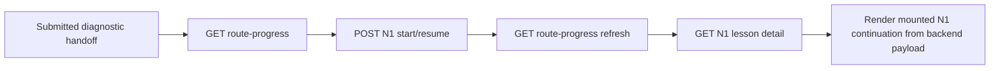

# Evidence: MVP-07-n1-lesson-detail-continuation-001

Stage: `mvp`
Status: `PASS_AFTER_FRESH_VERIFIER_PARENT_SYNC`
Functional passes: `true`
Updated: 2026-05-14

## Summary

Implemented a backend-owned read-only N1 lesson detail continuation after the verified route/progress summary slice.

The mounted `/profile/session` flow now proceeds:

This remains a scoped prerequisite across `MVP-06.03`, `MVP-06.04` and `MVP-07.04`. It does not close full `MVP-06`, full `MVP-07`, the MVP stage or human gates.

## Implementation

- Added `GET /api/v1/learning/me/lessons/{lessonId}` under existing `employeeProfileSessionBearerAuth`.
- Endpoint accepts no request body and no client-supplied employee/tenant/pilot/access/org/subscription/seat identifiers.
- Endpoint supports `N1` only and resolves registration/scope server-side through the profile-session bearer token.
- Lesson detail returns only after both conditions are true for the authenticated registration:
  - diagnostic state is `SUBMITTED` with safe `routePreview=true` and `recommendedFirstLessonId=N1`;
  - existing N1 progress row is `STARTED`.
- Before readiness, endpoint returns safe `409 LESSON_DETAIL_NOT_READY` without lesson content.
- Success and failure reads do not create, update or delete diagnostic attempts, lesson progress or content.
- Response includes draft N1 display detail, `humanReviewRequired=true`, `productionReady=false`, review statuses, active methodology/GetCourse provenance and sensitive-data boundary.
- Response excludes quiz answer keys, scoring, final level, `R1-R6`, weak zones, HR insight payloads, diagnostic answers, internal scope IDs, tokens/hashes/raw invite codes, completion, quiz/practice submission, points, rewards, analytics/events, exact sensitive values and advice.
- Updated OpenAPI snapshot and generated `@finrhythm/api-client` helper `fetchLearningMeLessonDetail`.
- Mounted web continuation now fetches backend-owned N1 detail via generated helper after N1 start/resume and refreshed route-progress summary.
- Mounted continuation no longer imports or renders `syntheticN1LessonFixture`; standalone `/learning` demo fixture routes remain unchanged.

## Changed Files

Backend:

- `apps/api/src/main/java/com/finrhythm/api/learning/domain/LearningLessonBlock.java`
- `apps/api/src/main/java/com/finrhythm/api/learning/domain/LearningLessonDetail.java`
- `apps/api/src/main/java/com/finrhythm/api/learning/domain/LearningLessonProvenance.java`
- `apps/api/src/main/java/com/finrhythm/api/learning/domain/LearningLessonReview.java`
- `apps/api/src/main/java/com/finrhythm/api/learning/domain/LearningLessonSensitiveDataPolicy.java`
- `apps/api/src/main/java/com/finrhythm/api/learning/domain/LearningLessonSourceRef.java`
- `apps/api/src/main/java/com/finrhythm/api/learning/domain/LearningN1LessonDetailDraft.java`
- `apps/api/src/main/java/com/finrhythm/api/learning/service/LearningLessonDetailService.java`
- `apps/api/src/main/java/com/finrhythm/api/learning/service/LearningProgressFailureReason.java`
- `apps/api/src/main/java/com/finrhythm/api/learning/web/LearningLessonBlockResponse.java`
- `apps/api/src/main/java/com/finrhythm/api/learning/web/LearningLessonDetailResponse.java`
- `apps/api/src/main/java/com/finrhythm/api/learning/web/LearningLessonProvenanceResponse.java`
- `apps/api/src/main/java/com/finrhythm/api/learning/web/LearningLessonReviewResponse.java`
- `apps/api/src/main/java/com/finrhythm/api/learning/web/LearningLessonSensitiveDataPolicyResponse.java`
- `apps/api/src/main/java/com/finrhythm/api/learning/web/LearningLessonSourceRefResponse.java`
- `apps/api/src/main/java/com/finrhythm/api/learning/web/LessonProgressController.java`
- `apps/api/src/test/java/com/finrhythm/api/learning/LearningProgressControllerIT.java`

Web and API client:

- `apps/web/components/diagnostic-api-flow-screen.ts`
- `apps/web/tests/browser-smoke.mjs`
- `apps/web/tests/learning-shell.test.mjs`
- `packages/api-client/README.md`
- `packages/api-client/openapi/finrhythm-api.openapi.json`
- `packages/api-client/scripts/check-openapi-drift.mjs`
- `packages/api-client/scripts/generate-contracts.mjs`
- `packages/api-client/src/generated/contracts.ts`
- `packages/api-client/dist/generated/contracts.js`
- `packages/api-client/dist/generated/contracts.d.ts`

Docs and stage artifacts:

- `docs/architecture/access-and-subscriptions.md`
- `.agent/stages/mvp/sprint_contract.md`
- `.agent/stages/mvp/task-files/MVP-07-n1-lesson-detail-continuation-001.md`
- `.agent/stages/mvp/backlog.md`
- `.agent/stages/mvp/progress.md`
- `.agent/stages/mvp/status.json`
- `.agent/stages/mvp/feature_list.json`
- `.agent/stages/mvp/publish_manifest.json`
- `.agent/stages/mvp/evidence/MVP-07-n1-lesson-detail-continuation-001.md`
- `.agent/stages/mvp/evidence/MVP-07-n1-lesson-detail-continuation-001.json`
- `.agent/stages/mvp/evidence.md`
- `.agent/stages/mvp/evidence.json`

## Validation

Builder raw refs:

- `cd apps/api && JAVA_HOME=/opt/homebrew/opt/openjdk@21 PATH=/opt/homebrew/opt/openjdk@21/bin:$PATH ./mvnw -q -Dtest=LearningProgressControllerIT test` -> PASS
  Raw: `.agent/stages/mvp/raw/builder-MVP-07-n1-lesson-detail-continuation-001-20260514/backend-learning-lesson-detail-focused-test-1.txt`
- `cd apps/api && JAVA_HOME=/opt/homebrew/opt/openjdk@21 PATH=/opt/homebrew/opt/openjdk@21/bin:$PATH ./mvnw -q verify` -> PASS
  Raw: `.agent/stages/mvp/raw/builder-MVP-07-n1-lesson-detail-continuation-001-20260514/backend-mvn-verify-1.txt`
- `pnpm --filter @finrhythm/api-client generate` -> PASS
  Raw: `.agent/stages/mvp/raw/builder-MVP-07-n1-lesson-detail-continuation-001-20260514/api-client-generate-1.txt`
- `pnpm --filter @finrhythm/api-client build` -> PASS
  Raw: `.agent/stages/mvp/raw/builder-MVP-07-n1-lesson-detail-continuation-001-20260514/api-client-build-1.txt`
- `pnpm --filter @finrhythm/api-client check:generated` -> PASS
  Raw: `.agent/stages/mvp/raw/builder-MVP-07-n1-lesson-detail-continuation-001-20260514/api-client-check-generated-1.txt`
- `pnpm --filter @finrhythm/api-client check:openapi-drift` -> PASS
  Raw: `.agent/stages/mvp/raw/builder-MVP-07-n1-lesson-detail-continuation-001-20260514/api-client-check-openapi-drift-1.txt`
- `pnpm --filter @finrhythm/api-client typecheck` -> PASS
  Raw: `.agent/stages/mvp/raw/builder-MVP-07-n1-lesson-detail-continuation-001-20260514/api-client-typecheck-1.txt`
- `pnpm --filter @finrhythm/web typecheck` -> PASS
  Raw: `.agent/stages/mvp/raw/builder-MVP-07-n1-lesson-detail-continuation-001-20260514/web-typecheck-1.txt`
- `pnpm --filter @finrhythm/web test` -> PASS
  Raw: `.agent/stages/mvp/raw/builder-MVP-07-n1-lesson-detail-continuation-001-20260514/web-test-1.txt`
- `pnpm --filter @finrhythm/web build` -> PASS
  Raw: `.agent/stages/mvp/raw/builder-MVP-07-n1-lesson-detail-continuation-001-20260514/web-build-1.txt`
- Browser plugin attempted first and failed because `iab` was unavailable. Fallback repo smoke with local Chrome passed with 35 screenshots.
  Raw limitation: `.agent/stages/mvp/raw/builder-MVP-07-n1-lesson-detail-continuation-001-20260514/browser-plugin-limitation-1.txt`
  Raw smoke: `.agent/stages/mvp/raw/builder-MVP-07-n1-lesson-detail-continuation-001-20260514/web-browser-smoke-2.txt`
  Summary JSON: `.agent/stages/mvp/raw/builder-MVP-07-n1-lesson-detail-continuation-001-20260514/browser-smoke/MVP-07-n1-lesson-detail-continuation-001-browser-smoke.json`
- `make verify` -> PASS
  Raw: `.agent/stages/mvp/raw/builder-MVP-07-n1-lesson-detail-continuation-001-20260514/make-verify-1.txt`
- `make test-unit` -> PASS
  Raw: `.agent/stages/mvp/raw/builder-MVP-07-n1-lesson-detail-continuation-001-20260514/make-test-unit-1.txt`
- `make build` -> PASS
  Raw: `.agent/stages/mvp/raw/builder-MVP-07-n1-lesson-detail-continuation-001-20260514/make-build-1.txt`

Parent evidence-sync guardrails:

- `jq empty` for current JSON artifacts -> PASS
  Raw: `.agent/stages/mvp/raw/orchestrator-MVP-07-n1-lesson-detail-continuation-001-evidence-sync-20260514/jq-empty-pre-evidence.txt`
- `git diff --check -- . ':(exclude).agent/stages/**/raw/**' ':(exclude).agent/tasks/**/raw/**'` -> PASS
  Raw: `.agent/stages/mvp/raw/orchestrator-MVP-07-n1-lesson-detail-continuation-001-evidence-sync-20260514/git-diff-check.txt`
- Changed-files proof -> PASS
  Raw: `.agent/stages/mvp/raw/orchestrator-MVP-07-n1-lesson-detail-continuation-001-evidence-sync-20260514/changed-files.txt`
- Token storage/cookie/console guard -> PASS
  Raw: `.agent/stages/mvp/raw/orchestrator-MVP-07-n1-lesson-detail-continuation-001-evidence-sync-20260514/token-storage-guard.txt`
- Web generated-helper and no mounted N1 fixture payload guard -> PASS
  Raw: `.agent/stages/mvp/raw/orchestrator-MVP-07-n1-lesson-detail-continuation-001-evidence-sync-20260514/web-generated-helper-guard.txt`
- Backend read-only guard -> PASS
  Raw: `.agent/stages/mvp/raw/orchestrator-MVP-07-n1-lesson-detail-continuation-001-evidence-sync-20260514/backend-readonly-guard.txt`
- Backend safe-response guard -> PASS after refined scan; the broad initial scan only matched a no-scoring Schema description.
  Raw: `.agent/stages/mvp/raw/orchestrator-MVP-07-n1-lesson-detail-continuation-001-evidence-sync-20260514/backend-safe-response-guard-refined.txt`
- N1-only/no route-profile detail guard -> PASS
  Raw: `.agent/stages/mvp/raw/orchestrator-MVP-07-n1-lesson-detail-continuation-001-evidence-sync-20260514/n1-only-route-guard.txt`
- Browser request order guard -> PASS
  Raw: `.agent/stages/mvp/raw/orchestrator-MVP-07-n1-lesson-detail-continuation-001-evidence-sync-20260514/browser-event-order-guard.txt`
- Customer brand / real-data / advice wording guard -> PASS
  Raw: `.agent/stages/mvp/raw/orchestrator-MVP-07-n1-lesson-detail-continuation-001-evidence-sync-20260514/brand-real-data-advice-guard.txt`
- OpenAPI endpoint summary -> PASS
  Raw: `.agent/stages/mvp/raw/orchestrator-MVP-07-n1-lesson-detail-continuation-001-evidence-sync-20260514/openapi-lesson-detail-summary.json`
- Generated helper usage refs -> PASS
  Raw: `.agent/stages/mvp/raw/orchestrator-MVP-07-n1-lesson-detail-continuation-001-evidence-sync-20260514/generated-helper-usage.txt`

## Browser Evidence

- Browser smoke passed with 35 screenshots.
- Key before lesson detail: `.agent/stages/mvp/raw/builder-MVP-07-n1-lesson-detail-continuation-001-20260514/browser-smoke/MVP-07-n1-lesson-detail-continuation-001-mobile-profile-session-diagnostic-route-progress.png`
- Key mounted backend-owned N1 continuation: `.agent/stages/mvp/raw/builder-MVP-07-n1-lesson-detail-continuation-001-20260514/browser-smoke/MVP-07-n1-lesson-detail-continuation-001-mobile-start-to-profile-session-diagnostic-n1-progress.png`
- Browser summary request events include `lesson-detail:request` and `lesson-detail:response:200` after refreshed route-progress.

## Docs

- Updated canonical doc target: `docs/architecture/access-and-subscriptions.md` section 7.4.
- Change: profile-session learning boundary now covers `GET /api/v1/learning/me/lessons/{lessonId}` with readiness gates and a compact Mermaid flow/state update.
- Product docs: no update needed. Existing N1 semantics, draft review status, sensitive-data rules and mobile lesson pattern were followed.

## Human Gates

Still open:

- final N1 financial correctness and wording review;
- final Q0/SA/Q diagnostic wording review;
- scoring correctness and route-rule correctness;
- HR/privacy wording and reporting-boundary approval;
- legal/privacy boundaries and real employee/customer data processing approval;
- production content approval and methodologist publish approval;
- points/reward economy and real fulfillment decisions;
- admin/support production access policy for sensitive diagnostic/learning data;
- design/accessibility QA on real mobile screens.

## Out Of Scope Confirmed

No final scoring, final route assignment, `R1-R6`, HR reports, analytics/events, points, rewards, learning completion, quiz/practice submission, exact sensitive data, advice, customer brand, real data, account/org/subscription/seat/billing work, full `MVP-06`, full `MVP-07` or full MVP closure was introduced.

## Fresh Verifier

- Verdict: `PASS`
- Verdict ref: `.agent/stages/mvp/verdicts/MVP-07-n1-lesson-detail-continuation-001.json`
- Problems ref: `.agent/stages/mvp/problems/MVP-07-n1-lesson-detail-continuation-001.md`
- Raw dir: `.agent/stages/mvp/raw/verifier-MVP-07-n1-lesson-detail-continuation-001-20260514-fresh/`

## Next

Run post-PASS publish flow. Full MVP-06, full MVP-07, the MVP stage and all human gates remain open.
