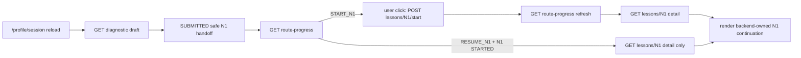

# Evidence: MVP-07-n1-readonly-resume-continuation-001

Stage: `mvp`
Sprint contract: `MVP-07-n1-readonly-resume-continuation-001`
Builder status: `PASS_AFTER_FRESH_VERIFIER_PARENT_SYNC`
Functional passes: `true`
Updated: 2026-05-14

## Scope Summary

Implemented the web-first read-only N1 resume continuation for mounted `/profile/session`.

When diagnostic draft load is already `SUBMITTED` and generated route-progress returns `diagnosticState=SUBMITTED`, `routePreview=true`, `recommendedFirstLessonId=N1`, `n1.status=STARTED` and `nextAction=RESUME_N1`, the mounted web component now builds the local N1 progress banner from `GET /learning/me/route-progress`, fetches backend-owned N1 detail through generated `fetchLearningMeLessonDetail`, and renders the existing N1 continuation without calling generated `startLearningMeLesson`.

The first-start path remains intact: `START_N1` still allows the user click to call generated `startLearningMeLesson`, then refresh route-progress and fetch N1 detail.

## Changed Files

- `apps/web/components/diagnostic-api-flow-screen.ts`
- `apps/web/tests/learning-shell.test.mjs`
- `apps/web/tests/browser-smoke.mjs`
- `docs/architecture/access-and-subscriptions.md`
- `.agent/stages/mvp/evidence/MVP-07-n1-readonly-resume-continuation-001.md`
- `.agent/stages/mvp/evidence/MVP-07-n1-readonly-resume-continuation-001.json`
- `.agent/stages/mvp/evidence.md`
- `.agent/stages/mvp/evidence.json`
- `.agent/stages/mvp/progress.md`
- `.agent/stages/mvp/status.json`
- `.agent/stages/mvp/feature_list.json`
- `.agent/stages/mvp/publish_manifest.json`

Pre-existing spec-freezer changes in `.agent/stages/mvp/{stage_spec.md,backlog.md,sprint_contract.md,status.json,feature_list.json}` and `.agent/stages/mvp/task-files/MVP-07-n1-readonly-resume-continuation-001.md` were preserved and not reverted.

## First Touch

First meaningful builder write was in `apps/web/components/diagnostic-api-flow-screen.ts`, adding the local `readOnlyResume` progress marker before any builder writes to docs or evidence. This satisfies the contract first-touch requirement for an `apps/web` production/test file.

## Contract Proof

- Generated helpers used: `fetchLearningMeRouteProgress`, `fetchLearningMeLessonDetail`, `startLearningMeLesson`.
- `RESUME_N1` path: `buildReadOnlyN1LessonProgressFromRouteProgress(...)` derives display progress from route-progress and `loadSafeN1LessonDetail(...)` fetches backend-owned detail.
- `startLearningMeLesson(...)` is only used when current route-progress is not `RESUME_N1`; the button handler also guards the fallback resume case by reading detail instead of posting start.
- Browser structured proof for `mobile-profile-session-diagnostic-n1-readonly-resume` request events:
  - `profile-session:request`
  - `legal-acceptance:request`
  - `diagnostic-draft:get:request`
  - `route-progress:request:1`
  - `lesson-detail:request`
  - no `diagnostic-submit:request`
  - no `learning-start:request`
- Browser structured proof ref: `.agent/stages/mvp/raw/builder-MVP-07-n1-readonly-resume-continuation-001-20260514/browser-smoke/MVP-07-n1-readonly-resume-continuation-001-browser-smoke.json`.
- Key screenshot ref: `.agent/stages/mvp/raw/builder-MVP-07-n1-readonly-resume-continuation-001-20260514/browser-smoke/MVP-07-n1-readonly-resume-continuation-001-mobile-profile-session-diagnostic-n1-readonly-resume.png`.
- First-start path proof remains covered by `mobile-start-to-profile-session-diagnostic-n1-progress` in the same browser summary: it includes `learning-start:request`, refreshed `route-progress:request:2` and `lesson-detail:request`.
- Token proof: browser smoke asserts no profile-session token in URL or visible text, route/detail/start request URLs contain no token or invite code, request bodies do not echo token/code/scope IDs, and the read-only resume scenario checks localStorage, sessionStorage, cookies and IndexedDB/service-worker surfaces.

## Validation Commands

| Command | Status | Raw ref | Notes |
|---|---:|---|---|
| `pnpm --filter @finrhythm/web test` | 0 | `.agent/stages/mvp/raw/builder-MVP-07-n1-readonly-resume-continuation-001-20260514/web-test-1.txt` | Focused web test includes read-only N1 continuation helper and generated-helper guards. |
| `pnpm --filter @finrhythm/web typecheck` | 0 | `.agent/stages/mvp/raw/builder-MVP-07-n1-readonly-resume-continuation-001-20260514/web-typecheck-1.txt` | Web TS check. |
| `pnpm --filter @finrhythm/web build` | 0 | `.agent/stages/mvp/raw/builder-MVP-07-n1-readonly-resume-continuation-001-20260514/web-build-1.txt` | Production-like web build. |
| `cd apps/api && ./mvnw -q -Dtest=LearningProgressControllerIT test` | blocked/retried | `.agent/stages/mvp/raw/builder-MVP-07-n1-readonly-resume-continuation-001-20260514/backend-learning-progress-focused-test-1.txt` | Direct macOS Java stub reported no runtime and hung; stopped and retried with explicit Java 21 env. |
| `JAVA_HOME=/opt/homebrew/opt/openjdk@21 ... cd apps/api && ./mvnw -q -Dtest=LearningProgressControllerIT test` | 0 | `.agent/stages/mvp/raw/builder-MVP-07-n1-readonly-resume-continuation-001-20260514/backend-learning-progress-focused-test-2-java21.txt` | Focused backend learning regression passed. |
| `JAVA_HOME=/opt/homebrew/opt/openjdk@21 ... cd apps/api && ./mvnw -q verify` | 0 | `.agent/stages/mvp/raw/builder-MVP-07-n1-readonly-resume-continuation-001-20260514/backend-mvn-verify-1.txt` | Backend verify passed; no backend code changed in this slice. |
| `pnpm --filter @finrhythm/api-client check:generated` | 0 | `.agent/stages/mvp/raw/builder-MVP-07-n1-readonly-resume-continuation-001-20260514/api-client-check-generated-1.txt` | Generated client unchanged and consistent. |
| `pnpm --filter @finrhythm/api-client check:openapi-drift` | 0 | `.agent/stages/mvp/raw/builder-MVP-07-n1-readonly-resume-continuation-001-20260514/api-client-check-openapi-drift-1.txt` | No OpenAPI drift. |
| `pnpm --filter @finrhythm/api-client typecheck` | 0 | `.agent/stages/mvp/raw/builder-MVP-07-n1-readonly-resume-continuation-001-20260514/api-client-typecheck-1.txt` | Api-client TS check. |
| `pnpm --filter @finrhythm/api-client build` | 0 | `.agent/stages/mvp/raw/builder-MVP-07-n1-readonly-resume-continuation-001-20260514/api-client-build-1.txt` | Api-client build. |
| Browser smoke via default Playwright runtime | 1 | `.agent/stages/mvp/raw/builder-MVP-07-n1-readonly-resume-continuation-001-20260514/web-browser-smoke-2.txt` | Local Playwright Chromium cache missing. |
| Browser smoke via local Google Chrome, absolute root raw output | 0 | `.agent/stages/mvp/raw/builder-MVP-07-n1-readonly-resume-continuation-001-20260514/web-browser-smoke-4-absolute-output.txt` | Passed with 36 screenshots and structured request summary. |
| `make verify` | 0 | `.agent/stages/mvp/raw/builder-MVP-07-n1-readonly-resume-continuation-001-20260514/make-verify-1.txt` | Root wrapper passed. |
| `make test-unit` | 0 | `.agent/stages/mvp/raw/builder-MVP-07-n1-readonly-resume-continuation-001-20260514/make-test-unit-1.txt` | Root unit wrapper passed. |
| `make build` | 0 | `.agent/stages/mvp/raw/builder-MVP-07-n1-readonly-resume-continuation-001-20260514/make-build-1.txt` | Root build wrapper passed. |
| Guardrail scans | 0 | `.agent/stages/mvp/raw/builder-MVP-07-n1-readonly-resume-continuation-001-20260514/guardrail-scans-2.txt` | Confirms no backend/API/generated/schema changes, generated helper usage, no token storage/query/hash/history/log APIs, no `POST /start` on resume path and no out-of-scope expansion. |
| `jq empty` changed JSON artifacts | 0 | `.agent/stages/mvp/raw/builder-MVP-07-n1-readonly-resume-continuation-001-20260514/jq-empty-2.txt` | Final JSON artifacts validate after evidence updates. |
| `git diff --check -- . ':(exclude).agent/stages/**/raw/**' ':(exclude).agent/tasks/**/raw/**'` | 0 | `.agent/stages/mvp/raw/builder-MVP-07-n1-readonly-resume-continuation-001-20260514/git-diff-check-3.txt` | Final diff check passes; earlier run caught trailing whitespace in evidence markdown and was fixed. |

## Docs Sync

- Updated `docs/architecture/access-and-subscriptions.md` section 7.4 to distinguish:
  - `START_N1`: user action may call `POST /learning/me/lessons/N1/start`, refresh route-progress, then fetch detail;
  - `RESUME_N1`: mounted web reopens N1 through `GET route-progress` + `GET lesson detail` without re-posting start.
- Product docs: `NOOP` because N1 semantics, draft review status, sensitive-data policy and mobile lesson patterns were followed.
- API/generated-client docs: `NOOP` because helper coverage already existed and no API/OpenAPI/generated helper changed.

## Backend Baseline

Backend baseline remains Spring Boot, Java 21, Maven Wrapper, PostgreSQL, Flyway and OpenAPI/springdoc. No backend production code, Flyway migration, OpenAPI snapshot or generated api-client source was changed by this builder slice.

## Human Gates And Non-Closure

Still open:

- final N1 financial correctness and wording review;
- final Q0/SA/Q diagnostic wording review;
- scoring correctness and route-rule correctness;
- HR/privacy wording and reporting-boundary approval;
- legal/privacy boundaries and real employee/customer data processing approval;
- production content approval and methodologist publish approval;
- points/reward economy, real fulfillment and paid-tier/reward decisions;
- admin/support production access policy for sensitive diagnostic/learning data;
- design/accessibility QA on real mobile screens.

This evidence does not close full `MVP-06`, full `MVP-07`, the MVP stage or any human gate.

## Explicit Out Of Scope Confirmation

No completion, theory completion, quiz/practice submission, points, rewards, wallet, final scoring, final route assignment, full `Q1-Q27`, `Q28`, final `R1-R6`, weak zones, HR reports, analytics/events, exact sensitive data, personal financial/investment/tax/credit/legal advice, customer brand, real data, account/org/subscription/seat/entitlement, SSO/SCIM or billing work was introduced.

## Fresh Verifier PASS

Fresh verifier returned `PASS` for the scoped sprint.

- Verdict: `.agent/stages/mvp/verdicts/MVP-07-n1-readonly-resume-continuation-001.json`
- Problems: `.agent/stages/mvp/problems/MVP-07-n1-readonly-resume-continuation-001.md`
- Raw verifier dir: `.agent/stages/mvp/raw/verifier-MVP-07-n1-readonly-resume-continuation-001-20260514-fresh/`
- Browser summary: `.agent/stages/mvp/raw/verifier-MVP-07-n1-readonly-resume-continuation-001-20260514-fresh/browser-smoke/MVP-07-n1-readonly-resume-continuation-001-verifier-browser-smoke.json`
- Read-only resume screenshot: `.agent/stages/mvp/raw/verifier-MVP-07-n1-readonly-resume-continuation-001-20260514-fresh/browser-smoke/MVP-07-n1-readonly-resume-continuation-001-verifier-mobile-profile-session-diagnostic-n1-readonly-resume.png`

Verifier checks passed: web test/typecheck/build, focused backend `LearningProgressControllerIT`, `apps/api ./mvnw -q verify`, api-client generated/OpenAPI/typecheck/build, browser smoke with structured network proof, `make verify`, `make test-unit`, `make build`, JSON validation, `git diff --check` and guardrail scans.

## Known Limitations / Blockers

- No blocking verifier problems remain for this scoped sprint.
- Direct Maven wrapper without Java env hit the macOS `/usr/bin/java` stub and was retried with `/opt/homebrew/opt/openjdk@21`, matching the Makefile Java 21 fallback.
- Default Playwright browser cache was missing; browser smoke passed with the local Google Chrome executable and absolute repo-root raw output.
- Fresh verifier noted that a verifier-owned dev server on `3407` could not start because an existing `apps/web` dev server lock pointed to `3404`; fresh browser smoke passed against that existing local server.

## Required Next Step

Execute the post-PASS publish flow through `$push-main` using `.agent/stages/mvp/publish_manifest.json`.
