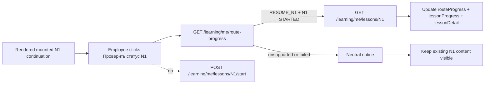

# Evidence: MVP-07-n1-readonly-status-refresh-001

Stage: `mvp`
Sprint contract: `MVP-07-n1-readonly-status-refresh-001`
Proof status: `PASS_AFTER_FRESH_VERIFIER_PARENT_SYNC`
Functional passes: `true`
Updated: 2026-05-14

## Scope Summary

Implemented one read-only status refresh action inside the mounted `/profile/session` N1 continuation screen.

When N1 is already visible from backend-owned `RESUME_N1` route-progress and N1 lesson detail, the employee can click `Проверить статус N1`. The refresh calls generated `fetchLearningMeRouteProgress` first through `loadSafeRouteProgress(...)`. Only when the refreshed summary is still the safe shape (`SUBMITTED`, `routePreview=true`, `recommendedFirstLessonId=N1`, `n1.status=STARTED`, `nextAction=RESUME_N1`) it derives read-only mounted progress and calls generated `fetchLearningMeLessonDetail` through `loadSafeN1LessonDetail(...)`. On success it updates mounted `routeProgress`, read-only `lessonProgress` and `lessonDetail`.

The refresh path does not call generated `startLearningMeLesson` and does not issue `POST /api/v1/learning/me/lessons/N1/start`. Failed or unsupported refresh shows a neutral notice and keeps the already loaded N1 content visible.

## Changed Files

- `apps/web/components/diagnostic-api-flow-screen.ts`
- `apps/web/tests/learning-shell.test.mjs`
- `apps/web/tests/browser-smoke.mjs`
- `docs/architecture/access-and-subscriptions.md`
- `.agent/stages/mvp/evidence/MVP-07-n1-readonly-status-refresh-001.md`
- `.agent/stages/mvp/evidence/MVP-07-n1-readonly-status-refresh-001.json`
- `.agent/stages/mvp/evidence.md`
- `.agent/stages/mvp/evidence.json`
- `.agent/stages/mvp/progress.md`
- `.agent/stages/mvp/status.json`
- `.agent/stages/mvp/feature_list.json`
- `.agent/stages/mvp/publish_manifest.json`

Pre-existing spec-freezer artifact edits in `.agent/stages/mvp/feature_list.json`, `.agent/stages/mvp/progress.md`, `.agent/stages/mvp/publish_manifest.json`, `.agent/stages/mvp/sprint_contract.md`, `.agent/stages/mvp/status.json` and `.agent/stages/mvp/task-files/MVP-07-n1-readonly-status-refresh-001.md` were preserved and not reverted.

## First Touch

First meaningful builder write was in `apps/web/components/diagnostic-api-flow-screen.ts`, adding mounted N1 refresh state and handler before any builder writes to docs or evidence. This satisfies the contract first-touch requirement for an `apps/web` production/test file.

## Contract Proof

- Generated helpers used by production web: `fetchLearningMeRouteProgress`, `fetchLearningMeLessonDetail`, `startLearningMeLesson`.
- Refresh path uses only read helpers:
  - `refreshStartedN1Status()` calls `loadSafeRouteProgress(profileSessionToken)`;
  - it derives read-only progress with `buildReadOnlyN1LessonProgressFromRouteProgress(...)`;
  - only then it calls `loadSafeN1LessonDetail(profileSessionToken, safeProgress.lessonId)`.
- `startLearningMeLesson(...)` remains only in `startFirstLesson()` for the existing `START_N1` first-start path.
- Focused web test `keeps mounted N1 status refresh read-only and generated-helper based` isolates the refresh handler block and proves it contains no `startLearningMeLesson`, diagnostic submit/save mutation, raw `fetch`, `POST`, URL/history, storage/cookie/IndexedDB or console usage.
- Browser success proof for `mobile-profile-session-diagnostic-n1-readonly-refresh` request events:
  - initial reopen: `route-progress:request:1`, `lesson-detail:request:1`;
  - refresh click: `route-progress:request:2`, `lesson-detail:request:2`;
  - no `learning-start:request`;
  - no `diagnostic-submit:request`;
  - no `diagnostic-draft:put:request`.
- Browser unsupported proof for `mobile-profile-session-diagnostic-n1-readonly-refresh-unsupported` request events:
  - initial reopen: `route-progress:request:1`, `lesson-detail:request:1`;
  - refresh click: `route-progress:request:2`;
  - no second `lesson-detail:request:2`;
  - no `learning-start:request`;
  - visible text includes `Не удалось обновить статус`, `Показываем уже открытый материал N1` and the original N1 content.
- Browser structured proof ref: `.agent/stages/mvp/raw/builder-MVP-07-n1-readonly-status-refresh-001-20260514/browser-smoke-abs/MVP-07-n1-readonly-status-refresh-001-browser-smoke.json`.
- Key screenshot refs:
  - `.agent/stages/mvp/raw/builder-MVP-07-n1-readonly-status-refresh-001-20260514/browser-smoke-abs/MVP-07-n1-readonly-status-refresh-001-mobile-profile-session-diagnostic-n1-readonly-refresh.png`
  - `.agent/stages/mvp/raw/builder-MVP-07-n1-readonly-status-refresh-001-20260514/browser-smoke-abs/MVP-07-n1-readonly-status-refresh-001-mobile-profile-session-diagnostic-n1-readonly-refresh-unsupported.png`
  - `.agent/stages/mvp/raw/builder-MVP-07-n1-readonly-status-refresh-001-20260514/browser-smoke-abs/MVP-07-n1-readonly-status-refresh-001-mobile-start-to-profile-session-diagnostic-n1-progress.png`
  - `.agent/stages/mvp/raw/builder-MVP-07-n1-readonly-status-refresh-001-20260514/browser-smoke-abs/MVP-07-n1-readonly-status-refresh-001-mobile-profile-session-diagnostic-n1-readonly-resume.png`
- First-start path remains covered by `mobile-start-to-profile-session-diagnostic-n1-progress`: it includes `learning-start:request`, refreshed `route-progress:request:2` and `lesson-detail:request`.
- Read-only reopen path remains covered by `mobile-profile-session-diagnostic-n1-readonly-resume`: it includes `route-progress:request:1` and `lesson-detail:request:1` with no `learning-start:request`.
- Token proof: browser smoke asserts no profile-session token in URL or visible text, route/detail/start request URLs contain no token or invite code, request bodies do not echo token/code/scope IDs, and N1 read-only scenarios check localStorage, sessionStorage, cookies, IndexedDB and service-worker surfaces.

## Validation Commands

| Command | Status | Raw ref | Notes |
|---|---:|---|---|
| `pnpm --filter @finrhythm/web test` | 0 | `.agent/stages/mvp/raw/builder-MVP-07-n1-readonly-status-refresh-001-20260514/web-test-1.txt` | Focused web test includes mounted N1 refresh guard. |
| `pnpm --filter @finrhythm/web typecheck` | 0 | `.agent/stages/mvp/raw/builder-MVP-07-n1-readonly-status-refresh-001-20260514/web-typecheck-1.txt` | Web TS check. |
| `pnpm --filter @finrhythm/web build` | 0 | `.agent/stages/mvp/raw/builder-MVP-07-n1-readonly-status-refresh-001-20260514/web-build-1.txt` | Production-like web build. |
| Browser smoke via default Playwright runtime | 1 | `.agent/stages/mvp/raw/builder-MVP-07-n1-readonly-status-refresh-001-20260514/web-browser-smoke-1.txt` | Local Playwright Chromium cache missing; retried with local Chrome. |
| Browser smoke against `127.0.0.1:3407` | 1 | `.agent/stages/mvp/raw/builder-MVP-07-n1-readonly-status-refresh-001-20260514/web-browser-smoke-2-chrome.txt` | Dev server lock pointed to existing `3404`; retried against `3404`. |
| Browser smoke via local Google Chrome, absolute root raw output | 0 | `.agent/stages/mvp/raw/builder-MVP-07-n1-readonly-status-refresh-001-20260514/web-browser-smoke-4-absolute-output.txt` | Passed with 38 screenshots and structured request summary. |
| `pnpm --filter @finrhythm/api-client check:generated` | 0 | `.agent/stages/mvp/raw/builder-MVP-07-n1-readonly-status-refresh-001-20260514/api-client-check-generated-1.txt` | Generated client unchanged and consistent. |
| `pnpm --filter @finrhythm/api-client check:openapi-drift` | 0 | `.agent/stages/mvp/raw/builder-MVP-07-n1-readonly-status-refresh-001-20260514/api-client-check-openapi-drift-1.txt` | No OpenAPI drift. |
| `pnpm --filter @finrhythm/api-client typecheck` | 0 | `.agent/stages/mvp/raw/builder-MVP-07-n1-readonly-status-refresh-001-20260514/api-client-typecheck-1.txt` | Api-client TS check. |
| `pnpm --filter @finrhythm/api-client build` | 0 | `.agent/stages/mvp/raw/builder-MVP-07-n1-readonly-status-refresh-001-20260514/api-client-build-1.txt` | Api-client build; no generated diff remained. |
| `cd apps/api && ./mvnw -q -Dtest=LearningProgressControllerIT test` | blocked/retried | `.agent/stages/mvp/raw/builder-MVP-07-n1-readonly-status-refresh-001-20260514/backend-learning-progress-controller-it-1.txt` | Direct macOS Java stub reported no runtime; retried with explicit Java 21 env. |
| `cd apps/api && JAVA_HOME=/opt/homebrew/opt/openjdk@21 ... ./mvnw -q -Dtest=LearningProgressControllerIT test` | 0 | `.agent/stages/mvp/raw/builder-MVP-07-n1-readonly-status-refresh-001-20260514/backend-learning-progress-controller-it-2-java21.txt` | Focused backend learning regression passed. |
| `cd apps/api && ./mvnw -q verify` | blocked/retried | `.agent/stages/mvp/raw/builder-MVP-07-n1-readonly-status-refresh-001-20260514/backend-mvn-verify-1-java-blocked.txt` | Direct Java stub issue; retried with explicit Java 21 env. |
| `cd apps/api && JAVA_HOME=/opt/homebrew/opt/openjdk@21 ... ./mvnw -q verify` | 0 | `.agent/stages/mvp/raw/builder-MVP-07-n1-readonly-status-refresh-001-20260514/backend-mvn-verify-2-java21.txt` | Backend verify passed; no backend code changed. |
| `pnpm -s run build:docs` | 0 | `.agent/stages/mvp/raw/builder-MVP-07-n1-readonly-status-refresh-001-20260514/docs-build-1.txt` | Doc-sync check after architecture doc update. |
| `make verify` | 0 | `.agent/stages/mvp/raw/builder-MVP-07-n1-readonly-status-refresh-001-20260514/make-verify-1.txt` | Root wrapper passed. |
| `make test-unit` | 0 | `.agent/stages/mvp/raw/builder-MVP-07-n1-readonly-status-refresh-001-20260514/make-test-unit-1.txt` | Root unit wrapper passed. |
| `make build` | 0 | `.agent/stages/mvp/raw/builder-MVP-07-n1-readonly-status-refresh-001-20260514/make-build-1.txt` | Root build wrapper passed. |
| Guardrail scans | 0 | `.agent/stages/mvp/raw/builder-MVP-07-n1-readonly-status-refresh-001-20260514/guardrail-scans-3.txt` | Confirms no backend/API/generated/schema changes, generated helper usage, no token storage/query/hash/history/log APIs, no start mutation on refresh and no out-of-scope expansion. |
| `jq empty` for changed stage JSON | 0 | `.agent/stages/mvp/raw/builder-MVP-07-n1-readonly-status-refresh-001-20260514/jq-empty-final.txt` | Final JSON validity check for changed stage JSON/evidence artifacts. |
| `git diff --check -- . ':(exclude).agent/stages/**/raw/**' ':(exclude).agent/tasks/**/raw/**'` | 0 | `.agent/stages/mvp/raw/builder-MVP-07-n1-readonly-status-refresh-001-20260514/git-diff-check-final.txt` | Final whitespace check excluding raw evidence paths. |

## Docs Sync

- Updated `docs/architecture/access-and-subscriptions.md` section 7.4 because the existing canonical boundary covered read-only reopen but did not explicitly cover a user-triggered refresh from the already-rendered mounted N1 continuation.
- The doc now states that mounted refresh may repeat only `GET /learning/me/route-progress`, then conditional `GET /learning/me/lessons/N1` when the summary remains `RESUME_N1` with `N1 STARTED`, and must keep existing content visible without `POST /start` on unsupported or failed refresh.
- Product docs: `NOOP` because N1 semantics, draft review status, sensitive-data policy and mobile lesson patterns were followed.
- API/generated-client docs: `NOOP` because no API/OpenAPI/generated helper changed.

## Backend Baseline

Backend baseline remains Spring Boot, Java 21, Maven Wrapper, PostgreSQL, Flyway and OpenAPI/springdoc. No backend production code, Flyway migration, OpenAPI snapshot or generated api-client source was changed by this builder slice.

## Human Gates And Non-Closure

Still open:

- final N1 financial correctness and wording review;
- final Q0/SA/Q diagnostic wording review;
- scoring correctness and route-rule correctness;
- HR/privacy wording and reporting-boundary approval;
- legal/privacy boundaries and real employee/customer data processing approval;
- production content approval and methodologist publish approval;
- points/reward economy, real fulfillment and paid-tier/reward decisions;
- admin/support production access policy for sensitive diagnostic/learning data;
- design/accessibility QA on real mobile screens.

This evidence does not close full `MVP-06`, full `MVP-07`, the MVP stage or any human gate.

## Explicit Out Of Scope Confirmation

No completion, theory completion, quiz/practice submission, points, rewards, wallet, final scoring, final route assignment, full `Q1-Q27`, `Q28`, final `R1-R6`, weak zones, HR reports, analytics/events, exact sensitive data, personal financial/investment/tax/credit/legal advice, customer brand, real data, account/org/subscription/seat/entitlement, SSO/SCIM or billing work was introduced.

## Fresh Verifier Status

Fresh verifier returned `PASS` for `MVP-07-n1-readonly-status-refresh-001`.

- Immutable verdict: `.agent/stages/mvp/verdicts/MVP-07-n1-readonly-status-refresh-001.json`.
- Immutable problems: `.agent/stages/mvp/problems/MVP-07-n1-readonly-status-refresh-001.md`.
- Fresh verifier raw dir: `.agent/stages/mvp/raw/verifier-MVP-07-n1-readonly-status-refresh-001-20260514-fresh/`.
- Verifier reran web test/typecheck/build, browser smoke with refresh network proof, backend `LearningProgressControllerIT`, apps/api `mvnw verify`, api-client checks, `make verify`, `make test-unit`, `make build`, guardrails, JSON validation and `git diff --check`.
- Latest evidence/verdict/problems aliases now point to this sprint after parent sync.
- Scoped functional pass applies only to this sprint; full `MVP-06`, full `MVP-07`, MVP stage and human gates remain open.

## Known Limitations / Blockers

- No blocker remains after fresh verifier PASS.
- Direct Maven wrapper without Java env hit the macOS `/usr/bin/java` stub and was retried with `/opt/homebrew/opt/openjdk@21`, matching the Makefile Java 21 fallback.
- Default Playwright browser cache was missing; browser smoke passed with `/Applications/Google Chrome.app/Contents/MacOS/Google Chrome`.
- A local `apps/web` dev server lock existed on `3404`; browser smoke passed against that existing local server with absolute repo-root raw output.

## Required Next Step

Run the required post-PASS publish flow through repo-local `$push-main`.
