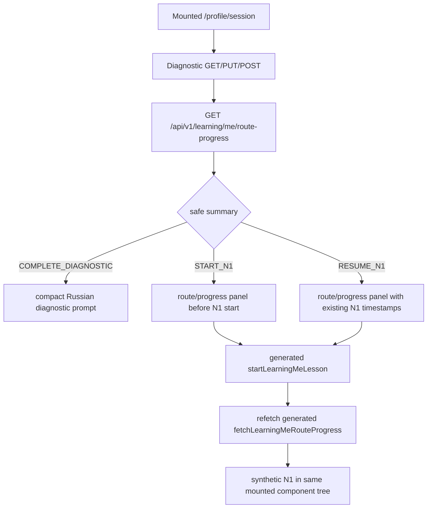

# Evidence: MVP-07-n1-route-progress-summary-001

Stage: `mvp`
Sprint contract: `MVP-07-n1-route-progress-summary-001`
Builder status: `BUILT_FIXED_AND_FRESH_VERIFIED`
Fresh verifier status: `PASS`
Functional passes: `true`
Builder checks pass: `true`
Updated: 2026-05-14

## Summary

Implemented the frozen backend-first route/progress summary slice for the mounted profile-session diagnostic/N1 flow.

The new scoped flow is:

`/profile/session -> diagnostic submit/read summary -> compact route/progress panel -> generated N1 start/resume -> refreshed route/progress summary`.

Backend now exposes a read-only `GET /api/v1/learning/me/route-progress` under existing employee profile-session bearer auth. The endpoint accepts no body and no client-supplied scope identifiers, resolves registration/scope server-side and does not persist on success or failure. The response is limited to safe route/progress summary fields: diagnostic state, N1 route preview only after safe submitted diagnostic handoff, N1 `NOT_STARTED|STARTED` state, timestamps only when the existing N1 progress row exists and the next action.

First fresh verifier reproduced the technical proof but returned `FAIL` for English/mixed-language route/progress UI copy. The minimal fixer replaced those labels and adjacent smoke-tested diagnostic entry labels with Russian neutral wording, then a fresh verifier rerun returned `PASS`. Full MVP-06, full MVP-07, MVP stage and all human gates remain open.

## Changed Files

Backend production/test:

- `apps/api/src/main/java/com/finrhythm/api/learning/domain/LearningRouteDiagnosticState.java`
- `apps/api/src/main/java/com/finrhythm/api/learning/domain/LearningRouteN1Progress.java`
- `apps/api/src/main/java/com/finrhythm/api/learning/domain/LearningRouteN1Status.java`
- `apps/api/src/main/java/com/finrhythm/api/learning/domain/LearningRouteNextAction.java`
- `apps/api/src/main/java/com/finrhythm/api/learning/domain/LearningRouteProgressSummary.java`
- `apps/api/src/main/java/com/finrhythm/api/learning/persistence/LearningRouteProgressRepository.java`
- `apps/api/src/main/java/com/finrhythm/api/learning/service/LearningRouteProgressService.java`
- `apps/api/src/main/java/com/finrhythm/api/learning/web/LearningRouteN1ProgressResponse.java`
- `apps/api/src/main/java/com/finrhythm/api/learning/web/LearningRouteProgressResponse.java`
- `apps/api/src/main/java/com/finrhythm/api/learning/web/LessonProgressController.java`
- `apps/api/src/test/java/com/finrhythm/api/learning/LearningProgressControllerIT.java`

OpenAPI/generated client:

- `packages/api-client/openapi/finrhythm-api.openapi.json`
- `packages/api-client/scripts/generate-contracts.mjs`
- `packages/api-client/scripts/check-openapi-drift.mjs`
- `packages/api-client/src/generated/contracts.ts`
- `packages/api-client/dist/generated/contracts.js`
- `packages/api-client/dist/generated/contracts.d.ts`
- `packages/api-client/README.md`

Mounted web flow:

- `apps/web/components/diagnostic-api-flow-screen.ts`
- `apps/web/components/diagnostic-preview-screen.ts`
- `apps/web/components/employee-home-screen.ts`
- `apps/web/components/learning-shell.ts`
- `apps/web/components/profile-session-entry-screen.ts`
- `apps/web/app/globals.css`
- `apps/web/tests/learning-shell.test.mjs`
- `apps/web/tests/browser-smoke.mjs`

Docs and stage artifacts:

- `docs/architecture/access-and-subscriptions.md`
- `.agent/stages/mvp/evidence/MVP-07-n1-route-progress-summary-001.md`
- `.agent/stages/mvp/evidence/MVP-07-n1-route-progress-summary-001.json`
- `.agent/stages/mvp/evidence.md`
- `.agent/stages/mvp/evidence.json`
- `.agent/stages/mvp/progress.md`
- `.agent/stages/mvp/status.json`
- `.agent/stages/mvp/feature_list.json`
- `.agent/stages/mvp/publish_manifest.json`

## First Touch

The first meaningful implementation touch was in `apps/api/src/test/java/com/finrhythm/api/learning/LearningProgressControllerIT.java`, before OpenAPI, generated client, web, docs or stage evidence updates.

The builder did not create child subagents. No verifier was run.

## First Verifier Result And Fixer Scope

Fresh verifier `FAIL` was recorded in `.agent/stages/mvp/verdicts/MVP-07-n1-route-progress-summary-001.json` and `.agent/stages/mvp/problems/MVP-07-n1-route-progress-summary-001.md`.

Blocking gap: the new mounted route/progress panel still exposed English or mixed-language labels such as `handoff`, `Route preview`, `Route progress`, `Backend progress`, `summary`, `scoring` and `sprint`, violating the frozen Russian-copy acceptance criterion.

Minimal fixer:

- replaced the route/progress panel labels and explanatory copy with Russian neutral wording;
- renamed visible aria labels/classes tied to the panel from handoff/backend wording to Russian-safe transfer/progress wording where relevant;
- updated adjacent smoke-tested diagnostic entry copy so browser smoke no longer depends on English `preview/scoring/handoff` labels;
- kept generated helper usage, profile-session token handling, backend API shape, OpenAPI/generated client and canonical docs unchanged.

Fresh verifier rerun accepted the fixer and returned scoped `PASS`.

## Backend Implementation

- Added read-only `GET /api/v1/learning/me/route-progress` under the existing employee profile-session bearer auth boundary.
- Reused `EmployeeRegistrationService.authenticateProfileSessionBearer` for server-side registration/scope resolution.
- Added a read repository that only selects from existing `diagnostic_attempts` and `employee_lesson_progress`.
- Added no Flyway migration because existing V011/V012 tables are sufficient.
- The endpoint accepts no request body, no path scope identifier and no query scope identifier.
- Successful and failed requests do not insert or update rows.
- Safe response states are `NOT_STARTED`, `DRAFT`, `SUBMITTED` for diagnostic state; `NOT_STARTED`, `STARTED` for N1 progress; and `COMPLETE_DIAGNOSTIC`, `START_N1`, `RESUME_N1` for next action.
- `routePreview=true` and `recommendedFirstLessonId=N1` are returned only after an existing submitted diagnostic safely recommends N1.
- `startedAt` and `lastOpenedAt` are returned only when an existing N1 progress row exists.
- The response does not expose employee IDs, tenant/pilot/access-pool IDs, diagnostic answers, scoring, final route assignment, HR data, points, rewards, lesson completion, quiz/practice state or advice.

## API And Web Flow

The web uses generated `fetchLearningMeRouteProgress` and `startLearningMeLesson` helpers from `@finrhythm/api-client`. The profile-session token stays in mounted component memory and is not written to URL, browser storage, cookies, IndexedDB, service-worker cache, logs or screenshots.

## Commands

Full outputs are under `.agent/stages/mvp/raw/builder-MVP-07-n1-route-progress-summary-001-20260514/`.

| Command | Exit | Raw ref |
|---|---:|---|
| `cd apps/api && JAVA_HOME=/opt/homebrew/opt/openjdk@21 PATH=/opt/homebrew/opt/openjdk@21/bin:$PATH ./mvnw -q -Dtest=LearningProgressControllerIT test` | 0 | `.agent/stages/mvp/raw/builder-MVP-07-n1-route-progress-summary-001-20260514/backend-learning-route-progress-focused-test-3.txt` |
| `cd apps/api && JAVA_HOME=/opt/homebrew/opt/openjdk@21 PATH=/opt/homebrew/opt/openjdk@21/bin:$PATH ./mvnw -q verify` | 0 | `.agent/stages/mvp/raw/builder-MVP-07-n1-route-progress-summary-001-20260514/backend-mvn-verify-1.txt` |
| `pnpm --filter @finrhythm/api-client generate` | 0 | `.agent/stages/mvp/raw/builder-MVP-07-n1-route-progress-summary-001-20260514/api-client-generate-1.txt` |
| `pnpm --filter @finrhythm/api-client build` | 0 | `.agent/stages/mvp/raw/builder-MVP-07-n1-route-progress-summary-001-20260514/api-client-build-1.txt` |
| `pnpm --filter @finrhythm/api-client check:generated` | 0 | `.agent/stages/mvp/raw/builder-MVP-07-n1-route-progress-summary-001-20260514/api-client-check-generated-1.txt` |
| `pnpm --filter @finrhythm/api-client check:openapi-drift` | 0 | `.agent/stages/mvp/raw/builder-MVP-07-n1-route-progress-summary-001-20260514/api-client-check-openapi-drift-1.txt` |
| `pnpm --filter @finrhythm/api-client typecheck` | 0 | `.agent/stages/mvp/raw/builder-MVP-07-n1-route-progress-summary-001-20260514/api-client-typecheck-1.txt` |
| `pnpm --filter @finrhythm/web typecheck` | 0 | `.agent/stages/mvp/raw/builder-MVP-07-n1-route-progress-summary-001-20260514/web-typecheck-1.txt` |
| `pnpm --filter @finrhythm/web test` | 0 | `.agent/stages/mvp/raw/builder-MVP-07-n1-route-progress-summary-001-20260514/web-test-1.txt` |
| `pnpm --filter @finrhythm/web build` | 0 | `.agent/stages/mvp/raw/builder-MVP-07-n1-route-progress-summary-001-20260514/web-build-1.txt` |
| `CHROMIUM_EXECUTABLE_PATH=/Applications/Google Chrome.app/Contents/MacOS/Google Chrome WEB_SMOKE_BASE_URL=http://127.0.0.1:3404 WEB_SMOKE_OUTPUT_DIR=... pnpm --filter @finrhythm/web smoke:browser` | 0 | `.agent/stages/mvp/raw/builder-MVP-07-n1-route-progress-summary-001-20260514/web-browser-smoke-2.txt` |
| `make verify` | 0 | `.agent/stages/mvp/raw/builder-MVP-07-n1-route-progress-summary-001-20260514/make-verify-1.txt` |
| `make test-unit` | 0 | `.agent/stages/mvp/raw/builder-MVP-07-n1-route-progress-summary-001-20260514/make-test-unit-1.txt` |
| `make build` | 0 | `.agent/stages/mvp/raw/builder-MVP-07-n1-route-progress-summary-001-20260514/make-build-1.txt` |
| `jq empty ...` | 0 | `.agent/stages/mvp/raw/builder-MVP-07-n1-route-progress-summary-001-20260514/jq-empty-1.txt` |
| `git diff --check -- . ':(exclude).agent/stages/**/raw/**' ':(exclude).agent/tasks/**/raw/**'` | 0 | `.agent/stages/mvp/raw/builder-MVP-07-n1-route-progress-summary-001-20260514/git-diff-check-1.txt` |

Fixer outputs are under `.agent/stages/mvp/raw/fixer-MVP-07-n1-route-progress-summary-001-20260514/`.

| Command | Exit | Raw ref |
|---|---:|---|
| `pnpm --filter @finrhythm/web typecheck` | 0 | `.agent/stages/mvp/raw/fixer-MVP-07-n1-route-progress-summary-001-20260514/web-typecheck-fixer-1.txt` |
| `pnpm --filter @finrhythm/web test` | 0 | `.agent/stages/mvp/raw/fixer-MVP-07-n1-route-progress-summary-001-20260514/web-test-fixer-1.txt` |
| `pnpm --filter @finrhythm/web build` | 0 | `.agent/stages/mvp/raw/fixer-MVP-07-n1-route-progress-summary-001-20260514/web-build-fixer-1.txt` |
| `CHROMIUM_EXECUTABLE_PATH=/Applications/Google Chrome.app/Contents/MacOS/Google Chrome WEB_SMOKE_BASE_URL=http://127.0.0.1:3404 WEB_SMOKE_OUTPUT_DIR=... pnpm --filter @finrhythm/web smoke:browser` | 0 | `.agent/stages/mvp/raw/fixer-MVP-07-n1-route-progress-summary-001-20260514/web-browser-smoke-fixer-1.txt` |
| `rg ... russian-copy guard` | 0 | `.agent/stages/mvp/raw/fixer-MVP-07-n1-route-progress-summary-001-20260514/web-russian-copy-guard-fixer-1.txt` |
| `rg ... profile-session token storage guard` | 0 | `.agent/stages/mvp/raw/fixer-MVP-07-n1-route-progress-summary-001-20260514/web-token-storage-guard-fixer-1.txt` |
| `git diff --check -- . ':(exclude).agent/stages/**/raw/**' ':(exclude).agent/tasks/**/raw/**'` | 0 | `.agent/stages/mvp/raw/fixer-MVP-07-n1-route-progress-summary-001-20260514/git-diff-check-fixer-1.txt` |

Superseded failures are recorded and fixed:

- `backend-learning-route-progress-focused-test-1.txt`: wrapper variable issue, not a test failure.
- `backend-learning-route-progress-focused-test-2.txt`: OpenAPI assertion was too strict around the generated `Authorization` header parameter; focused test was corrected and rerun passed.
- `web-browser-smoke-1.txt`: bundled Playwright Chromium was unavailable locally; rerun with installed Google Chrome passed.
- `web-dev-server-3415.txt`: new dev-server attempt was unnecessary because an existing local Next server was already available on `127.0.0.1:3404`.

## Browser Evidence

- Smoke summary: `.agent/stages/mvp/raw/builder-MVP-07-n1-route-progress-summary-001-20260514/browser-smoke/MVP-07-n1-route-progress-summary-001-browser-smoke.json`
- Screenshot count: 35 screenshots plus summary JSON.
- Before N1 start panel: `.agent/stages/mvp/raw/builder-MVP-07-n1-route-progress-summary-001-20260514/browser-smoke/MVP-07-n1-route-progress-summary-001-mobile-profile-session-diagnostic-route-progress.png`
- After N1 start/resume refreshed summary: `.agent/stages/mvp/raw/builder-MVP-07-n1-route-progress-summary-001-20260514/browser-smoke/MVP-07-n1-route-progress-summary-001-mobile-start-to-profile-session-diagnostic-n1-progress.png`
- Artifact relocation proof: `.agent/stages/mvp/raw/builder-MVP-07-n1-route-progress-summary-001-20260514/browser-smoke-artifact-relocation-1.txt`
- Fixer smoke summary: `.agent/stages/mvp/raw/fixer-MVP-07-n1-route-progress-summary-001-20260514/browser-smoke/MVP-07-n1-route-progress-summary-001-fixer-browser-smoke.json`
- Fixer screenshot count: 35 screenshots plus summary JSON.
- Fixer before N1 start panel: `.agent/stages/mvp/raw/fixer-MVP-07-n1-route-progress-summary-001-20260514/browser-smoke/MVP-07-n1-route-progress-summary-001-fixer-mobile-profile-session-diagnostic-route-progress.png`
- Fixer after N1 start/resume refreshed summary: `.agent/stages/mvp/raw/fixer-MVP-07-n1-route-progress-summary-001-20260514/browser-smoke/MVP-07-n1-route-progress-summary-001-fixer-mobile-start-to-profile-session-diagnostic-n1-progress.png`

The Codex in-app Browser plugin was unavailable in this runtime (`iab` unavailable); that limitation is recorded in `.agent/stages/mvp/raw/builder-MVP-07-n1-route-progress-summary-001-20260514/browser-plugin-iab-unavailable.txt`. Browser smoke was still run with local Google Chrome through the repo smoke script.

## Guardrails

Raw guard refs:

- No migration diff: `.agent/stages/mvp/raw/builder-MVP-07-n1-route-progress-summary-001-20260514/no-migration-diff-1.txt`
- Web generated-helper usage: `.agent/stages/mvp/raw/builder-MVP-07-n1-route-progress-summary-001-20260514/web-route-progress-generated-helper-guard-1.txt`
- Profile-session token storage guard: `.agent/stages/mvp/raw/builder-MVP-07-n1-route-progress-summary-001-20260514/web-token-storage-guard-1.txt`
- Backend scope/out-of-scope scan: `.agent/stages/mvp/raw/builder-MVP-07-n1-route-progress-summary-001-20260514/backend-scope-guard-1.txt`
- Fixer Russian-copy guard: `.agent/stages/mvp/raw/fixer-MVP-07-n1-route-progress-summary-001-20260514/web-russian-copy-guard-fixer-1.txt`
- Fixer token storage guard: `.agent/stages/mvp/raw/fixer-MVP-07-n1-route-progress-summary-001-20260514/web-token-storage-guard-fixer-1.txt`

Passed guardrails:

- No migration was added.
- Endpoint is read-only and no-success/no-failure persistence is covered by focused backend tests.
- OpenAPI and focused backend tests confirm no request body and no client scope path/query identifiers.
- Web route/progress summary uses the generated client helper, not a hand-written URL or raw fetch.
- Profile-session token stays in mounted memory only.
- Response and UI expose only the safe route/progress summary fields for this slice.

## Docs Sync

Canonical docs updated:

- `docs/architecture/access-and-subscriptions.md` section `7.4 Current MVP N1 learning progress boundary`.

The section now records both `POST /api/v1/learning/me/lessons/{lessonId}/start` and read-only `GET /api/v1/learning/me/route-progress`, including server-side scope resolution, no body/query/path scope identifiers, no persistence on summary reads, safe response fields, generated-client requirements and memory-only token handling.

Product docs remain `NOOP_EXPECTED`: this slice follows existing diagnostic/N1 assumptions and does not change methodology, final scoring, content meaning or product semantics.

## Fresh Verifier

Fresh verifier rerun returned scoped `PASS` for `MVP-07-n1-route-progress-summary-001`.

Verifier refs:

- Verdict: `.agent/stages/mvp/verdicts/MVP-07-n1-route-progress-summary-001.json`
- Problems: `.agent/stages/mvp/problems/MVP-07-n1-route-progress-summary-001.md`
- Raw proof: `.agent/stages/mvp/raw/verifier-MVP-07-n1-route-progress-summary-001-20260514-fresh-rerun/`
- Browser summary: `.agent/stages/mvp/raw/verifier-MVP-07-n1-route-progress-summary-001-20260514-fresh-rerun/browser-smoke/MVP-07-n1-route-progress-summary-001-verifier-rerun-browser-smoke.json`
- Before N1 start screenshot: `.agent/stages/mvp/raw/verifier-MVP-07-n1-route-progress-summary-001-20260514-fresh-rerun/browser-smoke/MVP-07-n1-route-progress-summary-001-verifier-rerun-mobile-profile-session-diagnostic-route-progress.png`
- After N1 start screenshot: `.agent/stages/mvp/raw/verifier-MVP-07-n1-route-progress-summary-001-20260514-fresh-rerun/browser-smoke/MVP-07-n1-route-progress-summary-001-verifier-rerun-mobile-start-to-profile-session-diagnostic-n1-progress.png`

Fresh verifier rerun passed focused backend route-progress IT, `apps/api ./mvnw verify`, api-client generated/OpenAPI drift/typecheck/build checks, web typecheck/test/build, browser smoke with 35 screenshots, `make verify`, `make test-unit`, `make build`, guardrail scans, JSON validation and `git diff --check`.

## Human Gates And Out Of Scope

Still open:

- Final N1 financial correctness and wording review.
- Final Q0/SA/Q diagnostic wording review.
- Scoring correctness and route-rule correctness.
- HR/privacy wording and reporting-boundary approval.
- Legal/privacy boundaries and real employee/customer data processing approval.
- Production content approval and methodologist publish approval.
- Points/reward economy, real fulfillment and any paid-tier/reward rule decisions.
- Admin/support production access policy for sensitive diagnostic/learning data.
- Design/accessibility QA on real mobile screens.

Explicitly out of scope: final scoring, final route assignment, `R1-R6`, full `Q1-Q27`, `Q28`, HR reports, analytics/events, points, rewards, lesson completion, quiz/practice submission, `N2+`, advice, customer brand, real data, account/org/subscription/billing models, full MVP-06, full MVP-07, full MVP stage and human-gate closure.
