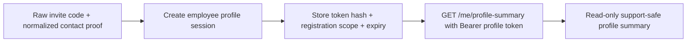

# Sprint contract: MVP-03-employee-profile-session-001

Stage: `mvp`
Parent unit: `MVP-03.04`
Status: `FROZEN`
Created: 2026-05-12
Owner role: stage_builder

## Purpose

Implement the smallest backend/API identity prerequisite for a later safe contact-update slice: issue a short-lived employee profile session only after the already proven raw invite code plus normalized contact match, then use that session for a read-only authenticated `me/profile-summary` lookup.

This contract does not implement contact update, employee UI, login/password setup, `User`, `OrgMembership`, subscriptions/seats, support tickets, HR reporting, diagnostics, points, CMS, rewards, real-data operations, full `MVP-03`, the MVP stage or any human-gate closure.

## Latest PASS State To Preserve

- Latest verified scoped slice is `MVP-03-profile-contact-summary-001` with fresh verifier `PASS`; aliases/evidence/verdict/status are synchronized.
- `MVP-03-admin-sensitive-access-audit-001` PASS and immutable refs are preserved.
- Current backend has read-only `POST /api/v1/employee-registrations/profile-summary`, requiring raw invite code plus matching normalized fullName/email/phone.
- `apps/web` remains non-mutating for consent/profile/contact flows until a trustworthy employeeRegistrationId/session bridge exists.
- Current MVP-03 and human gates remain open.

## Rationale

`MVP-03.04` includes profile, contact update and support-ready identity basics. The previous slice proved a safe read-only lookup, but a contact update is still unsafe without a trustworthy employee-bound session. This slice freezes only that prerequisite: a narrow profile-session boundary scoped to an existing employee registration and a read-only `me/profile-summary` call.

The session must not become a shortcut account model. It does not create `User`, `OrgMembership`, organization seat access, product entitlement, password setup, login or SSO.

## Current Code Shape

- Existing registration endpoint: `POST /api/v1/employee-registrations`.
- Existing profile proof endpoint: `POST /api/v1/employee-registrations/profile-summary`.
- Existing profile proof requires raw invite code plus matching normalized fullName/email/phone and returns support-safe summary only.
- Existing backend stack baseline: Spring Boot, Java 21, Maven Wrapper, PostgreSQL, Flyway and OpenAPI/springdoc.
- `packages/api-client` has OpenAPI snapshot/generated contracts and drift checks that must be synchronized for API changes.

## Source Refs

- `docs/stages/MVP.md`: `MVP-03.04` profile, contact update and support-ready identity basics; MVP-03 privacy/human gates remain open.
- `docs/product/b2b-mvp/lemanapro/product-foundation-v1.md`: invite-code registration, identity/contact data for access, communication, support/recovery; real-data handling remains human-gated.
- `docs/architecture/access-and-subscriptions.md`: current access/session boundaries, no `user.organization_id`, no role/subscription shortcuts, human-gated production access policies.
- `docs/architecture/organization-access-subscription-model.md`: `User`/`OrgMembership`/invitation/password setup constraints that this slice must not introduce.
- `docs/architecture/documentation-workflow.md`: doc targets and Mermaid expectations before build.
- `docs/engineering/definition-of-done.md`: backend/schema/API verification, generated client notes, evidence and fresh verifier requirements.

## Affected IDs

- `MVP-03.04`
- `MVP-03-employee-profile-session-001`

## In Scope

- Add a narrow backend/API session creation endpoint:
  - recommended route: `POST /api/v1/employee-registrations/profile-sessions`;
  - request proof fields: raw `inviteCode`, `fullName`, `email`, `phone`;
  - proof must reuse existing invite-code lookup hash and contact normalization/match rules from profile-summary.
- Return a one-time-visible opaque high-entropy profile-session token plus `expiresAt` on successful proof.
- Store only a server-side hash of the profile-session token; never persist or log the raw token.
- Persist sessions in PostgreSQL unless the builder records a concrete safer alternative; if persisted, add an append-only Flyway migration for the session table/indexes.
- Define explicit session lifecycle:
  - recommended TTL: 15 minutes;
  - revoke previous unexpired profile sessions for the same registration on successful new session creation;
  - read-only profile-summary lookup does not consume the session;
  - expired or revoked sessions fail authorization.
- Add read-only authenticated profile endpoint:
  - recommended route: `GET /api/v1/employee-registrations/me/profile-summary`;
  - authentication: `Authorization: Bearer <profile-session-token>`;
  - successful response returns only support-safe profile summary fields from the existing verified profile-summary contract.
- Return safe structured errors:
  - `400` for invalid proof input;
  - `401` for missing/malformed/expired/revoked/unknown profile-session bearer token;
  - `404` for failed invite+contact proof or missing registration, without distinguishing enumeration-sensitive cases.
- Keep controllers thin; proof, token hashing, expiry, revocation and lookup rules live in service/domain code.
- Update OpenAPI/springdoc source, OpenAPI snapshot and generated `packages/api-client` artifacts/checks.
- Add focused JUnit/Testcontainers coverage for session creation success, failed proof, invalid input, me lookup success, missing/malformed/expired/revoked/unknown token, previous-session revocation, no contact mutation and runtime OpenAPI.
- Update canonical docs: `docs/architecture/access-and-subscriptions.md` should document the MVP employee profile-session boundary and include a small Mermaid flow unless the builder proves no canonical decision changed.
- Record evidence, docs-sync decision, human gates and fresh verifier result.

## Out Of Scope

- Contact update/mutation.
- Employee profile UI, consent/profile/contact mutations in `apps/web`, browser screenshots.
- Login, password setup, account recovery, SSO/SCIM, full auth framework or product session.
- `User`, `OrgMembership`, organization invitations/codes beyond the existing invite-code registration proof, subscriptions, seats, entitlements, `pro_user`, `premium`.
- Support tickets, support operator UI, HR reporting, diagnostics/routing, learning progress, points/wallet, rewards, merch, CMS/content changes.
- Admin UI or admin auth/role/audit policy changes beyond preserving existing behavior.
- Real employee/customer/personal/financial data.
- Full `MVP-03`, MVP stage or human-gate closure.

## Acceptance Checklist

- Session creation endpoint exists and requires raw invite code plus matching normalized fullName/email/phone before issuing any session.
- Profile-session token is opaque, high-entropy, non-JWT, returned only once and stored only as a server-side hash.
- Expiry, revocation and consumption policy is implemented and tested: 15-minute or explicitly documented short TTL, previous active sessions revoked on new creation, read-only me lookup does not consume, expired/revoked sessions rejected.
- Authenticated `me/profile-summary` works only with a valid unexpired profile-session bearer token.
- Successful `me/profile-summary` response includes only support-safe fields already allowed by profile-summary: `employeeRegistrationId`, normalized `fullName`, `email`, `phone`, `tenantId`, `pilotLaunchId`, `accessPoolId`, `registeredAt`, and a session/proof boolean/key if needed.
- Failure responses use safe `400`/`401`/`404` semantics and do not echo raw token, raw invite code, fullName/email/phone values, lookup hash, activation subject ref, legal bodies, diagnostics, points, HR/reporting data or stored PII.
- No contact update or mutation of employee contact fields occurs.
- No UUID-only public profile lookup is introduced.
- No `User`, `OrgMembership`, subscription, seat, `pro_user`, `premium`, login/password setup or SSO shortcut is introduced.
- OpenAPI snapshot and generated client artifacts/checks are synchronized from backend source.
- Append-only Flyway migration is present if sessions are persisted; Flyway/Testcontainers proof covers it.
- Tests use synthetic `.test` data only.
- Canonical docs sync is completed or an exact no-doc-change reason is recorded; expected doc target is `docs/architecture/access-and-subscriptions.md` with Mermaid session-flow diagram.
- Human gates and full `MVP-03` remain open.
- Fresh verifier PASS is required before this slice is marked passing.

## Expected Files

- New or extended `apps/api/src/main/java/com/finrhythm/api/registration/service/**`.
- New or extended `apps/api/src/main/java/com/finrhythm/api/registration/web/**`.
- If persisted, next append-only migration under `apps/api/src/main/resources/db/migration/` for employee profile sessions.
- Focused tests in `apps/api/src/test/java/com/finrhythm/api/registration/EmployeeRegistrationControllerIT.java` or a new narrow IT.
- `packages/api-client/openapi/finrhythm-api.openapi.json`.
- `packages/api-client/scripts/generate-contracts.mjs` and `check-openapi-drift.mjs` if generator/drift scripts need the new DTO/routes.
- Generated `packages/api-client/src/generated/contracts.ts` and `dist/**`.
- Canonical docs target: `docs/architecture/access-and-subscriptions.md`.

## Proof Plan

- Java 21 proof with explicit `JAVA_HOME=/opt/homebrew/opt/openjdk@21/libexec/openjdk.jdk/Contents/Home` if unqualified Java remains unavailable.
- `cd apps/api && ./mvnw -q -Dtest=EmployeeRegistrationControllerIT test` or a focused profile-session IT.
- `cd apps/api && ./mvnw -q test`.
- `cd apps/api && ./mvnw -q verify`.
- `pnpm --filter @finrhythm/api-client build`.
- `pnpm --filter @finrhythm/api-client check:generated`.
- `pnpm --filter @finrhythm/api-client check:openapi-drift`.
- `pnpm --filter @finrhythm/api-client typecheck`.
- `make verify`, `make test-unit`, `make build` when Java proof exists.
- JSON validation and `git diff --check -- . ':(exclude).agent/stages/**/raw/**'`.
- Guardrail scans for raw token/invite/contact echo, token/hash persistence leaks, activation subject ref leaks, UUID-only lookup, contact mutation, auth/session/account shortcuts, `User`/`OrgMembership`/subscription/seat/pro_user/premium shortcuts and real data.
- Fresh `stage_verifier`.

## Docs Sync

Expected canonical doc change: update `docs/architecture/access-and-subscriptions.md` with a current MVP employee profile-session boundary and a small Mermaid flow:

The doc must state that this boundary is not a `User` session, not `OrgMembership`, not an entitlement, not login/password setup, not SSO and not contact update.

## Human Gates

Remain open:

- legal/privacy wording and consent copy;
- real employee/customer data processing;
- customer-specific HR/reporting boundaries;
- production admin auth/role/audit policy;
- support answer policy for sensitive topics;
- final financial correctness of lessons/diagnostics/quizzes/explanations;
- reward economy, stock, prices and fulfillment;
- production-ready content approval.
