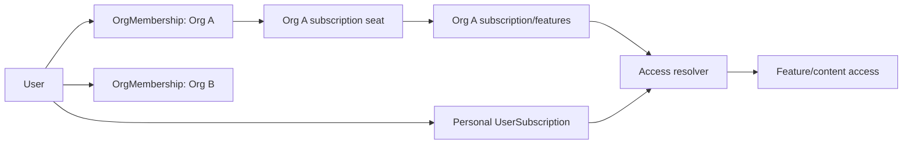
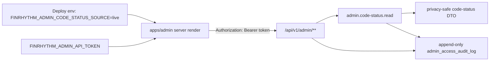
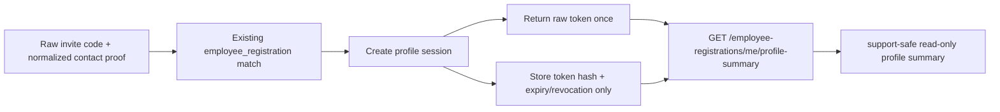

# Access, organizations and subscriptions

Этот документ фиксирует базовую модель доступа для B2B seats/pro-seats, будущей B2C Pro-подписки, ролей и участия пользователя в нескольких организациях.

Детальная модель сущностей, приглашений, organization codes, подписок, seats, индексов и acceptance-транзакций живёт в `docs/architecture/organization-access-subscription-model.md`. При разработке account/organization/access/subscription slices нужно читать оба документа: этот файл задаёт guardrails и human gates, detailed model задаёт рекомендуемые сущности и lifecycle.

## 1. Решение

FinLit разделяет source records доступа, access resolver и RBAC:

- B2B corporate access: `org_subscriptions -> org_subscription_seats -> organization-scoped access`;
- B2C Pro-подписка пользователя: `user_subscriptions -> user-scoped access`;
- для сложных future slices допустим materialized/projection слой `entitlement_grant`, если он строится из canonical source records and не заменяет их;
- роли и permissions остаются отдельной RBAC-моделью для административных и операционных полномочий.

Подписка, pro-seat или premium-доступ не являются ролью. Роль описывает ответственность и полномочия, например `org.admin`, `hr`, `analyst`, `content.editor`. Product access описывается активным source record или entitlement/projection, например доступом к Pro-лекциям, магазину или расширенной аналитике.

## 2. Базовые принципы

1. `users` не должен содержать единственный `organization_id`.
2. Участие пользователя в организациях моделируется через `org_membership`.
3. MVP может временно ограничивать пользователя одной активной employee membership на уровне бизнес-логики, но схема и доменная модель не должны блокировать несколько организаций.
4. B2B pro-seat действует только в рамках организации или membership, из которой он выдан.
5. B2C Pro принадлежит пользователю лично и не должен становиться видимым HR/admin другой организации без отдельного support/legal основания.
6. Проверка доступа отвечает на вопрос "есть ли активный source record / entitlement для нужного контекста", а не "есть ли роль `pro_user`".
7. Коммерческие, billing, pricing, paywall and external-contract decisions остаются human-gated до отдельного stage/slice approval.

## 3. Концептуальная схема

```text
User
Organization
OrgMembership
  - user_id
  - organization_id
  - status
  - member_type
  - joined_at
  - ended_at

Role
Permission
RolePermission
RoleAssignment
  - principal_type: user | group | org_membership
  - principal_id
  - role_id
  - scope_type: organization | global | resource
  - scope_id
  - valid_from
  - valid_until

EntitlementDefinition
PlanEntitlement
EntitlementGrant
  - beneficiary_type: user | organization | group | org_membership
  - beneficiary_id
  - entitlement_key
  - scope_type: global | organization | course | content | feature
  - scope_id
  - source_type: b2c_subscription | org_contract | seat_assignment | promo | manual
  - source_id
  - valid_from
  - valid_until
  - revoked_at
```

`EntitlementGrant` здесь является optional resolver/projection layer для slices, которым нужен единый механизм проверки разных источников доступа. Минимальная implementation slice может проверять `UserSubscription`, `OrgSubscription` and `OrgSubscriptionSeat` напрямую, но не должна смешивать personal and organization contexts или кодировать Pro-доступ через роль.

## 4. B2B corporate seats and pro-seats

B2B seats/pro-seats являются продуктовым отображением внешнего коммерческого договора. Оплата, цена, количество и юридические условия согласуются с Organization вне приложения; внутри продукта хранится операционная подписка, квота и назначение мест.

```text
OrgSubscription
  - organization_id
  - plan_id
  - status: active | past_due | cancelled | expired
  - seats_limit
  - current_period_end
  - custom_config
  - provider
  - provider_subscription_id

OrgSubscriptionSeat
  - org_subscription_id
  - org_membership_id
  - status: active | released
  - assigned_at
  - released_at
```

Рекомендуемая связь seat — через `org_membership_id`, а не напрямую через `user_id`. Это не даёт pro-seat одной Organization протечь в другую организацию пользователя.

Если нужна упрощённая первая реализация, допустим временный `organization_id + user_id` в assignment при обязательном unique/check на active membership. Но canonical target остаётся `org_membership_id`, а detailed lifecycle берётся из `docs/architecture/organization-access-subscription-model.md`.

## 5. B2C Basic and Pro

Basic является дефолтным состоянием пользователя и не обязан иметь отдельную строку подписки. Pro моделируется как пользовательская подписка.

```text
Plan
  - code: basic | team | enterprise | personal_pro
  - scope: user | organization
  - is_pro
  - features_config

UserSubscription
  - user_id
  - plan_id
  - status: active | past_due | cancelled | expired
  - started_at
  - current_period_end
  - cancel_at_period_end
  - provider
  - provider_subscription_id
```

Pro может давать доступ на:

- доступ к магазину;
- расширенную кастомизацию кабинета;
- дополнительные теоретические и учебные материалы;
- другие features, явно включённые в `plans.features_config` или future `plan_entitlement`.

Billing lifecycle не должен жить в `role_assignment`. Trial, grace period, renewal, cancellation, refund, provider IDs and payment status принадлежат B2C subscription/billing layer.

## 6. Access resolution

Доступ вычисляется по активным source records текущего контекста. Личный Pro не расширяет корпоративный доступ, а корпоративная Pro-подписка не расширяет личное пространство пользователя.

```text
hasAccess(user, access_key, active_org_id):
  if personal context:
    active UserSubscription for user with matching Plan/features
  if organization context:
    active OrgMembership in active_org_id
    AND required permission, if action requires permission
    AND active OrgSubscription for active_org_id
    AND active OrgSubscriptionSeat for OrgMembership, if feature consumes seat
  OR approved promo/manual grant scoped to user/org/content, if such source is introduced
```

Если пользователь состоит в нескольких организациях, product flow должен явно знать `active_org_id` для B2B-контекста. Личная B2C Pro-подписка действует только в personal context, а B2B pro-seat должен быть scoped к Organization или `OrgMembership`.



## 7. Roles and permissions

RBAC отвечает за административные действия:

- `org.admin` может управлять approved seats and organization settings внутри своей организации;
- `hr` или `analyst` может видеть только разрешённые агрегированные отчёты;
- `content.editor` может редактировать материалы в CMS;
- `support.operator` может выполнять approved support-действия с audit trail.

Запрещённые shortcut-и:

- `pro_user` как роль для продуктового доступа;
- `subscription` как role assignment с `expires_at`;
- доступ к B2B pro-функциям без organization/membership scope;
- раскрытие B2C subscription state HR/admin организации без отдельного правового и support-сценария.

### 7.1 Current MVP admin API boundary

До появления полноценной модели admin identity/RBAC текущая live-точка code-status в `apps/api` защищается deploy-configured bearer token из `FINRHYTHM_ADMIN_API_TOKEN`. Этот токен не является ролью пользователя, подпиской, pro-state или customer-facing entitlement; он только выдаёт технический permission `admin.code-status.read` для минимальной операторской read-only поверхности.

Live-режим `apps/admin` выбирается только server-side env (`FINRHYTHM_ADMIN_CODE_STATUS_SOURCE=live`), а не query-параметром. Fixture остаётся дефолтным режимом для локальной разработки.

Текущая MVP admin boundary пишет append-only audit rows для успешного чтения code-status, missing/invalid bearer-token attempts на известном code-status route и default-denied попыток под `/api/v1/admin/**`. В audit log допускаются только безопасные технические metadata: timestamp, method, route template or coarse normalized admin path without query string, action, permission, parsed tenant/pilotLaunch/accessPool UUID scope when safely available, status code, outcome and non-secret principal type/ref. Raw bearer token, raw invite code, activation subject ref, employee contact PII, request/response bodies, full query strings and legal text bodies must not be persisted. Это не вводит persisted admin users, sessions, full RBAC, `User`, `OrgMembership`, subscriptions or seat shortcuts; production admin auth/role/audit policy remains human-gated.



Когда в отдельном slice появятся admin users, sessions or persisted RBAC, этот boundary должен быть заменён или подключён к canonical `OrgMembership`/`Role`/`Permission` модели без shortcut-ролей вроде `pro_user`.

### 7.2 Current MVP employee profile-session boundary

До появления полноценной модели `User`, employee login/password setup и `OrgMembership` текущая MVP employee boundary для профиля остаётся привязанной к `employee_registrations`. Короткоживущая profile session создаётся только после повторной проверки raw invite code plus normalized `fullName`/`email`/`phone` against the existing registration. Это не является общим логином, password setup, account recovery, entitlement, subscription, seat or RBAC role.

Profile-session token is opaque, high-entropy and non-JWT. Backend returns the raw token only once in `POST /api/v1/employee-registrations/profile-sessions`, stores only a SHA-256 token hash in `employee_profile_sessions`, applies a short TTL and revokes previous active sessions for the same registration when a new one is created. `GET /api/v1/employee-registrations/me/profile-summary` uses this bearer token only for read-only support-safe profile summary. Contact update remains a separate later slice that must freeze mutation semantics, auditability and identity proof before implementation.

Profile-session storage must not persist raw invite code, raw profile token, lookup hash, activation subject ref, employee contact values beyond the existing registration record, request/response bodies, diagnostics, points, HR/reporting data or legal text bodies. This boundary does not add `users.organization_id`, `User`, `OrgMembership`, subscription, seat, `pro_user` or `premium` shortcuts.



## 8. MVP boundary

MVP остаётся B2B-first пилотом без in-app подписки и платежей. Текущий MVP может реализовывать `tenant`, `pilotLaunch`, `accessPool`, invite codes and registration без полной subscription/seat модели.

Однако любые новые account, organization, admin role, access, seat, billing or subscription slices должны следовать этому документу and `docs/architecture/organization-access-subscription-model.md`. Если stage решает временно отложить полную модель, evidence должен явно зафиксировать:

- почему достаточно текущего `tenant/pilotLaunch/accessPool/invite` boundary;
- что не добавлен `user.organization_id`;
- что нет `pro_user`/`premium` role shortcut;
- какие migration/backfill assumptions нужны для будущего `org_membership`, `user_subscriptions`, `org_subscriptions`, `org_subscription_seats` and optional `entitlement_grant`.

## 9. Human gates

Следующие решения нельзя закрывать только агентной работой:

- pricing, тарифы, paywall and refund policy;
- внешний B2B contract model and seat quantity/pricing rules;
- B2C billing provider, legal terms and payment copy;
- правила доступа к магазину и reward economy for paid tiers;
- раскрытие или скрытие B2C subscription state для support/admin;
- customer-specific reporting boundaries and real employee data processing.
