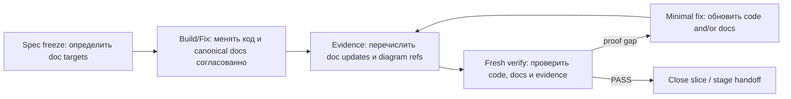

# Documentation Workflow

Статус: accepted  
Обновлено: 2026-05-03

## Назначение

Этот документ задаёт обязательный `doc-sync` для agent-first разработки FinLit. Цель — не допускать расхождения между кодом, stage artifacts, архитектурными решениями, API contract and canonical docs.

## Когда doc-sync обязателен

Агент обязан обновить документацию в том же logical slice, если он:

- изменил user behavior, business rule, product contract or operating flow;
- уточнил неоднозначность и фактически принял новое решение по architecture, integration, status model, workflow or data;
- изменил API contract, setup/runtime expectations or developer workflow;
- добавил важный module, boundary, integration path or proof policy;
- обнаружил contradiction между текущей документацией и реализованным решением.

Молчаливый documentation drift считается workflow defect.

## Куда писать canonical changes

Обновляй самый узкий source of truth:

- product/stage scope: `docs/stages/*.md` only when changing stage baseline intentionally;
- repo-wide architecture and stack: `docs/architecture/source-of-truth.md`;
- doc-sync and harness policy: `AGENTS.md`, this document, `.agents/skills/stage-launch-proof-loop/*`;
- API contract: Spring/OpenAPI source in `apps/api` and generated client notes;
- setup/runtime: `README.md`, `docs/setup/codex-setup.md`, `docs/architecture/init-and-dev-contract.md`;
- backend local rules: `apps/api/AGENTS.md`;
- human gates and DoD: `docs/engineering/*.md`.

Stage artifacts in `.agent/stages/<stage_id>/` are required for handoff and proof, but they do not replace canonical docs.

## Что должно попадать в evidence

Every non-trivial slice must record:

- canonical docs updated;
- decisions made or clarified;
- Mermaid diagram refs added/refreshed;
- explicit note when docs did not need changes;
- any deferred doc debt with exact reason.

## Диаграммы

Use Mermaid when text alone would not explain the system safely. Diagrams are especially expected for:

- state machines and lifecycle flows;
- stage/orchestrator handoff paths;
- auth/session, points ledger, redemption, support and CMS publishing flows;
- retry/conflict/idempotency paths;
- multi-module data flow.

Rules:
- keep diagrams small and targeted;
- update existing diagrams instead of creating contradictory ones;
- explain what the diagram fixes and what it does not cover.

## Doc-sync loop

Material docs drift is a verifier proof gap.
