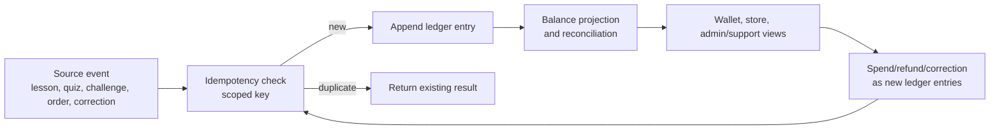

# Production readiness contract: infra and points

Статус: accepted
Обновлено: 2026-05-12

## Назначение

Этот документ фиксирует узкий readiness contract для production infrastructure и points ledger перед deployment/rewards slices. Он закрывает документационный пробел readiness-аудита, но не реализует IaC, deploy pipeline, database schema, points wallet, reward catalog, redemption или merch fulfillment.

До появления отдельного frozen slice этот документ является canonical guardrail для вопросов:

- что должно быть описано до первого production deployment;
- какие environment/IaC prerequisites должны быть зафиксированы до работы с реальными окружениями;
- какие append-only and idempotency prerequisites обязательны до начисления, списания, возврата или ручной корректировки `points`.

## Scope boundaries

In scope:

- readiness outline для `infra/yc` и production environment contract;
- TODO contract для будущего IaC slice;
- prerequisites для future append-only points ledger;
- proof gates, которые future slices должны закрыть evidence before deploy/rewards enablement.

Out of scope:

- выбор окончательного IaC toolchain;
- создание Yandex Cloud resources;
- secrets, реальные environment values and customer data;
- Flyway migrations, API endpoints, UI, generated clients;
- утверждение reward economy, points prices, real merch availability or fulfillment operations.

## Production infra readiness outline

`infra/yc` remains a placeholder until a dedicated infra slice adds reviewed IaC. Production resources must not be created by undocumented console-only steps and must not depend on state that cannot be reproduced from repository-controlled docs/IaC.

Before any production deployment slice, the repository must contain:

| Area | Required readiness contract |
|------|-----------------------------|
| IaC ownership | Explicit IaC tool, directory layout under `infra/yc`, state storage/locking approach and review procedure. |
| Environment matrix | Separate `dev`, `stage` and `prod` environment names, domains, service names and database names. Real values may live outside the repo, but required keys must be documented. |
| Secrets | Secret names, owners, rotation expectations and runtime injection path. No secrets, tokens, passwords, invite codes or real employee data in git. |
| Managed PostgreSQL | Database sizing assumption, SSL requirement, backup/PITR policy, restore drill, migration identity, runtime identity and least-privilege grants. |
| Migrations | Release procedure for Flyway migrations, rollback/forward-fix policy and explicit ban on ad hoc production schema changes. |
| Serverless containers | Image build source, immutable image tag/digest policy, health/smoke endpoint expectations and runtime env contract for web/admin/api surfaces. |
| Object Storage | Bucket purposes, private/public boundary, lifecycle policy and import/export retention expectations. |
| Optional Redis | Allowed only as cache/rate-limit/session acceleration; never as source of truth for points, progress, content, subscriptions or orders. |
| Observability | Application logs, audit logs, metrics, alerts and operational owner for incident triage. |
| Data safety | Synthetic data in non-prod by default; real employee/customer data only after privacy/legal human gates and environment approval. |

Production deployment is not ready until evidence shows:

- IaC plan/review output for the target environment;
- documented env/secrets matrix with no secret values committed;
- backup and restore procedure for PostgreSQL;
- migration dry-run or stage proof for the same migration set;
- smoke checks for deployed web/admin/api surfaces;
- rollback or forward-fix procedure for failed deploys;
- ownership for logs, alerts and incident response.

## Points ledger prerequisites

`points` are non-money product rewards. Any slice that enables accrual, wallet display, spending, refunds, reward reports or merch fulfillment must implement points through an append-only auditable ledger. A cached or projected balance may exist, but it must be derivable from ledger entries and must not be the only source of truth.

Minimum future ledger contract:

| Requirement | Readiness expectation |
|-------------|----------------------|
| Append-only history | Ledger entries are inserted, never updated in place for business corrections. Corrections and refunds are new entries linked to the original event/order. |
| Idempotency | Every grant/spend/refund/correction has a stable idempotency key scoped to actor, rule, source event and tenant/pilot context. Retries must not duplicate points. |
| Context scoping | Entries include user, tenant/pilot or organization context needed to prevent points from leaking across corporate contexts. |
| Source reference | Entries reference the source event, lesson, quiz attempt, practice task, challenge check-in, order or manual adjustment. |
| Non-money semantics | Schema, API, UI copy and exports must not model points as currency, cash, payout, debt relief or guaranteed financial benefit. |
| Spend safety | Spending must be atomic with order creation and must reject insufficient available balance unless a separately approved rule says otherwise. |
| Refund safety | Cancellation/refund creates exactly one compensating ledger entry linked to the spend/order. |
| Manual adjustments | Admin corrections require actor, reason, audit trail and reward-ops visibility. |
| Reconciliation | Admin/support can reconcile ledger entries, projected balances, orders and suspicious duplicate attempts. |
| Privacy | Ledger/reporting exports must follow B2B privacy boundaries and avoid exposing personal financial answers to HR/sponsor roles. |

Expected proof before enabling rewards:

- Flyway migration and domain/service implementation for the ledger;
- concurrency/idempotency tests for duplicate lesson completion, quiz retry, challenge check-in, order spend, cancellation refund and manual correction;
- audit/reconciliation evidence for support/admin views;
- OpenAPI/client sync if the ledger is exposed to web/admin;
- human-gate status for reward economy rules, merch prices, real stock and fulfillment operations.

The diagram is a readiness shape, not an implementation design. Future slices must still freeze schema names, APIs, transaction boundaries and tests before coding.

## Cross-slice gates

The following work must reference this contract in its spec/evidence before it can be marked done:

- production or stage deployment to Yandex Cloud;
- enabling real environment variables, secrets or customer data paths;
- points wallet, points history or reward balance UI;
- lesson/quiz/practice/challenge accrual;
- store/redemption, merch order cancellation/refund or manual points correction;
- reward/merch/operator exports and HR/sponsor reports that include points or rewards.

Human approval remains required for real reward rules, real merch catalog, stock, fulfillment procedures, legal/privacy wording and any customer-specific handling of employee data.
