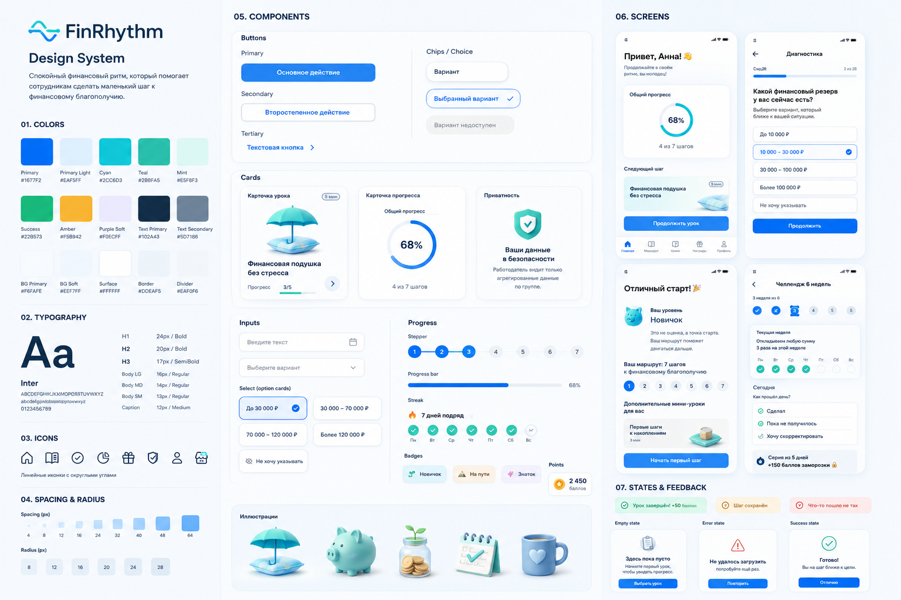

# FinRhythm Design System

> **Canonical note**
>
> Этот markdown-файл является рабочим baseline дизайн-системы для B2B-first MVP. Он может использоваться багентом / B-agent / coding-agent / design-agent как source-of-truth для UI-стиля, дизайн-токенов, экранных паттернов и QA визуальной консистентности. PNG reference board является визуальным companion artifact, но не заменяет markdown baseline.



**Стиль:** Calm Progress Fintech / «спокойный финансовый ритм»
**Назначение:** mobile-first дизайн-система для B2B-first приложения финансового благополучия сотрудников.
**Главная задача:** передать ощущение спокойствия, приватности, понятного прогресса и маленьких достижимых финансовых шагов.

> **Короткая формула**
>
> FinRhythm Design System — это спокойная mobile-first дизайн-система для финансового благополучия сотрудников: светлая, мягкая, доверительная, с акцентом на маленькие действия, личный прогресс, приватность и поддержку без стыда.

---

## 1. Product design intent

FinRhythm — не банковское приложение, не брокерский сервис, не корпоративный экзамен и не публичный рейтинг финансовой грамотности. Это мягкий финансовый тренер в телефоне, который помогает сотруднику разобраться с личными финансами через короткие уроки, диагностику, персональный маршрут, челленджи, баллы и награды.

Интерфейс должен ощущаться как:

> «Я в безопасном пространстве. Меня не оценивают. Мне показывают один понятный шаг, который я могу сделать сегодня».

Интерфейс не должен ощущаться как:

> «Меня тестируют», «работодатель видит мои слабые места», «мне навязывают финансовый продукт», «я попал в сложный банковский интерфейс».

Ключевые продуктовые ограничения, которые влияют на дизайн:

- продукт запускается как **B2B-first mobile web**;
- employee-facing UI использует **нейтральный бренд**, без бренда работодателя;
- пользователь проходит **диагностику, маршрут, короткие уроки, практические задания, челленджи и магазин наград**;
- точные личные финансовые суммы, документы, фото и банковские скриншоты не должны быть обязательными для прохождения;
- HR-аналитика по умолчанию агрегированная, а не персонально-контролирующая;
- геймификация поддерживает действие, но не превращает продукт в соревнование или азартную игру.

---

## 2. Style personality

### 2.1. Основные ассоциации

- спокойствие;
- финансовая опора;
- маленький следующий шаг;
- доверие;
- приватность;
- мягкий прогресс;
- личный ритм;
- забота без давления;
- практичность;
- светлый fintech.

### 2.2. Архетип

**Спокойный наставник / финансовый тренер.**

Он:

- объясняет просто;
- не стыдит;
- не сравнивает с коллегами;
- не давит срочностью;
- не обещает быстрых финансовых результатов;
- помогает выбрать безопасное действие;
- напоминает, что начать можно с малого.

### 2.3. Визуальная метафора

Главная метафора — **ритм**.

Она выражается через:

- волнообразный знак в логотипе;
- плавные фоновые волны;
- progress path;
- stepper 1–7;
- weekly rhythm в челлендже;
- фразы «в своём ритме», «маленький шаг», «ритм появился».

Метафора не должна становиться слишком музыкальной или декоративной. Здесь «ритм» — это регулярность, спокойствие и возвращение к действию.

---

## 3. Design principles

### 3.1. Calm first

Тема денег часто вызывает тревогу. Поэтому интерфейс должен снижать напряжение: светлый фон, мягкие цвета, понятные тексты, отсутствие красных наказаний и агрессивных визуальных акцентов.

### 3.2. One screen — one thought

Один экран должен содержать одну главную мысль или одно действие. Это особенно важно для mobile web и microlearning.

### 3.3. Privacy is visible

Приватность нельзя прятать в мелкий юридический текст. В чувствительных сценариях нужны отдельные privacy-card, shield/lock метафоры и понятные объяснения: кто что видит, какие данные не передаются HR и почему точные суммы можно не указывать.

### 3.4. Progress without pressure

Прогресс — личный и поддерживающий. Нельзя создавать ощущение гонки, публичного рейтинга или сравнения сотрудников.

### 3.5. Gamification supports behavior

Баллы, streak и магазин нужны для возврата и закрепления действий, а не для фарма, соревнования или азарта.

### 3.6. Soft correction, no shame

Ошибки в тестах и пропуски в челлендже не должны выглядеть как провал. Текст и визуальные состояния должны помогать вернуться.

### 3.7. Practical over academic

Дизайн урока должен вести к действию: выбрать сумму/диапазон, правило, чек-лист, привычку, цель или check-in. Длинная теория и перегруженные финансовые таблицы не подходят для MVP-стиля.

---

## 4. Color system

### 4.1. Color direction

Палитра строится на светлом фоне, уверенном синем CTA, бирюзово-cyan брендовом акценте, мягком mint/success для завершения и тёплом amber для баллов и наград.

Цвета не должны выглядеть как классический тяжёлый banking UI. Общий визуальный тон — светлый, мягкий, чистый, но не детский.

### 4.2. Core palette

| Token | HEX | Role | Usage |
|---|---:|---|---|
| `color-bg-primary` | `#F6FAFE` | App canvas | Основной фон приложения |
| `color-bg-soft` | `#EEF7FF` | Soft background | Информационные блоки, спокойные секции |
| `color-surface-primary` | `#FFFFFF` | Surface | Карточки, поля, модальные окна |
| `color-surface-blue` | `#EAF5FF` | Blue surface | Активные карточки, privacy-блоки |
| `color-primary` | `#1677F2` | Primary action | Основной CTA, progress, активные состояния |
| `color-primary-hover` | `#0F63D8` | Primary pressed | Hover / pressed / active для primary |
| `color-primary-soft` | `#D8ECFF` | Selected bg | Фон selected-состояний |
| `color-cyan` | `#2CC6D3` | Brand accent | Логотип, волны, иллюстрации |
| `color-teal` | `#2BBFA5` | Progress accent | Завершённые шаги, поддержка |
| `color-mint` | `#E5F8F3` | Success surface | Мягкие success-блоки |
| `color-success` | `#22B573` | Success icon | Completed, check, positive state |
| `color-amber` | `#F5B942` | Reward | Баллы, монеты, награды |
| `color-purple-soft` | `#F0ECFF` | Optional surface | Optional «Знаток», bonus lessons |
| `color-error-soft` | `#FFEAEA` | Error surface | Мягкий error state |
| `color-error` | `#E84D4F` | Error icon/text | Ошибки, использовать редко |
| `color-warning-soft` | `#FFF4DE` | Warning surface | Мягкие предупреждения |
| `color-warning` | `#D98A00` | Warning text/icon | Осторожные подсказки |

### 4.3. Neutral palette

| Token | HEX | Usage |
|---|---:|---|
| `color-text-primary` | `#102A43` | Основной текст, заголовки |
| `color-text-secondary` | `#5D7186` | Описания, подписи |
| `color-text-muted` | `#8EA4B8` | Metadata, disabled text |
| `color-border` | `#DDEAF5` | Границы карточек и инпутов |
| `color-divider` | `#EAF0F6` | Разделители |
| `color-icon-default` | `#294B68` | Основные outline-иконки |
| `color-disabled-bg` | `#F1F4F7` | Disabled controls |
| `color-disabled-text` | `#9AAABD` | Disabled text |

### 4.4. Gradients

Градиенты должны быть мягкими, свежими и умеренными.

```css
--gradient-brand: linear-gradient(135deg, #1677F2 0%, #2CC6D3 100%);
--gradient-calm: linear-gradient(180deg, #F6FAFE 0%, #EEF7FF 100%);
--gradient-success-soft: linear-gradient(135deg, #E5F8F3 0%, #EAF5FF 100%);
--gradient-reward-soft: linear-gradient(135deg, #FFF4DE 0%, #EAF5FF 100%);
```

### 4.5. Color rules

**Do:**

- использовать blue для действия и структуры;
- использовать teal/mint для progress/completed;
- использовать amber только для rewards/points;
- использовать soft surfaces для чувствительных подсказок;
- оставлять много белого пространства.

**Don’t:**

- использовать агрессивный красный для пропуска streak;
- делать интерфейс тёмным и тяжёлым;
- использовать gold/amber как основной цвет CTA;
- превращать reward-UI в казино-стилистику;
- использовать кислотные fintech-градиенты.

---

## 5. Typography

### 5.1. Font direction

Рекомендуемый тип шрифта: современный humanist sans-serif, дружелюбный и хорошо читаемый на мобильных экранах.

Подойдут:

- Inter;
- Manrope;
- Graphik;
- SF Pro;
- IBM Plex Sans;
- аналогичный нейтральный sans-serif.

### 5.2. Type scale

| Token | Size | Line height | Weight | Usage |
|---|---:|---:|---:|---|
| `text-display-sm` | 28–32 px | 36–40 px | 700 | Редкие hero-заголовки |
| `text-h1` | 24 px | 32 px | 700 | Заголовок экрана |
| `text-h2` | 20 px | 28 px | 700 | Заголовок секции |
| `text-h3` | 17–18 px | 24 px | 600 | Заголовок карточки |
| `text-body-lg` | 16 px | 24 px | 400/500 | Основной текст |
| `text-body-md` | 14–15 px | 22 px | 400 | Описание, уроки |
| `text-body-sm` | 13 px | 18 px | 400 | Подписи, metadata |
| `text-caption` | 11–12 px | 16 px | 500 | Статусы, бейджи, nav labels |
| `text-button` | 15–16 px | 20 px | 600 | Кнопки |

### 5.3. Typography rules

- Заголовки должны быть короткими и человеческими.
- Не использовать финансовый жаргон без объяснения.
- Не перегружать экран числами.
- В sensitive-сценариях текст privacy должен быть читаемым, не меньше `body-sm`.
- Основной текст урока лучше держать в пределах 400–600 знаков на экран.
- CTA должен быть конкретным: «Продолжить урок», «Выбрать комфортную сумму», «Зафиксировать шаг».

---

## 6. Spacing, grid and radius

### 6.1. Spacing scale

| Token | Value | Usage |
|---|---:|---|
| `space-2xs` | 4 px | Иконка + текст, мелкие gaps |
| `space-xs` | 8 px | Chips, compact rows |
| `space-sm` | 12 px | Внутренние gaps карточки |
| `space-md` | 16 px | Базовый vertical rhythm |
| `space-lg` | 24 px | Screen padding, секции |
| `space-xl` | 32 px | Крупные секции |
| `space-2xl` | 40 px | Hero spacing |
| `space-3xl` | 48 px | Большие отступы |
| `space-4xl` | 64 px | Landing / presentation layout |

### 6.2. Layout tokens

| Token | Value | Usage |
|---|---:|---|
| `screen-padding-mobile` | 20–24 px | Боковые поля mobile |
| `screen-padding-desktop` | 32–48 px | Desktop / dashboard |
| `card-padding-sm` | 12 px | Compact card |
| `card-padding-md` | 16 px | Standard card |
| `card-padding-lg` | 20 px | Rich card |
| `section-gap` | 24–32 px | Между секциями |
| `component-gap` | 12–16 px | Между компонентами |
| `bottom-nav-height` | 64–72 px | Mobile bottom nav |

### 6.3. Radius scale

| Token | Value | Usage |
|---|---:|---|
| `radius-xs` | 8 px | Badges, small chips |
| `radius-sm` | 12 px | Chips, compact buttons |
| `radius-md` | 14 px | Inputs, primary buttons |
| `radius-lg` | 16 px | Standard cards |
| `radius-xl` | 20 px | Large cards, lesson blocks |
| `radius-2xl` | 24 px | Hero cards, phone surfaces |
| `radius-round` | 999 px | Pills, progress dots, avatars |

### 6.4. Shadow tokens

```css
--shadow-card: 0 8px 24px rgba(16, 42, 67, 0.08);
--shadow-soft: 0 4px 16px rgba(16, 42, 67, 0.06);
--shadow-floating: 0 12px 32px rgba(16, 42, 67, 0.12);
--shadow-none: none;
```

Shadows должны быть мягкими и почти незаметными. Нельзя использовать тяжёлые тени, создающие ощущение перегруженного SaaS или banking dashboard.

---

## 7. Iconography

### 7.1. Icon style

Стиль иконок: **rounded line icons**.

Параметры:

- stroke: 1.75–2 px;
- rounded line caps;
- rounded joins;
- простая геометрия;
- без агрессивных углов;
- цветные акценты только для важных состояний.

### 7.2. Core icon metaphors

| Смысл | Иконка |
|---|---|
| Приватность | shield, lock |
| Финансовый резерв | umbrella, cushion, piggy bank |
| Прогресс | ring, path, check |
| Накопления | coin, jar, piggy |
| Челлендж | calendar, soft flame |
| Урок | book, card |
| Награды | gift, store |
| Поддержка | heart, chat |
| Профиль | user |
| Маршрут | route, nodes |
| Безопасность | shield-check |
| Баллы | coin-star |

### 7.3. Icon rules

**Do:**

- использовать простые метафоры;
- поддерживать единый stroke;
- сохранять округлую форму;
- использовать иконки как помощников навигации.

**Don’t:**

- использовать реалистичные банковские пиктограммы;
- использовать агрессивные warning-иконки без необходимости;
- делать иконки слишком детализированными;
- смешивать filled, outline и 3D-иконки без правил.

---

## 8. Illustration system

### 8.1. Illustration direction

Иллюстрации должны быть простыми, объёмными, пастельными, без перегруженности.

Подход:

- light 3D / soft vector;
- мягкие градиенты;
- округлые формы;
- крупные понятные объекты;
- минимум деталей;
- бело-голубая светлая среда.

### 8.2. Core illustration set

| Иллюстрация | Где использовать |
|---|---|
| Зонт + подушка | Финансовый резерв, безопасность |
| Копилка | Накопления, баллы, челлендж |
| Банка с монетами / росток | Рост привычки, копилка |
| Календарь с check | Weekly check-in, challenge |
| Кружка | Магазин наград |
| Сумка-шоппер | Мерч |
| Шарф | Мерч high-tier |
| Shield | Privacy-card |
| Волна / rhythm line | Бренд, onboarding, empty state |

### 8.3. Illustration rules

**Do:**

- использовать иллюстрации как эмоциональную поддержку;
- держать размер иллюстрации умеренным;
- использовать soft blue / teal / mint;
- добавлять лёгкое confetti только на milestone.

**Don’t:**

- показывать пачки денег;
- показывать графики «быстрого дохода»;
- использовать стрессовые лица;
- использовать красные кризисные сцены;
- изображать банковские продукты как рекомендацию;
- делать магазин похожим на лутбокс или азартную механику.

---

## 9. Component system

## 9.1. Buttons

### Primary button

Главное действие на экране.

```css
--button-primary-bg: #1677F2;
--button-primary-text: #FFFFFF;
--button-primary-bg-hover: #0F63D8;
--button-height: 52px;
--button-radius: 14px;
--button-padding-x: 20px;
--button-font-weight: 600;
```

Usage:

- «Продолжить»
- «Начать диагностику»
- «Продолжить урок»
- «Выбрать комфортную сумму»
- «Зафиксировать шаг»
- «Пройти мини-квиз»

### Secondary button

Вторичное действие без давления.

```css
--button-secondary-bg: #FFFFFF;
--button-secondary-text: #1677F2;
--button-secondary-border: #DDEAF5;
--button-secondary-bg-hover: #EAF5FF;
```

Usage:

- «Назад»
- «Сделаю позже»
- «Пропустить точную сумму»
- «Посмотреть маршрут»

### Tertiary button

Текстовая кнопка с иконкой.

Usage:

- «Читать дальше»
- «Подробнее о приватности»
- «Задать вопрос»
- «Открыть историю баллов»

### Button copy rules

**Хорошо:**

- «Выбрать комфортный вариант»
- «Зафиксировать маленький шаг»
- «Продолжить в своём ритме»
- «Вернуться к маршруту»

**Плохо:**

- «Срочно исправить»
- «Докажи результат»
- «Победить коллег»
- «Закрыть слабую зону»

---

## 9.2. Cards

Карточки — основной строительный блок интерфейса.

### Standard card

```css
--card-bg: #FFFFFF;
--card-border: 1px solid #DDEAF5;
--card-radius: 16px;
--card-padding: 16px;
--card-shadow: 0 8px 24px rgba(16, 42, 67, 0.08);
```

Usage:

- урок;
- следующий шаг;
- карточка прогресса;
- товар магазина;
- диагностический вариант;
- privacy-block.

### Active card

```css
--card-active-bg: #EAF5FF;
--card-active-border: #1677F2;
--card-active-check: #1677F2;
```

Usage:

- selected option;
- текущий урок;
- активный challenge;
- выбранная привычка.

### Completed card

```css
--card-completed-bg: #E5F8F3;
--card-completed-border: #BDEDE0;
--card-completed-icon: #22B573;
```

Usage:

- завершённый урок;
- выполненный check-in;
- completed milestone.

### Privacy card

```css
--privacy-card-bg: #E5F8F3;
--privacy-card-border: #BDEDE0;
--privacy-card-icon: #2BBFA5;
```

Copy example:

> Ваши личные ответы диагностики не передаются работодателю как персональный отчёт. HR видит агрегированные данные по группе.

---

## 9.3. Inputs

Инпуты должны выглядеть простыми и безопасными.

```css
--input-height: 48px;
--input-radius: 14px;
--input-border: #DDEAF5;
--input-bg: #FFFFFF;
--input-focus-border: #1677F2;
--input-focus-shadow: 0 0 0 4px rgba(22, 119, 242, 0.12);
--input-placeholder: #8EA4B8;
```

Input rules:

- prefer choice cards, chips and ranges over free text for sensitive data;
- always include «не хочу указывать» where relevant;
- never require exact income, debt, account balance or bank screenshots for MVP completion.

---

## 9.4. Choice cards and chips

### Choice card

Large touch-friendly option for diagnostics and practice tasks.

States:

| State | Visual |
|---|---|
| Default | white surface, grey-blue border |
| Selected | soft blue background, primary border, check icon |
| Disabled | disabled bg, muted text |
| Error | soft error bg, but only when necessary |
| Success | mint bg, check icon |

Recommended size:

```css
--choice-min-height: 56px;
--choice-padding: 14px 16px;
--choice-radius: 14px;
```

### Chips

Use for tags, filters and lightweight choices.

Examples:

- «Новичок»
- «На пути»
- «Знаток»
- «5 мин»
- «Практика»
- «Магазин»
- «+50 баллов»

---

## 9.5. Progress components

### Progress ring

Usage:

- dashboard/home;
- общий прогресс маршрута;
- completion summary.

Visual:

- blue/teal active arc;
- pale blue background track;
- percentage in center;
- short supporting label.

### Stepper 1–7

Usage:

- маршрут «Новичок»;
- lesson progress;
- track completion.

States:

| State | Color |
|---|---|
| Completed | teal / green |
| Current | primary blue |
| Upcoming | pale grey-blue |
| Optional | purple soft |
| Locked | muted grey |

### Progress bar

Usage:

- диагностика;
- урок;
- quiz;
- onboarding.

Rules:

- show context: «2 из 28», «Урок 1 из 5»;
- avoid pressure copy like «осталось много»;
- use calm phrasing: «Вы уже прошли 4 из 7 шагов».

---

## 9.6. Streak and challenge

Streak должен быть мягким, без наказания.

Components:

- weekly dots;
- soft flame icon;
- freeze badge;
- check-in buttons;
- missed state card.

Copy examples:

- «7 дней подряд»
- «Серия на 5 дней»
- «Пропуск — не провал. Можно вернуться завтра»
- «Заморозка серии доступна»

Don’t:

- use harsh red for missed days;
- use copy like «серия проиграна»;
- make streak the main source of anxiety.

---

## 9.7. Points and rewards

### Points wallet

Display:

- balance;
- history;
- earned points;
- spent points;
- reward rules;
- disclaimer that points are internal game mechanics.

Visual:

- amber coin icon;
- clear number;
- neutral text;
- no money-equivalent language.

### Reward card

Fields:

- title;
- image/icon;
- price in points;
- availability/status;
- CTA;
- limits if relevant.

Rules:

- no random rewards;
- no loot boxes;
- no aggressive scarcity;
- no cash equivalence.

---

## 9.8. Navigation

### Bottom navigation

Recommended 5 items max:

1. Главная
2. Маршрут / Уроки
3. Челлендж
4. Награды
5. Профиль

Visual:

- icon + label;
- active primary blue;
- inactive muted;
- height 64–72 px;
- safe-area aware.

### Top navigation

Use:

- back arrow;
- title;
- progress context;
- optional help/privacy icon.

Avoid overcrowding.

---

## 9.9. Alerts and states

### Success state

Visual:

- mint surface;
- green check;
- short supportive copy;
- one CTA.

Copy example:

> Готово. Вы на шаг ближе к цели.

### Error state

Visual:

- soft red surface;
- red icon;
- calm text;
- recovery CTA.

Copy example:

> Не удалось сохранить отметку. Попробуйте ещё раз — ваш прогресс важен.

### Empty state

Visual:

- soft illustration;
- low-pressure copy;
- clear next step.

Copy example:

> Здесь пока пусто. Начните первый урок, чтобы увидеть прогресс.

### Warning state

Use for safety tips, not intimidation.

Copy example:

> Не переходите по подозрительным ссылкам и не сообщайте коды из SMS.

---

## 10. Screen patterns

## 10.1. Onboarding

Purpose: создать доверие и объяснить ценность.

Components:

- logo;
- короткий value statement;
- invite code input;
- primary CTA;
- privacy-card;
- 2–3 benefit items.

Example structure:

1. Logo FinRhythm.
2. «Финансовое благополучие начинается с маленьких шагов».
3. Invite code field.
4. CTA «Продолжить».
5. Privacy-card: «Конфиденциально. Работодатель видит агрегированные данные».
6. Benefits: «Добровольно», «Без осуждения», «Практично».

Visual tone: spacious, calm, light.

---

## 10.2. Diagnostics

Purpose: мягкий self-check, не экзамен.

Components:

- progress bar;
- question number;
- short question;
- large option cards;
- selected state with check;
- privacy hint where needed;
- CTA.

Copy principles:

- «Выберите вариант, который ближе к вашей ситуации».
- «Точные суммы можно не указывать».
- «Это нужно, чтобы подобрать маршрут».

Avoid:

- «правильный/неправильный уровень»;
- heavy scoring language;
- shame labels.

---

## 10.3. Diagnostic result

Purpose: показать стартовую точку и маршрут без оценки.

Components:

- celebratory card;
- level badge: «Новичок» / «Знаток-lite»;
- supportive summary;
- 7-step route;
- optional mini-lessons;
- CTA «Начать первый шаг».

Copy example:

> Отличный старт. Ваш маршрут поможет собрать финансовую опору и двигаться дальше в своём ритме.

---

## 10.4. Home

Purpose: личная панель спокойного прогресса.

Components:

- greeting;
- progress ring;
- next step card;
- streak/challenge card;
- points balance;
- 1–7 path;
- bottom nav.

Layout:

- top greeting;
- main progress card;
- next action card;
- compact secondary widgets;
- bottom navigation.

---

## 10.5. Lesson

Purpose: microlearning flow.

Structure:

1. Situation.
2. Why it matters.
3. Rule.
4. Example.
5. Mini-test.
6. Practice.
7. Reward.

Components:

- lesson header;
- estimated time;
- progress dots/bar;
- cards for theory;
- illustration;
- quiz option cards;
- practice choice/checklist;
- reward screen.

Rules:

- one card = one thought;
- no long lectures;
- no dense tables on mobile;
- CTA always tells the next action.

---

## 10.6. Practice task

Purpose: convert knowledge into a small action.

Components:

- prompt;
- choice/range/checklist;
- privacy hint;
- «не хочу указывать» option when sensitive;
- CTA «Зафиксировать шаг».

Examples:

- choose reserve category;
- choose savings rhythm;
- choose 3–5 things to declutter;
- choose tax directions to check;
- choose money trigger;
- choose 1–2 habits.

---

## 10.7. Challenge

Purpose: return loop without pressure.

Components:

- 6-week progress;
- weekly check-in;
- soft missed state;
- freeze bonus;
- check-in choices.

Check-in choices:

- «Сделал»
- «Пока не получилось»
- «Хочу скорректировать»

Copy:

> Если план оказался слишком тяжёлым, уменьшить шаг — нормальное решение.

---

## 10.8. Store / rewards

Purpose: pleasant reward catalog, not marketplace.

Components:

- points balance;
- tabs: «Мерч» / «Бонусы»;
- reward cards;
- price in points;
- availability;
- order status;
- confirmation modal.

Visual tone:

- clean;
- light;
- friendly;
- no casino mechanics.

---

## 10.9. Profile

Purpose: personal settings and trust.

Components:

- user name;
- progress summary;
- points history;
- privacy settings / privacy explanation;
- notification preferences;
- support;
- legal documents.

---

## 10.10. HR dashboard

Purpose: B2B aggregated insight.

Visual difference:

- more structured SaaS layout;
- fewer illustrations;
- charts and cards;
- same palette, calmer density;
- aggregation and privacy boundaries visible.

Dashboard modules:

- activation;
- diagnostic completion;
- route progress;
- lesson completion;
- retention;
- challenge participation;
- store/reward activity;
- support categories;
- pilot outcome.

Rules:

- do not show personal diagnostic answers by default;
- avoid surveillance framing;
- emphasize aggregated insights and program health.

---

## 11. Content design / UX writing

## 11.1. Voice

Voice: **спокойный наставник / финансовый тренер**.

Characteristics:

- clear;
- short;
- warm;
- non-judgmental;
- specific;
- practical;
- privacy-aware.

### Good phrases

- «Можно начать с малого».
- «Выберите комфортный вариант».
- «Точные суммы можно не указывать».
- «Это частая ситуация, с неё можно начать».
- «Пропуск — не провал, можно вернуться завтра».
- «Мы не сравниваем вас с коллегами».
- «Работодатель видит агрегированные данные, а не ваши личные ответы».

### Forbidden phrases

- «Вы неправильно обращаетесь с деньгами».
- «У вас плохой уровень».
- «Срочно исправьте».
- «Докажите результат».
- «Лучшие сотрудники».
- «Финансово слабые участники».
- «Ваш работодатель увидит ваш результат».

---

## 11.2. Button copy

| Context | Good CTA | Avoid |
|---|---|---|
| Onboarding | «Продолжить» | «Войти в систему контроля» |
| Diagnostics | «Ответить и продолжить» | «Пройти проверку» |
| Lesson | «Продолжить урок» | «Изучить обязательный материал» |
| Practice | «Зафиксировать шаг» | «Отчитаться» |
| Challenge | «Отметить check-in» | «Доказать выполнение» |
| Store | «Обменять баллы» | «Купить за деньги» |
| Error | «Попробовать ещё раз» | «Ошибка пользователя» |

---

## 11.3. Privacy copy

Use short, direct, visible privacy copy.

Example:

> Эти ответы нужны, чтобы подобрать маршрут. Работодатель по умолчанию видит только агрегированные данные по группе — без ваших личных финансовых ответов, слабых зон, точных сумм и рефлексий.

For sensitive practice:

> Точные суммы можно не указывать. Выберите диапазон или вариант «не хочу указывать».

For tax:

> Урок носит образовательный характер. Мы не рассчитываем сумму вычета и не проверяем право на вычет. Актуальные условия нужно проверять на официальных ресурсах.

---

## 12. Motion and micro-interactions

### 12.1. Motion principles

Motion должен быть мягким и функциональным.

Use:

- card fade-in;
- progress ring animation;
- soft success pulse;
- subtle bottom sheet transition;
- skeleton loaders;
- small milestone confetti.

Avoid:

- aggressive bounce;
- flashing;
- heavy gamified explosions;
- casino-like reward animations;
- anxiety-inducing countdowns.

### 12.2. Timing

| Motion | Duration |
|---|---:|
| Button press feedback | 100–150 ms |
| Card enter | 200–300 ms |
| Bottom sheet | 250–350 ms |
| Progress ring fill | 600–900 ms |
| Success pulse | 400–600 ms |
| Confetti milestone | 800–1200 ms |

### 12.3. Easing

```css
--ease-standard: cubic-bezier(0.2, 0, 0, 1);
--ease-emphasized: cubic-bezier(0.2, 0, 0, 1);
--ease-decelerate: cubic-bezier(0, 0, 0, 1);
```

---

## 13. Accessibility

### 13.1. Minimum rules

- Touch target минимум 44×44 px.
- Основной текст не меньше 14–16 px.
- CTA и основной текст должны соответствовать WCAG AA.
- Не использовать только цвет для статуса: добавлять icon/label.
- Карточки выбора должны быть крупными.
- Long text разбивать на короткие блоки.
- Privacy copy не прятать в мелкий серый текст.
- Focus state должен быть видимым.
- Все иконки с функциональным смыслом должны иметь label/aria-label.

### 13.2. Mobile comfort

Учитывать, что пользователи могут проходить уроки:

- в сменном графике;
- на небольшом экране;
- между делами;
- в транспорте;
- после рабочего дня.

Therefore:

- не перегружать экран;
- не использовать сложные таблицы на mobile;
- делать CTA заметным;
- давать возможность вернуться;
- показывать progress context.

---

## 14. Responsive behavior

### 14.1. Mobile-first

Primary target: mobile web.

Rules:

- one-column layout;
- bottom nav;
- full-width CTA;
- cards stacked vertically;
- minimal table usage;
- sticky progress/CTA where helpful.

### 14.2. Tablet / desktop

For admin and HR dashboard:

- card grid;
- left sidebar navigation;
- charts in cards;
- tables with filters;
- aggregated metrics;
- same color tokens, less illustration.

---

## 15. Design tokens summary

```css
:root {
  /* Colors */
  --color-bg-primary: #F6FAFE;
  --color-bg-soft: #EEF7FF;
  --color-surface-primary: #FFFFFF;
  --color-surface-blue: #EAF5FF;

  --color-primary: #1677F2;
  --color-primary-hover: #0F63D8;
  --color-primary-soft: #D8ECFF;

  --color-cyan: #2CC6D3;
  --color-teal: #2BBFA5;
  --color-mint: #E5F8F3;
  --color-success: #22B573;

  --color-amber: #F5B942;
  --color-purple-soft: #F0ECFF;

  --color-error: #E84D4F;
  --color-error-soft: #FFEAEA;
  --color-warning: #D98A00;
  --color-warning-soft: #FFF4DE;

  --color-text-primary: #102A43;
  --color-text-secondary: #5D7186;
  --color-text-muted: #8EA4B8;
  --color-border: #DDEAF5;
  --color-divider: #EAF0F6;

  /* Typography */
  --font-family-base: Inter, Manrope, system-ui, -apple-system, BlinkMacSystemFont, "Segoe UI", sans-serif;

  --text-h1-size: 24px;
  --text-h1-line: 32px;
  --text-h1-weight: 700;

  --text-h2-size: 20px;
  --text-h2-line: 28px;
  --text-h2-weight: 700;

  --text-body-size: 16px;
  --text-body-line: 24px;
  --text-body-weight: 400;

  --text-caption-size: 12px;
  --text-caption-line: 16px;
  --text-caption-weight: 500;

  /* Spacing */
  --space-2xs: 4px;
  --space-xs: 8px;
  --space-sm: 12px;
  --space-md: 16px;
  --space-lg: 24px;
  --space-xl: 32px;
  --space-2xl: 40px;
  --space-3xl: 48px;
  --space-4xl: 64px;

  /* Radius */
  --radius-xs: 8px;
  --radius-sm: 12px;
  --radius-md: 14px;
  --radius-lg: 16px;
  --radius-xl: 20px;
  --radius-2xl: 24px;
  --radius-round: 999px;

  /* Shadows */
  --shadow-card: 0 8px 24px rgba(16, 42, 67, 0.08);
  --shadow-soft: 0 4px 16px rgba(16, 42, 67, 0.06);
  --shadow-floating: 0 12px 32px rgba(16, 42, 67, 0.12);

  /* Controls */
  --button-height: 52px;
  --button-radius: 14px;
  --input-height: 48px;
  --input-radius: 14px;
  --bottom-nav-height: 68px;
}
```

---

## 16. Do / Don’t

| Do | Don’t |
|---|---|
| Использовать светлый фон, белые карточки, blue/teal accents | Делать тёмный, тяжёлый, банковский интерфейс |
| Показывать один следующий шаг | Перегружать экран таблицами и длинными лекциями |
| Давать progress ring, stepper, мягкие rewards | Делать leaderboard и сравнение коллег |
| Использовать privacy-card и shield/lock метафоры | Прятать приватность в юридический мелкий текст |
| Писать «можно начать с малого» | Писать «вы должны срочно исправить» |
| Использовать диапазоны и choice chips | Требовать точные суммы, документы, скриншоты |
| Поддерживать missed state | Наказывать за пропуск визуально или текстово |
| Делать магазин наград спокойным | Делать азартные призы, рулетки, random rewards |
| Использовать neutral brand | Использовать бренд работодателя в employee-facing UI |
| Делать HR dashboard агрегированным | Показывать HR личные финансовые ответы |

---

## 17. Component checklist for Figma

### Foundations

- [ ] Color styles
- [ ] Text styles
- [ ] Spacing tokens
- [ ] Radius tokens
- [ ] Shadow styles
- [ ] Icon style
- [ ] Illustration style

### Components

- [ ] Primary button
- [ ] Secondary button
- [ ] Tertiary button
- [ ] Input
- [ ] Select
- [ ] Choice card
- [ ] Chip
- [ ] Badge
- [ ] Standard card
- [ ] Active card
- [ ] Completed card
- [ ] Privacy card
- [ ] Progress ring
- [ ] Progress bar
- [ ] Stepper 1–7
- [ ] Bottom nav
- [ ] Top nav
- [ ] Lesson card
- [ ] Quiz option
- [ ] Practice checklist
- [ ] Reward card
- [ ] Points wallet
- [ ] Challenge check-in
- [ ] Empty state
- [ ] Error state
- [ ] Success state
- [ ] Modal / bottom sheet
- [ ] HR dashboard metric card
- [ ] HR dashboard chart card

### Screens

- [ ] Welcome / invite code
- [ ] Privacy onboarding
- [ ] Diagnostics
- [ ] Diagnostic result
- [ ] Route
- [ ] Home
- [ ] Lesson
- [ ] Quiz
- [ ] Practice task
- [ ] Reward after lesson
- [ ] Challenge
- [ ] Store
- [ ] Profile
- [ ] Support
- [ ] HR dashboard

---

## 18. Reference screen set

Recommended screen set for visual QA:

1. Welcome with invite code and privacy-card.
2. Diagnostics question with selected option.
3. Diagnostic result with «Новичок» and 7-step route.
4. Home with progress ring and next step.
5. Lesson card for «Финансовый резерв».
6. Practice screen with range choices.
7. 6-week challenge check-in.
8. Rewards store.
9. Empty state.
10. HR dashboard.

---

## 19. Acceptance criteria

Design system draft is ready for MVP design work when:

1. Core tokens are created in Figma or code.
2. Mobile components use consistent radius, shadows and spacing.
3. Primary CTA is visually dominant but not aggressive.
4. Diagnostics use choice cards, not dense forms.
5. Sensitive screens include visible privacy copy.
6. Lesson screens follow one-screen-one-thought.
7. Progress is personal and non-competitive.
8. Store uses points language, not money language.
9. Error/missed states are supportive.
10. HR dashboard presents aggregated program analytics, not personal financial surveillance.
11. Accessibility contrast and touch targets pass audit.
12. UI copy follows anti-shame rules.

---

## 20. One-line design system intro

**FinRhythm Design System — это спокойная mobile-first дизайн-система для финансового благополучия сотрудников: светлая, мягкая, доверительная, с акцентом на маленькие действия, личный прогресс, приватность и поддержку без стыда.**
